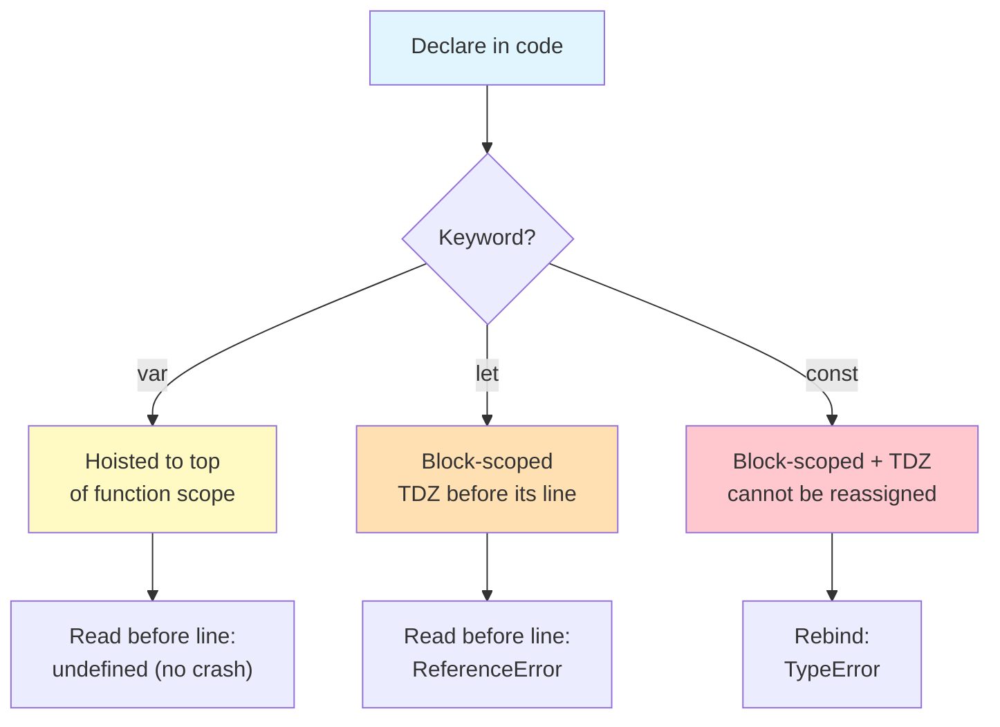
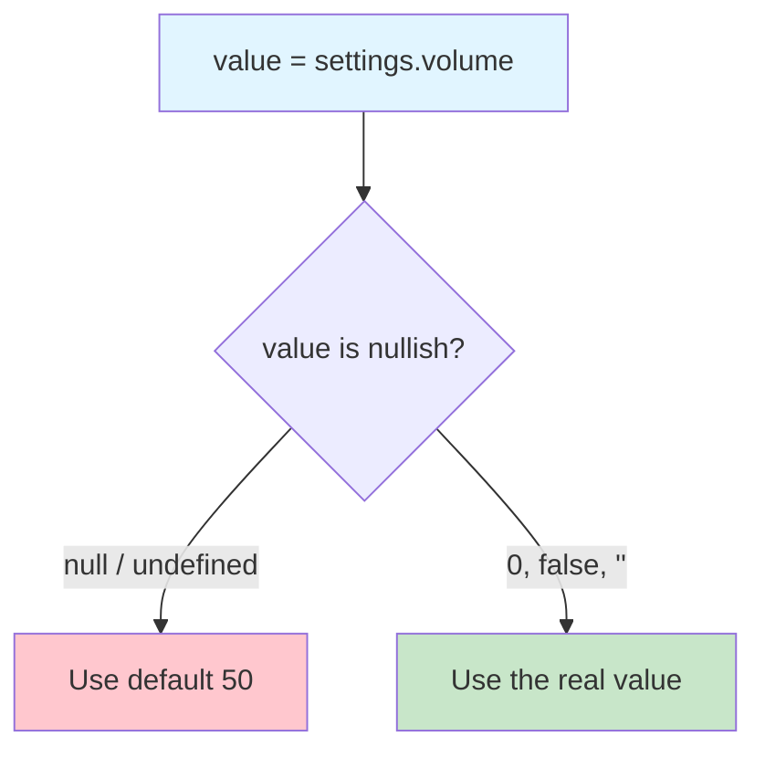
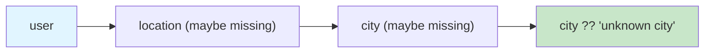

# Lab 1: Declarations, Scope & Safe Data Rendering

**Difficulty: Intermediate | ~50 min | Requires JavaScript Lab 5**

## 1. Problem Statement / Use Case Overview

The ShelfWise store-profile screen receives API data where some stores have no coordinates, some users have no saved preferences, some values are genuinely `0`, some values are genuinely `false`, and some fields are simply missing. When you render that data, you must distinguish a *missing* value from a *valid* value such as `0` and `false` — using `||` for defaults destroys real zeros, and accessing `user.settings.theme` on a user without settings crashes the whole page.

This lab teaches you to declare variables correctly (`var`, `let`, `const`), understand hoisting and the Temporal Dead Zone, and safely render messy real-world data using template literals, the ternary operator, `??`, and optional chaining — all without a single string concatenation with `+`.

## 2. Input Data

Two hardcoded API response arrays (no network, no API keys):

- `stores` — 4 store records. Each has `id`, `name`, `city`; some have `coords` (`{ lat, lng }`), some have `tags` (array), some have `promo` (`{ active }`), and some lack them. **Corner Pantry's coordinates are genuinely `0, 0`**, so they must be shown, not replaced with a default.
- `users` — 3 user records. Some have `location` (`{ city, coords }`), some have `tags`, some have `contact`, some have `settings`. **Anshu's volume is genuinely `0` and notify is genuinely `false`**; **Maya's coordinates are `0, 0`**; Sana has almost nothing.

## 3. Processing

1. Step 1 — Predict the output of five snippets about `var`, `let`, `const`, hoisting, and the Temporal Dead Zone, then run them to check.
2. Step 2 — Fix a notification loop that prints the same store three times using two different techniques (`let` and an IIFE closure).
3. Step 3 — Build `renderStoreCard()` that produces a multi-line store card using only template literals.
4. Step 4 — Fix `settingsSummary()` so a real `0` and a real `false` survive, and a default is used only when a value is truly missing (`??`).
5. Step 5 — Build `summarise()` that safely reads city, coordinates, first tag, and optional contact — no `if` statements, only `?.` and `??`.
6. Step 6 — Collapse a nested `if/else` access banner into one line while keeping identical behaviour.

## 4. Output

Running the final `render.js` prints, in the browser page and console:

- Step 1 — prediction results: hoisted `undefined`, `ReferenceError` (TDZ), `TypeError` (const rebinding), block-scope isolation, and `const` object mutation.
- Step 2 — the buggy loop (same store three times) followed by both fixed versions showing the first three stores.
- Step 3 — four store cards; Riverside shows "coordinates not saved", Main St. shows "no tags yet", Corner Pantry shows `0, 0`.
- Step 4 — settings lines; Anshu keeps `volume=0` and `notifications=off`, plus a side-by-side proof that `||` would destroy them but `??` does not.
- Step 5 — three user summaries built with zero `if` statements.
- Step 6 — the one-line banner matching the nested version for every store, ending with "All records rendered without crashing".

Sample of the real output:

```
=== Step 4: Settings ===
  Anshu: theme=dark, volume=0, notifications=off
  Maya: theme=light, volume=5, notifications=on
  Sana: theme=light, volume=50, notifications=on
  || destroys real 0 → volume 50 (should be 0)
  ?? keeps real 0    → volume 0 (is 0)
  || flips false     → notify true (should be false)
  ?? keeps false     → notify false (is false)

=== Step 5: User summaries ===
  Anshu: Mumbai, 19.07, 72.87, first tag: design, contact: anshu@shelfwise.app
  Maya: Austin, 0, 0, first tag: no tags, contact: no contact saved
  Sana: unknown city, no coordinates, first tag: owner, contact: no contact saved
```

## 5. Tech Stack

- **HTML5** — host page with an `output` element and a Run button
- **CSS3** — minimal `style.css` for readable output
- **JavaScript (ES6+)** — `let`/`const`, template literals, ternary, `??`, `?.`
- **Browser** — any modern browser (Chrome, Firefox, Edge, Safari); Developer Tools (F12) Console

## 6. Underlying Concepts

### `var`, `let`, `const` and scope

- **`var`** is function-scoped: it ignores `{ }` blocks and is *hoisted* (its declaration is moved to the top of the function), so reading it before its line gives `undefined` instead of crashing.
- **`let`** is block-scoped and has a **Temporal Dead Zone (TDZ)**: using it before its declaration line throws `ReferenceError`.
- **`const`** is like `let` but the binding cannot be reassigned. It still allows mutating the object it points to (`obj.n = 2` is fine; `obj = {...}` throws).
- **Block scope** (`{ }` from `if`, `for`, etc.) is what fixes the classic loop bug: a `var` loop variable is one shared variable that keeps its final value, while a `let` loop variable is a fresh binding per iteration.



### Falsy vs missing: `||` vs `??`

`||` returns the right side whenever the left is *falsy* — and `0`, `false`, and `''` are falsy. So `volume || 50` turns a real `0` into `50`. The **nullish coalescing operator `??`** only falls back when the left side is `null` or `undefined`, so a real `0` and a real `false` survive. Use `??` for defaults, `||` only when you truly want to replace every falsy value.



### Optional chaining and the ternary

`user.location?.city` reads `city` only if `location` exists — otherwise it evaluates to `undefined` instead of throwing. Chained with `??` it becomes a safe one-liner. The ternary `condition ? a : b` is a short `if/else` that produces a value, which is why it (and `?.`) can replace whole `if` blocks when rendering.



## 7. Prerequisites

- **JavaScript Lab 1** — basics, variables & operators
- **JavaScript Lab 2** — strings, numbers, arrays & control flow
- **JavaScript Lab 3** — functions, objects & DOM
- **JavaScript Lab 5** — closures are assumed (an IIFE is used in Step 2)

## 8. Environment / Dependencies Setup

No setup required. You need:

- A modern web browser (Chrome, Firefox, Edge, or Safari)
- A text editor (VS Code, Sublime Text, or any editor)
- A blank project folder — no packages, no build tools, no API keys

## 9. Step-wise Development Instructions

### Step 0 — Create the host page

Create an `index.html` with a Run button and an output element, then a minimal `style.css`. Finally create `render.js` (this is your final deliverable).

```html
<!DOCTYPE html>
<html lang="en">
<head>
    <meta charset="UTF-8">
    <title>Lab 1: Declarations, Scope & Safe Data Rendering</title>
    <link rel="stylesheet" href="style.css">
</head>
<body>
    <h1>ShelfWise — Store Profile &amp; Settings</h1>
    <button id="runBtn">Run Exercises</button>
    <pre id="output"></pre>
    <script src="render.js"></script>
</body>
</html>
```

Start `render.js` with a log helper. It appends each message as its own element, so you never build strings with `+`:

```javascript
// Lab 1: Declarations, Scope & Safe Data Rendering
// ShelfWise — Store Profile & Settings Screen

const outputEl = document.getElementById('output');
function log(message) {
    console.log(message);
    const line = document.createElement('div');
    line.textContent = message;
    outputEl.append(line);
}
```

Then copy the messy API records (Section 2) into the file, and wrap everything in a `runExercises()` function plus a button hookup:

```javascript
function runExercises() {
    outputEl.textContent = '';
    // ... your steps below ...
}

document.getElementById('runBtn').addEventListener('click', runExercises);
runExercises();
```

### Step 1 — Predict, then run: `var`, `let`, `const`

Read each snippet below and write down your prediction *before* running. Pay attention to the phrases "no crash", "ReferenceError", "TypeError", and which variable survives its block.

Snippet 1:
```javascript
let before = a;
var a = 10;
```
Snippet 2:
```javascript
let before = b;
let b = 20;
```
Snippet 3:
```javascript
const c = 30;
c = 40;
```
Snippet 4:
```javascript
if (true) {
    var d = 50;
    let e = 60;
}
```
Snippet 5:
```javascript
const obj = { n: 1 };
obj.n = 2;
```

To run them safely (so one `ReferenceError` doesn't stop the page), guard each with a small probe helper that catches the error and logs it:

```javascript
    const probe = (label, fn) => {
        try {
            log(`  ${label}: ${fn()}`);
        } catch (error) {
            log(`  ${label}: THROWS ${error.name}`);
        }
    };

    log('\n=== Step 1: var, let, const ===');
    probe('1. var hoisting — undefined before, 10 after', () => {
        var tmp = a, a = 10;
        return `before: ${tmp}, after: ${a}`;
    });
    probe('2. let — accessing b before its line throws', () => {
        let before = b, b = 20;
        return `before: ${before}`;
    });
    probe('3. const — reassigning c throws', () => {
        const c = 30;
        c = 40;
        return 'reassignment worked';
    });
    probe('4. block scope — var survives, let dies', () => {
        if (true) { var d = 50; let e = 60; }
        try { return `e (let) escaped: ${e}`; }
        catch (error) { return `d (var) survived: ${d}, e (let) THROWS ${error.name}`; }
    });
    probe('5. const — the object is mutable, the binding is not', () => {
        const obj = { n: 1 };
        obj.n = 2;
        try { obj = { n: 3 }; }
        catch (error) { return `obj.n mutated to ${obj.n}, rebind THROWS ${error.name}`; }
        return 'rebinding worked';
    });
```

Compare predictions with the output. Key takeaway: `var` is hoisted (undefined, no crash), `let`/`const` throw from the TDZ, and `const` freezes the binding but not the object.

### Step 2 — Fix the notification loop (two techniques)

The following code is *supposed* to notify the first three stores. Run it and watch what actually happens:

```javascript
    log('\n=== Step 2: Notification loop ===');
    const count = 3;
    function notify() {
        const notices = [];
        for (var i = 0; i < count; i++) notices.push(() => `New promotion at ${stores[i].name}`);
        return notices;
    }
    const show = (title, getNotices) => {
        log(title);
        for (const notice of getNotices()) log(`  ${notice()}`);
    };
    show('Buggy — expected the first 3 stores, got:', notify);
```

It prints **"New promotion at Corner Pantry" three times** — the same store. Why? Every arrow function closes over the *same* `var i`. By the time you call the notices, the loop is finished and `i === 3`, so `stores[i]` is always the last store.

**Fix 1 — `let`.** A `let` loop variable is a fresh binding per iteration, so each notice keeps its own `i`:

```javascript
    function notifyWithLet() {
        const notices = [];
        for (let i = 0; i < count; i++) notices.push(() => `New promotion at ${stores[i].name}`);
        return notices;
    }
    show('Fix 1 — let (block scoped):', notifyWithLet);
```

**Fix 2 — IIFE closure.** An Immediately Invoked Function Expression captures `i`'s *value* per iteration by passing it as an argument, so `var` is still safe:

```javascript
    function notifyWithClosure() {
        const notices = [];
        for (var i = 0; i < count; i++) notices.push((function (idx) {
            return () => `New promotion at ${stores[idx].name}`;
        })(i));
        return notices;
    }
    show('Fix 2 — IIFE closure:', notifyWithClosure);
```

Both now print Downtown Market, Riverside Grocery, Main St. Foods — in the right order.

### Step 3 — `renderStoreCard()` with template literals

A store card is multi-line text. Build it with backticks and `${}` — **no `+`**:

```javascript
    log('\n=== Step 3: Store cards ===');
    function renderStoreCard(store) {
        const coords = store.coords
            ? `${store.coords.lat}, ${store.coords.lng}`
            : 'coordinates not saved';
        const tags = store.tags && store.tags.length > 0
            ? store.tags.join(', ')
            : 'no tags yet';
        return `--------------------------------------------
${store.name}
City: ${store.city}
Coordinates: ${coords}
Tags: ${tags}
--------------------------------------------`;
    }
    for (const store of stores) log(renderStoreCard(store));
```

Notice `store.coords ? ... : ...`: a ternary, not an `if`. A `{ lat: 0, lng: 0 }` object is truthy, so Corner Pantry correctly prints `0, 0`, while Riverside (no `coords`) prints "coordinates not saved". `store.tags && store.tags.length > 0` guards the missing-tags case because `undefined && anything` is `undefined` (falsy).

### Step 4 — Fix the settings bug (`??` not `||`)

Here is the bug. Run it and watch what happens to Anshu:

```javascript
    log('\n=== Step 4: Settings ===');
    function settingsSummary(user) {
        const settings = user.settings ?? {};
        const theme = settings.theme ?? 'light';
        const volume = settings.volume || 50;     // BUG: destroys real 0
        const notify = settings.notify || true;   // BUG: flips real false
        return `${user.name}: theme=${theme}, volume=${volume}, notifications=${notify ? 'on' : 'off'}`;
    }
    for (const user of users) log(`  ${settingsSummary(user)}`);
```

Anshu's volume is genuinely `0` and notify is genuinely `false`, but `||` treats both as missing, printing `volume=50` and `notifications=on`. Swap `||` for `??` — it falls back **only** when the value is `null`/`undefined`:

```javascript
        const volume = settings.volume ?? 50;
        const notify = settings.notify ?? true;
```

Anshu now keeps `volume=0` and `notifications=off`, Maya falls back to `theme=light`, and Sana (no settings at all) gets every default. Prove the difference with a side-by-side:

```javascript
    log(`  || destroys real 0 → volume ${users[0].settings.volume || 50} (should be 0)`);
    log(`  ?? keeps real 0    → volume ${users[0].settings.volume ?? 50} (is 0)`);
    log(`  || flips false     → notify ${users[0].settings.notify || true} (should be false)`);
    log(`  ?? keeps false     → notify ${users[0].settings.notify ?? true} (is false)`);
```

### Step 5 — `summarise()` with zero `if` statements

Retrieve city, coordinates, first tag, and optional contact from possibly-missing data — using only `?.`, `??`, and one ternary:

```javascript
    log('\n=== Step 5: User summaries ===');
    function summarise(user) {
        const city = user.location?.city ?? 'unknown city';
        const coords = user.location?.coords
            ? `${user.location.coords.lat}, ${user.location.coords.lng}`
            : 'no coordinates';
        const firstTag = user.tags?.[0] ?? 'no tags';
        const contact = user.contact?.email ?? user.contact?.phone ?? 'no contact saved';
        return `${user.name}: ${city}, ${coords}, first tag: ${firstTag}, contact: ${contact}`;
    }
    for (const user of users) log(`  ${summarise(user)}`);
```

- `user.location?.city` is `undefined` (not a crash) when `location` is missing, then `?? 'unknown city'` kicks in.
- `user.tags?.[0]` reads the first tag safely; Maya has no tags, so it shows "no tags".
- `contact` chains two fallbacks: email, then phone, then the default.
- Maya's `coords` object is truthy, so she correctly shows `0, 0` — real zeros are never labelled "missing".

### Step 6 — Collapse the access banner into one line

This nested `if/else` decides which promo banner a store shows:

```javascript
    log('\n=== Step 6: Access banner ===');
    function nestedBanner(store) {
        let banner;
        if (store.promo) {
            if (store.promo.active) banner = '20% off today!';
            else banner = 'Promo has ended';
        } else banner = 'No current promo';
        return banner;
    }
```

Rewrite it as one expression using `?.` and nested ternaries — identical behaviour, no `if`:

```javascript
    const oneLineBanner = (store) => store.promo?.active
        ? '20% off today!'
        : store.promo ? 'Promo has ended' : 'No current promo';
    for (const store of stores) {
        log(`  ${store.name}: ${oneLineBanner(store)} (matches nested: ${nestedBanner(store) === oneLineBanner(store)})`);
    }
```

Verify the equivalence on real data:

```javascript
    log('\n=== All records rendered without crashing ===');
```

- `promo` missing → `store.promo?.active` is `undefined` → falls to `store.promo` (falsy) → "No current promo" (same as nested).
- `promo` exists but `active` is false → the optional chain yields `false` → falls to `store.promo ? ...` → "Promo has ended" (same as nested).

## 10. Optional Exercise

Swap the fallback behaviour in `settingsSummary`: give Sana `settings: { volume: 0 }` (only), and change the `notify` default from `true` to `false`. Re-run and confirm Sana's volume prints `0` — not the `50` fallback — her notifications print `off`, Anshu and Maya are unchanged, and every record still renders without crashing and without `+` concatenation.

## 11. What We Learnt

- **`var` is hoisted** to the top of its function, so reading it before its line yields `undefined` — no crash, but a footgun.
- **`let` and `const` have a Temporal Dead Zone** — touching them before their declaration lines throws `ReferenceError`.
- **`const` prevents rebinding, not mutation** — `obj.n = 2` is fine, `obj = {...}` throws `TypeError`.
- **`{ }` blocks scope `let`/`const` but not `var`** — that is exactly why a loop bug printed the same store three times.
- **`let` and an IIFE are two different fixes** for closures over a loop variable.
- **Template literals** build multi-line strings with `${}` — no `+` concatenation anywhere.
- **The ternary** replaces short `if/else` whenever you need a *value*, not a statement.
- **`??` falls back only on `null`/`undefined`** — it keeps real `0` and real `false`; `||` destroys them.
- **Optional chaining `?.`** reads nested properties without crashing, and `?.[0]` reads array items safely.
- **Chaining `?.` with `??`** collapses three-level `if/else` promos into one readable line.