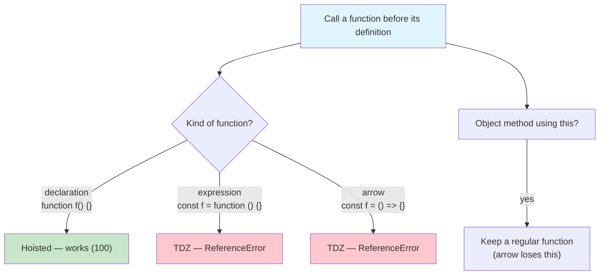
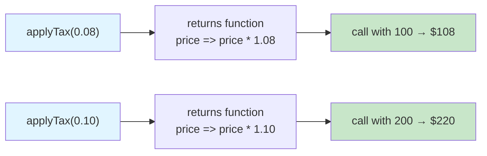
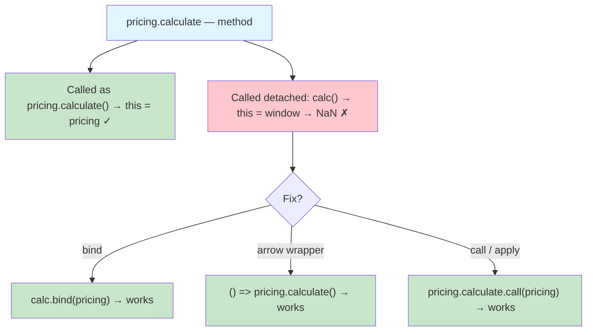

# Lab 2: Functions, `this` & Object Modelling

**Difficulty: Intermediate | ~60 min | Requires Lab 1 of this series**

## 1. Problem Statement / Use Case Overview

ShelfWise is growing from a single script into several files. It now needs to:

1. **Share utilities** — pricing formulas, logging, and one-shot initialisers used by every screen, written once and reused (functions as first-class citizens).
2. **Keep store credit private** — a customer's balance and history must not be reachable from outside the account object, so no one can read `account.balance` or wipe the history.
3. **Price products identically** — the same `ProductPricing` behaviour (base price, discount, tax) must exist both as a modern `class` and as the older *constructor function + prototype*, with byte-identical output.

All three requirements collide with one classic JavaScript trap: **`this` gets lost** the moment a method is detached from its object, passed as a callback, or used inside an array method — producing `NaN` or a crash instead of $324.00.

This lab teaches you the family of function syntaxes (declarations, expressions, arrows), the higher-order patterns built from them (callbacks, closures, currying, `once`, `withLogging`), the four ways to control `this` (`bind`, `call`, `apply`, arrows), and the two ways to model objects (`class` and constructor functions) — while engineering the private account with closures so its internals cannot be touched.

## 2. Input Data

All data is hardcoded in the four deliverable files — no network, no API keys:

- **`pricing`** — a helper object (`base: 100`, `taxRate: 0.08`) with `calculate()`, `totalFor(quantity)`, and `format(n)` methods, used to demonstrate lost `this`.
- **`items`** — `[100, 200, 50]`, prices summed in the array-callback demonstration.
- **`products`** — three products created with `new`:
  - `Widget` — base price `100`, default tax `0.08` (8%), discounted by `10` → `$90.00`, tax `$7.20`.
  - `Gadget` — base price `250`, custom tax `0.10` (10%), discounted by `20` → `$200.00`, tax `$20.00`.
  - `Bundle` — base price `300`, two chained discounts (`10` then `5`) → `$256.50`, tax `$20.52`.
- **An account** — created with `createAccount('Anshu', 1000)`, then `deposit(500)`, `withdraw(200)`, `deposit(50)` → final balance `$1350` and a 3-entry history.

## 3. Processing

1. **Step 1 — Function hoisting.** Three pricing functions are called *before* their definitions. Only the function **declaration** works; the **expression** and the **arrow** throw `ReferenceError`. Run a probe that catches each error so one crash doesn't stop the page.
2. **Step 2 — The shortest arrow.** Convert five helper functions to their shortest correct arrow form — and deliberately keep one function a regular function, because it uses `this` (arrows don't bind `this`).
3. **Step 3 — Utility toolkit.** Build `repeat()`, `once()`, `withLogging()` (higher-order functions / closures), and a curried `applyTax(rate)(price)`.
4. **Step 4 — Private store account.** `createAccount(owner, initialBalance)` returns an object whose `balance` and `history` live only inside a closure — `account.balance` and `account.history` are `undefined`, and tampering with the returned history cannot touch the real one.
5. **Step 5 — Fix five lost `this` bugs.** Fix the same pricing helper five different ways: `bind`, an arrow wrapper, an arrow inside `reduce`, `call`, and `apply`.
6. **Step 6 — One pricing system, two models.** Build `ProductPricing` as a `class` (modern) and as a constructor function with `prototype` methods (older). Both produce identical strings.

## 4. Output

Opening the host page prints six sections in the page and the console. The class and prototype sections must be byte-identical — that is the definition of success for Step 6. Real output sample:

```
=== Step 1: Function Hoisting ===
basicPrice(100): 100
discountPrice: THROWS ReferenceError
finalPrice: THROWS ReferenceError

=== Step 3: Utility Toolkit ===
repeat(3):
  iteration 0
  iteration 1
  iteration 2
once, call 1: ready
once, call 2: ready (cached)
  double(7) → 14
applyTax(0.08)(100): $108
applyTax(0.10)(200): $220

=== Step 4: Private Store Account ===
Owner: Anshu
Balance: $1350
History: [{"type":"deposit","amount":500,"balance":1500},{"type":"withdrawal","amount":200,"balance":1300},{"type":"deposit","amount":50,"balance":1350}]
Direct access account.balance: undefined
Direct access account.history: undefined
getHistory() returns a copy — mutating it cannot change the account:
History after tampering attempt: [{"type":"deposit","amount":500,"balance":1500},{"type":"withdrawal","amount":200,"balance":1300},{"type":"deposit","amount":50,"balance":1350}]

=== Step 5: Fix Lost this ===
1. Detached method: $NaN
   Fix (bind): $108.00
2. Passed as callback: $NaN
   Fix (arrow wrapper): $108.00
3. Fix (arrow in reduce): $378.00
4. Fix (call): $324.00
5. Fix (apply): $324.00

=== Step 6: Product Pricing (Class) ===
Widget: $90.00 (+tax $7.20)
Gadget: $200.00 (+tax $20.00)
Bundle: $256.50 (+tax $20.52)

=== Step 6: Product Pricing (Prototype) ===
Widget: $90.00 (+tax $7.20)
Gadget: $200.00 (+tax $20.00)
Bundle: $256.50 (+tax $20.52)
```

## 5. Tech Stack

- **HTML5** — host page with an `output` element and a Run button
- **CSS3** — minimal `style.css` for readable output
- **JavaScript (ES6+)** — arrows, default/rest parameters, `class`, closures, `this` control
- **Browser** — any modern browser (Chrome, Firefox, Edge, Safari); Developer Tools (F12) Console

## 6. Underlying Concepts

### Function declarations vs expressions vs arrows

- A **function declaration** (`function f() {}`) is *hoisted*: the whole function is lifted to the top of its scope, so calling it before its line works.
- A **function expression** (`const f = function () {}`) and an **arrow** (`const f = () => {}`) are *not* hoisted. The binding sits in the Temporal Dead Zone until its line runs, exactly like `let`/`const` from Lab 1 — calling them early throws `ReferenceError`.
- **Arrows** are the shortest form when the body is one expression (`x => x * 2`), but they inherit `this` from surrounding scope and cannot be used as constructors — so an object method that needs its own `this` stays a regular function.



### Higher-order functions, closures and currying

A function that takes a function (callback) or returns a function is a **higher-order function**. When the returned function remembers variables from the outer call — like `repeat`, `once`, and the curried `applyTax` — that memory is a **closure**. `once` keeps a private `called` flag; `createAccount` keeps a private `balance` and `history`. **Currying** turns `(rate, price)` into `(rate) => (price) => …`, so you can pre-configure tax rates once (`const tax8 = applyTax(0.08)`) and reuse them.



### `this`, and the four ways to fix a lost binding

`this` is decided by **how a function is called**, not where it is written. `pricing.calculate()` gives `this = pricing`; `const calc = pricing.calculate; calc()` has no receiver, so `this` is the global object (→ `NaN`) or `undefined` in strict mode (→ crash). Four fixes:

- **`bind`** — `calc.bind(pricing)` manufactures a permanent copy bound to `pricing`.
- **Arrow wrapper** — `() => pricing.calculate()` calls the method *as a method* on the object.
- **Arrow in an array method** — `prices.reduce((sum, p) => …this…)` inherits `this` from the enclosing function.
- **`call` / `apply`** — invoke immediately with an explicit `this`: `fn.call(obj, 1, 2)` vs `fn.apply(obj, [1, 2])`.



### Classes are sugar over prototypes

`class X { method() {} }` and `function X() {} … X.prototype.method = function () {}` produce **the same thing**: an instance that inherits shared methods from `X.prototype`. `class` is newer, tidier, and enforces `new`; the constructor-function form works in older environments and demystifies what `class` actually does. In this lab both must print identical `Widget: $90.00 (+tax $7.20)` lines.

## 7. Prerequisites

- **Lab 1 of this series** — `var`/`let`/`const`, hoisting, the Temporal Dead Zone, block scope
- **JavaScript Lab 1** — basics, variables & operators (of the earlier beginner series)
- **JavaScript Lab 2** — strings, numbers, arrays & control flow
- **JavaScript Lab 3** — functions, objects & DOM
- **JavaScript Lab 5** — closures (IIFEs are assumed in Step 3)

## 8. Environment / Dependencies Setup

No setup required. You need:
- A modern web browser (Chrome, Firefox, Edge, or Safari)
- A text editor (VS Code, Sublime Text, or any editor)
- A blank project folder — no packages, no build tools, no API keys

## 9. Step-wise Development Instructions

### Step 0 — Create the host page

Create `index.html` with a Run button, an output element, and `style.css`. Load the four deliverable files **in order** as separate classic `<script>` tags, then wire the Run button with an inline script:

```html
<!DOCTYPE html>
<html lang="en">
<head>
    <meta charset="UTF-8">
    <title>Lab 2: Functions, this & Object Modelling</title>
    <link rel="stylesheet" href="style.css">
</head>
<body>
    <h1>ShelfWise — Store Credit &amp; Product Pricing</h1>
    <button id="runBtn">Run Exercises</button>
    <pre id="output"></pre>
    <script src="utils.js"></script>
    <script src="account.js"></script>
    <script src="pricing-class.js"></script>
    <script src="pricing-prototype.js"></script>
    <script>
        document.getElementById('runBtn').addEventListener('click', () => {
            document.getElementById('output').textContent = '';
            runUtils();
            runAccount();
            runPricingClass();
            runPricingPrototype();
        });
        runUtils();
        runAccount();
        runPricingClass();
        runPricingPrototype();
    </script>
</body>
</html>
```

**Important:** classic `<script>` tags share one global scope. Each of the four files declares its own `outputEl` and `log` helper — using `var` and a function declaration (both tolerate redeclaration across scripts) rather than `const` (which would throw `Identifier 'outputEl' has already been declared`):

```javascript
var outputEl = document.getElementById('output');

function log(message) {
    console.log(message);
    const line = document.createElement('div');
    line.textContent = message;
    outputEl.append(line);
}
```

Each file exposes one entry point — `runUtils()`, `runAccount()`, `runPricingClass()`, `runPricingPrototype()` — that the page calls. Never call it inside the file itself.

### Step 1 — Function hoisting (in `utils.js`)

Call three pricing functions *before* they are defined. Only the declaration survives:

```javascript
function runUtils() {
    log('\n=== Step 1: Function Hoisting ===');

    log(`basicPrice(100): ${basicPrice(100)}`);

    try {
        log(`discountPrice(100, 20): ${discountPrice(100, 20)}`);
    } catch (error) {
        log(`discountPrice: THROWS ${error.name}`);
    }

    try {
        log(`finalPrice(100): ${finalPrice(100)}`);
    } catch (error) {
        log(`finalPrice: THROWS ${error.name}`);
    }

    function basicPrice(amount) { return amount; }              // declaration — hoisted
    const discountPrice = (amount, pct) => amount * (1 - pct / 100); // expression — TDZ
    const finalPrice = (amount) => amount * 1.08;               // arrow — TDZ
}
```

Each `try/catch` probe reports the error instead of crashing the page. `basicPrice` is hoisted and returns `100`; the other two throw `ReferenceError` from the Temporal Dead Zone.

### Step 2 — Convert to the shortest arrows (in `utils.js`)

Rewrite five one-line helpers as the *shortest correct* arrow form — dropping `function`, `return`, and parentheses whenever a single parameter is used:

```javascript
    log('\n=== Step 2: Arrow Functions ===');

    const double = x => x * 2;             // was: function (x) { return x * 2; }
    const triple = x => x * 3;
    const greet = name => `Hello, ${name}`;
    const add = (a, b) => a + b;
    const isEven = n => n % 2 === 0;

    log(`double(5): ${double(5)}`);
    log(`triple(5): ${triple(5)}`);
    log(`greet("Anshu"): ${greet('Anshu')}`);
    log(`add(3, 4): ${add(3, 4)}`);
    log(`isEven(7): ${isEven(7)}`);

    const product = { price: 25, getPrice: function() { return this.price; } };
    log(`product.getPrice(): ${product.getPrice()}`);
    log('(this one keeps a regular function — arrows do not bind this)');
```

`getPrice` is the deliberate exception: it needs `this` to refer to `product`, and **an arrow has no `this` of its own** — it would inherit from the surrounding scope and return `undefined`.

### Step 3 — The utility toolkit (in `utils.js`)

Build four reusable, higher-order utilities:

```javascript
function repeat(times, action) {
    for (let i = 0; i < times; i++) action(i);
}

function once(fn) {
    let called = false;
    let result;
    return function (...args) {
        if (!called) {
            result = fn(...args);
            called = true;
        }
        return result;
    };
}

function withLogging(fn) {
    return function (...args) {
        const result = fn(...args);
        log(`  ${fn.name}(${args.join(', ')}) → ${result}`);
        return result;
    };
}

const applyTax = (rate) => (price) => +(price * (1 + rate)).toFixed(2);
```

- `repeat(times, action)` runs a callback a given number of times, passing the index.
- `once(fn)` is a **closure**: it remembers `called` and `result` across calls, so the second call returns the cached value and the wrapped function never runs again.
- `withLogging(fn)` wraps any function and logs its name + arguments + result; `...args` (rest parameter) collects unlimited arguments into an array.
- `applyTax` is **curried**: call it once with a rate to get a ready-to-use pricing function.

Run them:

```javascript
    log('repeat(3):');
    repeat(3, (i) => log(`  iteration ${i}`));

    const setupOnce = once(() => { log('   → setup ran'); return 'ready'; });
    log(`once, call 1: ${setupOnce()}`);
    log(`once, call 2: ${setupOnce()} (cached)`);

    const loggedDouble = withLogging(double);
    loggedDouble(7);

    log(`applyTax(0.08)(100): $${applyTax(0.08)(100)}`);
    log(`applyTax(0.10)(200): $${applyTax(0.10)(200)}`);
```

The `→ setup ran` line appears exactly once, even though `setupOnce` is called twice.

### Step 4 — Private store account (in `account.js`)

Build `createAccount()` so `balance` and `history` live **inside the returned closures**, invisible from outside:

```javascript
function runAccount() {
    log('\n=== Step 4: Private Store Account ===');

    function createAccount(owner, initialBalance) {
        let balance = initialBalance;
        const history = [];

        return {
            getOwner() { return owner; },
            deposit(amount) {
                if (amount <= 0) return false;
                balance += amount;
                history.push({ type: 'deposit', amount, balance });
                return true;
            },
            withdraw(amount) {
                if (amount <= 0 || amount > balance) return false;
                balance -= amount;
                history.push({ type: 'withdrawal', amount, balance });
                return true;
            },
            getBalance() { return balance; },
            getHistory() { return [...history]; }
        };
    }

    const account = createAccount('Anshu', 1000);
    account.deposit(500);
    account.withdraw(200);
    account.deposit(50);

    log(`Owner: ${account.getOwner()}`);
    log(`Balance: $${account.getBalance()}`);
    log(`History: ${JSON.stringify(account.getHistory())}`);

    log(`Direct access account.balance: ${account.balance}`);
    log(`Direct access account.history: ${account.history}`);
    log(`getHistory() returns a copy — mutating it cannot change the account:`);
    account.getHistory().length = 0;
    log(`History after tampering attempt: ${JSON.stringify(account.getHistory())}`);
}
```

- `balance` and `history` are only referenced by the methods inside `createAccount` — there is no `this.balance`, no property at all. `account.balance` is therefore `undefined`.
- `getHistory()` returns `[...history]` — a **copy** via spread — so calling `account.getHistory().length = 0` clears the copy, not the real history.

### Step 5 — Fix five lost `this` bugs (in `pricing-class.js`)

Start with one helper object and demonstrate the same failure five ways, each with its own fix:

```javascript
function runPricingClass() {
    log('\n=== Step 5: Fix Lost this ===');

    const pricing = {
        base: 100,
        taxRate: 0.08,
        calculate() { return this.base * (1 + this.taxRate); },
        totalFor(quantity) { return this.calculate() * quantity; },
        format(n) { return `$${Number(n).toFixed(2)}`; }
    };

    const calc = pricing.calculate;
    log(`1. Detached method: ${pricing.format(calc())}`);
    log(`   Fix (bind): ${pricing.format(calc.bind(pricing)())}`);

    const runLater = (fn) => fn();
    log(`2. Passed as callback: ${pricing.format(runLater(pricing.calculate))}`);
    log(`   Fix (arrow wrapper): ${pricing.format(runLater(() => pricing.calculate()))}`);

    const items = [100, 200, 50];
    const taxSum = items.reduce((sum, p) => sum + p * (1 + pricing.taxRate), 0);
    log(`3. Fix (arrow in reduce): ${pricing.format(taxSum)}`);

    log(`4. Fix (call): ${pricing.format(pricing.totalFor.call(pricing, 3))}`);
    log(`5. Fix (apply): ${pricing.format(pricing.totalFor.apply(pricing, [3]))}`);
```

1. **Detached** — `calc()` runs with `this = window` (sloppy mode), so `this.base` is `undefined` → `$NaN`. `calc.bind(pricing)` fixes it.
2. **Callback** — `runLater(fn)` invokes `fn()` with no receiver, same loss. An arrow wrapper keeps the object in the call expression.
3. **Array method** — the arrow inside `reduce` never uses its own `this`; it closes over `pricing` directly (an arrow *would* also inherit `this` from the enclosing function).
4. **`call`** — `pricing.totalFor.call(pricing, 3)` runs immediately with `this = pricing` and arguments listed one by one.
5. **`apply`** — identical, but arguments arrive as an array: `pricing.totalFor.apply(pricing, [3])`.

`3 + 3` and `4 + 5` are the same $324.00 — the receiver matters, not the argument container.

### Step 6 — The pricing system, twice (in `pricing-class.js` and `pricing-prototype.js`)

**Modern `class`:**

```javascript
    log('\n=== Step 6: Product Pricing (Class) ===');

    class ProductPricing {
        constructor(name, basePrice, taxRate = 0.08) {
            this.name = name;
            this.basePrice = basePrice;
            this.taxRate = taxRate;
        }
        withTax() {
            return +(this.basePrice * (1 + this.taxRate)).toFixed(2);
        }
        applyDiscount(percent) {
            this.basePrice = +(this.basePrice * (1 - percent / 100)).toFixed(2);
            return this;              // enables chaining
        }
        toString() {
            const tax = (this.withTax() - this.basePrice).toFixed(2);
            return `${this.name}: $${this.basePrice.toFixed(2)} (+tax $${tax})`;
        }
    }

    const w1 = new ProductPricing('Widget', 100);
    w1.applyDiscount(10);
    log(`${w1}`);

    const g1 = new ProductPricing('Gadget', 250, 0.10);
    g1.applyDiscount(20);
    log(`${g1}`);

    const b1 = new ProductPricing('Bundle', 300);
    log(`${b1.applyDiscount(10).applyDiscount(5)}`);
```

Note the **default parameter** `taxRate = 0.08` and the **fluent `return this`**, which lets `applyDiscount` chain (`b1.applyDiscount(10).applyDiscount(5)`).

**Older constructor function + prototype** — the same behaviour, hand-rolled:

```javascript
function runPricingPrototype() {
    log('\n=== Step 6: Product Pricing (Prototype) ===');

    function ProductPricing(name, basePrice, taxRate) {
        this.name = name;
        this.basePrice = basePrice;
        this.taxRate = taxRate || 0.08;
    }

    ProductPricing.prototype.withTax = function () {
        return +(this.basePrice * (1 + this.taxRate)).toFixed(2);
    };

    ProductPricing.prototype.applyDiscount = function (percent) {
        this.basePrice = +(this.basePrice * (1 - percent / 100)).toFixed(2);
        return this;
    };

    ProductPricing.prototype.toString = function () {
        const tax = (this.withTax() - this.basePrice).toFixed(2);
        return `${this.name}: $${this.basePrice.toFixed(2)} (+tax $${tax})`;
    };

    const w2 = new ProductPricing('Widget', 100);
    w2.applyDiscount(10);
    log(`${w2}`);

    const g2 = new ProductPricing('Gadget', 250, 0.10);
    g2.applyDiscount(20);
    log(`${g2}`);

    const b2 = new ProductPricing('Bundle', 300);
    log(`${b2.applyDiscount(10).applyDiscount(5)}`);
}
```

`new ProductPricing(...)` in both files creates an object whose shared methods live on `ProductPricing.prototype`. That is exactly what `class` does under the hood — here the tax default is expressed with `taxRate || 0.08` instead of a default parameter. Both files print the *same* three lines: **that equality is the acceptance criterion.**

## 10. Optional Exercise

Add a `transfer(amount, targetAccount)` method to `createAccount()` that moves store credit between two accounts **atomically**:

- If the amount is invalid or exceeds the balance, return `false` and change **nothing** (neither account's balance nor history).
- Otherwise withdraw from this account and deposit into `targetAccount` (both are objects returned by `createAccount`), recording the transfer in **both** histories, and return `true`.

Verify with two accounts (e.g. Anshu `1000` → Sana `500`, transfer `300`): Anshu ends at `700`, Sana at `800`, both histories gain one entry each, and attempting to transfer `9999` returns `false` and leaves both accounts unchanged. Anshu's balance should still be unreadable via `account.balance`.

## 11. What We Learnt

- **Function declarations are hoisted** — callable before their line; **expressions and arrows** sit in the Temporal Dead Zone and throw `ReferenceError`.
- **Arrows** are the shortest form for one-expression functions, but they inherit `this` and can't be constructors, so object methods keep regular functions.
- **Default parameters** (`taxRate = 0.08`) and **rest parameters** (`...args`) make functions safer and more flexible.
- **Higher-order functions** take callbacks (`repeat`) and return functions (`withLogging`, `once`); **closures** are the memory that makes `once` cache and `createAccount` private.
- **Currying** `(rate) => (price) => …` lets you pre-configure a function once and reuse it.
- **`this` is set by the call**, not the definition — detaching a method or passing it as a callback yields `NaN` (window) or a crash (strict mode).
- **`bind`, arrow wrappers, arrays' arrows, `call`, and `apply`** are five ways to fix or exploit `this`; `call`/`apply` differ only in how arguments are listed.
- **Closures create real privacy** — `account.balance` is `undefined`, and `[...history]` copies defeat tampering.
- **`class` is sugar over prototype** — `new` + `X.prototype.method` and `class X { method }` are the same mechanism, verified by identical output.
- **`return this` enables method chaining**, the signature of a fluent API like `applyDiscount(10).applyDiscount(5)`.