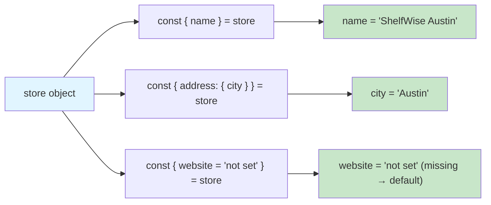
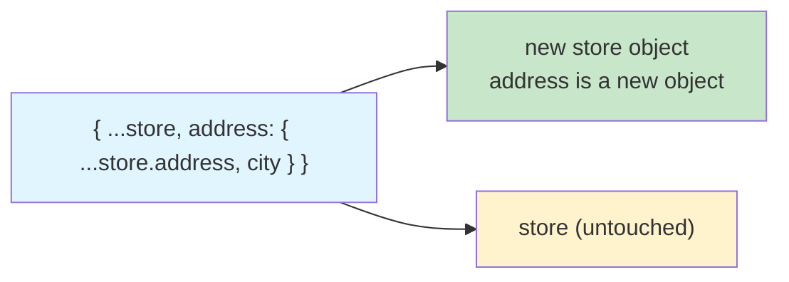

# Lab 3: Destructuring, Rest/Spread & Immutable Updates

**Difficulty: Beginner | ~55 min | Requires Lab 1 of this series**

## 1. Problem Statement / Use Case Overview

ShelfWise's shopping cart and admin panel both work with **one large shared object** — the `store`. It contains the store's address, the manager, the staff list, the stock, and marketing tags.

The old code *directly modified* this object. Two serious problems came from that:

1. **The undo system is broken.** A "snapshot" was supposed to be a copy of the store at one moment. But if the snapshot is really the *same* object, then when the store changes, the "snapshot" changes too — undo has nothing to go back to.
2. **A salary leak.** When making a copy of the manager record, a careless copy also copied the private `salary` field into data that should not contain it.

This lab teaches you the three skills that fix both problems:

- **Destructuring** — pull values out of objects and arrays in one line (Step 1–2).
- **Rest & spread** — gather values into one container (`...`) or spread a container into many values, which is how you build *immutable* updates (Step 3).
- **Pure update functions** — functions that never touch the original data; they always return a brand-new copy, which is what makes undo possible (Steps 4–5).

## 2. Input Data

One hardcoded object, saved as `store` in `immutable.js` (no network, no API keys):

```javascript
const store = {
    name: 'ShelfWise Austin',
    address: { city: 'Austin', street: '5th Ave' },
    manager: { name: 'Maya', salary: 80000 },   // salary is private!
    staff: [
        { id: 1, name: 'Anshu', role: 'designer', skills: ['design', 'support'] },
        { id: 2, name: 'Sana', role: 'manager', skills: ['stock'] }
    ],
    stock: [
        { name: 'Widget', qty: 10 },
        { name: 'Gadget', qty: 4 }
    ],
    tags: ['new', 'popular', 'new', 'popular']   // has duplicates on purpose
};
```

Plus two small demo values used inside Step 3 (`sumCart` prices) and Step 4 (a tiny `cart` object).

## 3. Processing

1. **Step 1 — Destructuring.** Write **six** destructuring statements that read values from `store` without repeating `store.address.city` style dot chains: simple, nested, renamed, with a default, from an array, and from an array inside an object.
2. **Step 2 — `badge()`.** One small function for the staff directory that destructures `name`, `role`, and `skills` **right inside the parameter list**, and also handles being called with no argument at all.
3. **Step 3 — Rest & spread.** Use `...` for four real tasks: calculate a cart total, strip the private salary out of a copy, merge two settings objects, and remove duplicate tags.
4. **Step 4 — Deep clone.** First reproduce the undo bug on purpose (an alias and a shallow copy), see why they are not independent, then write `deepClone()` that copies every nested level.
5. **Step 5 — Pure updates & undo.** Four pure update functions (`changeCity`, `restockItem`, `addSkill`, `removeStaff`). Each returns new data and never modifies `store` — verified with before/after checks, then used to power a **two-step undo** demonstration.

## 4. Output

Opening the host page (or clicking **Run Review**) prints five sections. Real output:

```
=== Step 1: Destructuring ===
1. Name: ShelfWise Austin
2. Nested city: Austin
3. Renamed town: Austin
4. Default: website = not set
5. Array: first = Anshu, second = Sana
6. First stock item: Widget

=== Step 2: badge() ===
Anshu — designer (design)
Sana — manager (stock)
unknown — staff (no skills yet)

=== Step 3: Rest & Spread ===
1. Cart total: $43
2. Salary pulled out (80000) → safe rest: {"name":"Maya"}
3. Merged settings: theme=dark, currency=USD
4. Unique tags: new, popular

=== Step 4: Deep clone ===
BUG: alias is the SAME object → cart city: Houston
Fixed: clone is independent → cart: Houston, clone: Denver

=== Step 5: Pure updates & undo ===
store untouched: city=Austin, staff=2, gadget=4
v4: city=Dallas, staff=1, skills=design, support, sales, gadget=7
v4 is a whole new object, not store: true
Undo 1 (restock) → gadget 4 | Undo 2 (city) → Austin
```

The two sharpest lines to watch:

- **Step 4:** `cart: Houston` stayed `Houston` for *both* the buggy alias and the deep clone — but only because we *first* showed the bug (they shared the nested object) and *then* proved the clone has its own copy.
- **Step 5:** `store untouched: city=Austin, staff=2, gadget=4` — after all four updates, the original still has Austin, 2 staff, 4 gadgets.

## 5. Tech Stack

- **HTML5** — host page with an output element and a Run Review button
- **CSS3** — minimal `style.css` for readable output
- **JavaScript (ES6+)** — destructuring, rest/spread, arrow functions, `Set`
- **Browser** — any modern browser (Chrome, Firefox, Edge, Safari); Developer Tools (F12) Console

## 6. Underlying Concepts

### Destructuring: unpacking in one line

Destructuring lets you **take values out and name them**, all in one statement, instead of writing `store.staff[0].name` over and over. There are three variations you use constantly:

- **Object destructuring** — `const { name } = store;` makes a variable `name` holding `store.name`.
- **Renaming** — `const { city: town } = store.address;` reads `city` but stores it as `town`.
- **Default values** — `const { website = 'not set' } = store;` uses `'not set'` only if the property is missing.



### Rest (`...`) gathers, spread (`...`) scatters

The **spread operator** `...` copies the contents of a collection into a new one — into an object literal (`{ ...store, ... }`) or an array literal (`[...prices]`, `[...new Set(tags)]`). The **rest operator** (also `...`, on the *left* side) gathers leftover values into one container — `const { salary, ...safeManager } = ...` removes `salary` and puts everything else in `safeManager`.



### Shallow vs deep copy

- `const b = { ...store }` copies only the **top level**. The nested `address`, `staff`, `stock` objects are still *shared* — write to `b.address.city` and you change `store` too. That's the **shallow** copy, and it is why the naive undo fails.
- A **deep** copy rebuilds every nested object. `deepClone()` checks every value: arrays are rebuilt with `.map`, objects with a `for...in` loop that copies each key, and everything calls itself again so numbers, strings, booleans, arrays, and objects at *any* depth all become independent copies.

### Pure functions make undo possible

A **pure update function** takes the current store, returns a *new* store, and never touches the input. Because every update produces a fresh object, you can save a **deep clone** before each update, and "undo" simply means going back to the saved snapshot. Step 5 shows two snapshots and two undos working.

## 7. Prerequisites

- **Lab 1 of this series** — `var`/`let`/`const`, scope, and safe data access
- **JavaScript Lab 1** — basics, variables & operators (of the earlier beginner series)
- **JavaScript Lab 2** — strings, numbers, arrays & control flow
- Comfort writing function calls and `console.log` — you already have this from the labs above

## 8. Environment / Dependencies Setup

No setup required. You need:
- A modern web browser (Chrome, Firefox, Edge, or Safari)
- A text editor (VS Code, Sublime Text, or any editor)
- A blank project folder — no packages, no build tools, no API keys

## 9. Step-wise Development Instructions

### Step 0 — Create the host page

Create `index.html` with a Run Review button and an output element, plus a minimal `style.css`. Then create `immutable.js` — this is your final deliverable.

```html
<!DOCTYPE html>
<html lang="en">
<head>
    <meta charset="UTF-8">
    <title>Lab 3: Destructuring, Rest/Spread & Immutable Updates</title>
    <link rel="stylesheet" href="style.css">
</head>
<body>
    <h1>ShelfWise — Cart &amp; Undoable Admin Panel</h1>
    <button id="runBtn">Run Review</button>
    <pre id="output"></pre>
    <script src="immutable.js"></script>
</body>
</html>
```

Start `immutable.js` with a tiny log helper that appends each message to the output element, and copy in the `store` data from Section 2:

```javascript
const outputEl = document.getElementById('output');

function log(message) {
    console.log(message);
    outputEl.textContent += message + '\n';
}
```

A classic script runs top to bottom. At the end of the file we hook up the button and run the review once so the page shows output immediately:

```javascript
document.getElementById('runBtn').addEventListener('click', runReview);
runReview();
```

### Step 1 — Six destructuring statements

Inside `runReview()`, pull every piece of data you need in one line — no repeated dot chains:

```javascript
const { name } = store;
log(`1. Name: ${name}`);

const { address: { city } } = store;
log(`2. Nested city: ${city}`);

const { address: { city: town } } = store;
log(`3. Renamed town: ${town}`);

const { website = 'not set' } = store;
log(`4. Default: website = ${website}`);

const [first, second] = store.staff;
log(`5. Array: first = ${first.name}, second = ${second.name}`);

const { stock: [{ name: item }] } = store;
log(`6. First stock item: ${item}`);
```

Read each one slowly:

1. `{ name }` — plain object destructuring.
2. `{ address: { city } }` — go *into* `address`, then take `city` (one nested step).
3. `{ address: { city: town } }` — nested *and renamed*.
4. `{ website = 'not set' }` — default only when the key is missing.
5. `[first, second]` — **array** destructuring matches by position: `first` is index 0, `second` is index 1.
6. `{ stock: [{ name: item }] }` — take the first element of `stock` and read its `name` into a variable called `item`.

### Step 2 — `badge()` destructures its parameters

A badge for the staff directory. The function **destructures inside the parameter list**, and the `= {}` default means calling it with no argument still works:

```javascript
function badge({ name = 'unknown', role = 'staff', skills = [] } = {}) {
    return `${name} — ${role} (${skills[0] || 'no skills yet'})`;
}
```

Test all three cases:

```javascript
log(badge(store.staff[0]));   // Anshu — designer (design)
log(badge(store.staff[1]));   // Sana — manager (stock)
log(badge());                 // unknown — staff (no skills yet)
```

Passing `store.staff[0]` runs `{ name = 'unknown', ... }` against that member — `name` gets Anshu, `role` gets designer, `skills[0]` is "design". Calling `badge()` with nothing runs `{ ... } = {}` against an empty object, so all defaults kick in.

### Step 3 — Rest & spread for real tasks

**Task 1 — Cart total with rest.** `...prices` collects every argument into an array, then `reduce` adds them:

```javascript
const sumCart = (...prices) => prices.reduce((a, b) => a + b, 0);
log(`1. Cart total: $${sumCart(9, 15, 7, 12)}`);
```

**Task 2 — Strip the salary (fix the leak).** Destructure `salary` to the side; `...safeManager` grabs everything else:

```javascript
const { manager: { salary, ...safeManager } } = store;
log(`2. Salary pulled out (${salary}) → safe rest: ${JSON.stringify(safeManager)}`);
```

`safeManager` ends up as `{"name":"Maya"}` — no salary anywhere in it.

**Task 3 — Merge settings with spread.** Later keys win, so `theme` is `dark`:

```javascript
const moreSettings = { theme: 'dark', currency: 'USD' };
const settings = { theme: 'light', ...moreSettings };
log(`3. Merged settings: theme=${settings.theme}, currency=${settings.currency}`);
```

**Task 4 — Remove duplicate tags.** `new Set(...)` keeps unique values; `[...new Set(...)]` turns it back into an array:

```javascript
const uniqueTags = [...new Set(store.tags)];
log(`4. Unique tags: ${uniqueTags.join(', ')}`);
```

### Step 4 — Reproduce the bug, then deep clone

First reproduce the exact undo bug. `alias = cart` does **not** copy anything — both names point at the *same* object:

```javascript
const cart = { items: ['Widget'], address: { city: 'Austin' } };
const alias = cart;
alias.address.city = 'Houston';
log(`BUG: alias is the SAME object → cart city: ${cart.address.city}`);
```

Now write `deepClone()` and prove it is independent:

```javascript
function deepClone(value) {
    if (Array.isArray(value)) return value.map(deepClone);
    if (value && typeof value === 'object') {
        const copy = {};
        for (const key in value) copy[key] = deepClone(value[key]);
        return copy;
    }
    return value;
}
```

Trace it line by line:

- Arrays → `value.map(deepClone)` builds a new array whose items are themselves cloned.
- Objects → a fresh `copy`, and **every key** is routed through `deepClone` again.
- Everything else (numbers, strings, booleans, `null`/`undefined`) → returned as-is.

```javascript
const clone = deepClone(cart);
clone.address.city = 'Denver';
log(`Fixed: clone is independent → cart: ${cart.address.city}, clone: ${clone.address.city}`);
```

`cart` keeps its `Houston`, while the clone changes to `Denver` — proof they no longer share the nested `address`.

### Step 5 — Four pure update functions and a two-step undo

Each updater returns a *brand-new* store built with spread, and never modifies the input:

```javascript
function changeCity(st, city) {
    return { ...st, address: { ...st.address, city } };
}

function restockItem(st, name, qty) {
    return { ...st, stock: st.stock.map(i => i.name === name ? { ...i, qty: i.qty + qty } : i) };
}

function addSkill(st, id, skill) {
    return { ...st, staff: st.staff.map(m => m.id === id ? { ...m, skills: [...m.skills, skill] } : m) };
}

function removeStaff(st, id) {
    return { ...st, staff: st.staff.filter(m => m.id !== id) };
}
```

Notice the recipe each function follows: `{ ...st, field: NEW_VALUE }` — spread the old store, then replace one field with an updated copy.

Now save a **snapshot before every update** (this is the undo history), chain all four updaters, and verify the original was never touched:

```javascript
const snap1 = deepClone(store);
const v1 = changeCity(store, 'Dallas');
const snap2 = deepClone(v1);
const v2 = restockItem(v1, 'Gadget', 3);
const v3 = addSkill(v2, 1, 'sales');
const v4 = removeStaff(v3, 2);

log(`store untouched: city=${store.address.city}, staff=${store.staff.length}, gadget=${store.stock[1].qty}`);
log(`v4: city=${v4.address.city}, staff=${v4.staff.length}, skills=${v4.staff[0].skills.join(', ')}, gadget=${v4.stock[1].qty}`);
log(`v4 is a whole new object, not store: ${v4 !== store}`);
```

Finally, undo the two updates by going back to the saved snapshots:

```javascript
log(`Undo 1 (restock) → gadget ${snap2.stock[1].qty} | Undo 2 (city) → ${snap1.address.city}`);
```

`snap2` was saved *after* the city change but *before* the restock, so it restores gadget quantity to 4. `snap1` was the original store, so it restores the city to Austin. That is two working undo steps.

## 10. Optional Exercise

Add a fifth pure updater, `addStockItem(st, item)`, that returns a **new** store with `item` appended to the `stock` array using spread:

```javascript
// item looks like: { name: 'Charger', qty: 8 }
// addStockItem(store, item) → a new store whose stock array is [...store.stock, item]
```

Then:

1. Prove the original is untouched: `store.stock.length` stays `2` after the call.
2. Save a snapshot of the current store, apply `addStockItem`, then verify the item is present in the new store and the original still has `2` items.
3. Undo by restoring the snapshot, and confirm the store is back to `2` items.

Use `JSON.stringify` to compare if you like. You're doing exactly what the admin panel's undo does.

## 11. What We Learnt

- **Destructuring** unpacks objects and arrays in one line — plain, nested, renamed, and with defaults.
- **`{ a, b } = obj`** reads by name; **`[a, b] = arr`** reads by position.
- **`const { city: town } = ...`** renames during destructuring; **`const { x = 5 } = ...`** defaults only when the key is missing.
- **Destructuring in the parameter list** (plus `= {}`) lets a function like `badge()` be called safely with no argument.
- **Rest `...` gathers** leftovers into one container; **spread `...` scatters** a container's values into a new object/array.
- **Rest can remove sensitive fields** — `const { salary, ...safeManager } = {...}` leaves salary out of `safeManager`, fixing the leak.
- **Spread copies are shallow** — nested objects are still shared, which is exactly why naive snapshots break undo.
- **`deepClone()`** rebuilds arrays and objects at every level so copies are truly independent.
- **Pure update functions** return new data and never modify the input — verified with `store untouched:` checks.
- **Save a snapshot before every update, and undo is free** — restoring a deep clone gives you a working two-step undo.