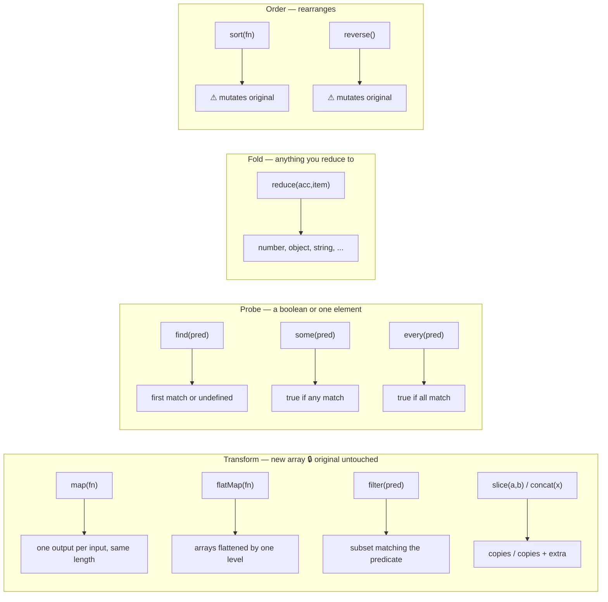
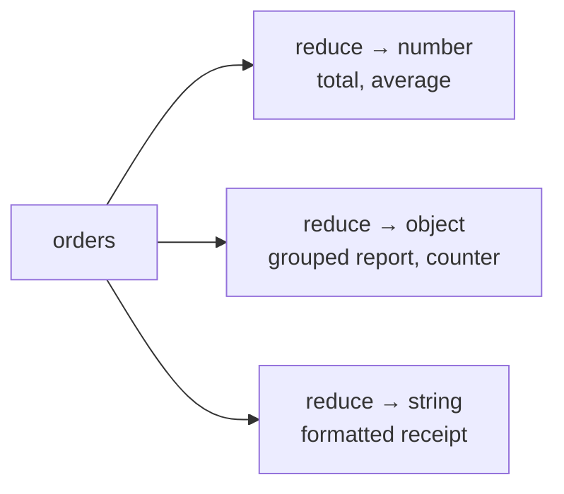

# Lab 4: Array Transformation Pipelines & Aggregation

**Difficulty: Advanced | ~55 min | Requires Lab 1 of this series**

## 1. Problem Statement / Use Case Overview

ShelfWise needs a **sales analytics dashboard** in the browser. The management page must show, from a raw list of orders, five numbers: **total revenue, number of orders, best-selling item, top employee, and average order value.**

The existing code had three problems you will fix by learning the right tool for each job:

1. **Nested loops everywhere** — every report was a `for` loop with a counter and a mutation somewhere. The data was read forward, the answer updated forward, and nobody could see the shape of the calculation.
2. **`sort()` reordered the live product catalogue** — a report sorted `store.products` directly, so sorting for display permanently changed the data the shop runs on.
3. **A filter that matched nothing produced `NaN`** — `undefined.price` is `NaN`, and `NaN` leaks through every later calculation.

By the end you will convert collections with `map`, `filter`, `find`, `some`, `every`, `sort`, and `reduce`, chain them into one-line pipelines, and build a `report(orders, store)` function that **never throws and returns zeros/empty values** for an empty order list.

## 2. Input Data

Two hardcoded values in `analytics.js` — no network, no API keys:

```javascript
const store = {
    name: 'ShelfWise Austin',
    products: [
        { id: 'w1', name: 'Widget', price: 30 },
        { id: 'g1', name: 'Gadget', price: 45 },
        { id: 'c1', name: 'Charger', price: 15 },
        { id: 'p1', name: 'Power Bank', price: 60 },
        { id: 's1', name: 'Smart Sensor', price: 25 }
    ],
    employees: [
        { id: 'e1', name: 'Maya', role: 'manager' },
        { id: 'e2', name: 'Anshu', role: 'designer' },
        { id: 'e3', name: 'Sana', role: 'stock' }
    ]
};

const orders = [
    { id: 'o1', employeeId: 'e1', items: [{ productId: 'w1', qty: 2 }, { productId: 'g1', qty: 1 }] },
    { id: 'o2', employeeId: 'e3', items: [{ productId: 's1', qty: 1 }] },
    { id: 'o3', employeeId: 'e2', items: [{ productId: 'c1', qty: 5 }] },
    { id: 'o4', employeeId: 'e1', items: [{ productId: 'p1', qty: 1 }] },
    { id: 'o5', employeeId: 'e3', items: [{ productId: 'g1', qty: 3 }] },
    { id: 'o6', employeeId: 'e2', items: [{ productId: 'w1', qty: 1 }] }
];
```

An **order** is a record with an `id`, the `employeeId` of the clerk who took it, and an `items` array where every line is `{ productId, qty }`. Prices live in the catalogue (`store`), never in the order — joining them is part of every report.

## 3. Processing

1. **Step 1 — Choose the Correct Array Method.** Ten dashboard questions; each answered with exactly one method call and one line.
2. **Step 2 — Array Pipelines.** Six report problems solved by chaining methods. Rule: **no loops, no extra variables, one line per solution.**
3. **Step 3 — `reduce()`.** Four problems solved *only* with `reduce`, turning an array into a number, a grouped object, a counter object, and a formatted receipt string.
4. **Step 4 — Mutation vs New Arrays.** Classify 14 array methods into *changes the original* vs *returns a new array*, then prove every classification at runtime — the direct cure for the catalogue-reordering bug.
5. **Step 5 — Dashboard Report.** Write `report(orders, store)` — no loops, safe for empty input — and run it against real data and `[]`.

## 4. Output

Opening the host page (or clicking **Run** after it auto-runs) prints five sections. Real output:

```
=== Step 1: Choose the Correct Array Method ===
1. Total revenue → 430
2. Orders handled by Maya → 2
3. Find order 'o3' → {"id":"o3","employeeId":"e2","items":[{"productId":"c1","qty":5}]}
4. Any order worth more than $100 → true
5. Every order has at least one item → true
6. Widgets sold → 3
7. Product names → Widget, Gadget, Charger, Power Bank, Smart Sensor
8. Cheapest product → Charger
9. First order containing a Smart Sensor → o2
10. Every clerk exists → true

=== Step 2: Array Pipelines (one line each) ===
1. Revenue per order → 105,25,75,60,135,30
2. Total units sold → 14
3. Orders worth over $100 → o1,o5
4. Sorted unique product names → Charger,Gadget,Power Bank,Smart Sensor,Widget
5. Highest-value order → o5
6. Units sold per product → Widget: 3,Gadget: 4,Charger: 5,Power Bank: 1,Smart Sensor: 1

=== Step 3: reduce() builds four things ===
1. Number — total units: 14
2. Object — qty per product: {"w1":3,"g1":4,"s1":1,"c1":5,"p1":1}
3. Object — orders per employee: {"e1":2,"e3":2,"e2":2}
4. String — receipt: 2× Widget — $60.00
1× Gadget — $45.00

=== Step 4: Mutation vs New Arrays ===
  push: MUTATES original
  pop: MUTATES original
  shift: MUTATES original
  unshift: MUTATES original
  splice: MUTATES original
  reverse: MUTATES original
  sort: MUTATES original
  map: returns new — original intact
  filter: returns new — original intact
  slice: returns new — original intact
  concat: returns new — original intact
  flatMap: returns new — original intact
  join: returns new — original intact
  reduce: returns new — original intact
Safe sort used a spread copy — live catalogue untouched: true

=== Step 5: Dashboard Report ===
Orders: 6
Total revenue: $430
Average order value: $71.67
Best-selling item: Charger
Top employee (by revenue): Maya
Empty orders → orders: 0, revenue: $0, avg: $0, best: null, top: null
```

The lines that prove the lab's three fixes:

- **Step 2.4 / Step 4:** `live catalogue untouched: true` — a sort ran (by price) and the product list order did not change.
- **Step 4:** exactly the 7 mutators flagged `MUTATES original`, the 7 safe methods `returns new`.
- **Step 5:** the empty run returns `0 / 0 / 0 / null / null` — no `NaN`, no throw.

## 5. Tech Stack

- **HTML5** — host page with an output element and a Run button
- **CSS3** — minimal `style.css` for readable output
- **JavaScript (ES6+)** — arrow functions, `map`/`filter`/`find`/`some`/`every`/`sort`/`reduce`/`flatMap`, spread, optional chaining (`?.`), nullish coalescing (`??`), template literals
- **Browser** — any modern browser (Chrome, Firefox, Edge, Safari); Developer Tools (F12) Console

## 6. Underlying Concepts

### The three method families

Every method you need belongs to one family, and the family tells you what it returns:



- **Transform** methods return a **new** array and never touch the input — they are how you reshape data.
- **Probe** methods answer a yes/no or pull out one element.
- **Fold** — `reduce` — collapses many values into a single *accumulated* value of any type: that is what turns orders into revenue.
- **Order** (`sort`, `reverse`) are the dangerous pair: they mutate the array they run on, which is exactly why sorting `store.products` broke the live catalogue.

`sort` depends on a comparator: `(a, b) => a.price - b.price` sorts ascending numerically. The safe idiom is to sort a *copy* — `[...arr].sort(fn)` — never the live array.

### `flatMap`: the loop-remover

An order holds a nested `items` array. To work on all line items at once, flatten them: `orders.flatMap(o => o.items)` returns one array of every line item across all orders — it is `map` followed by a flatten of one level. This is the single move that kills the nested loops.

### `reduce` output shapes

`reduce` is not "sum only". The accumulator starts at your seed and can be any type; each item folds into it:



- **Number** — seed `0`, add each item.
- **Object** — seed `{}`, grow a keyed map with spread: `{ ...group, [key]: value }`.
- **String** — seed `''`, append formatted text.

### NaN-safety

`find` returns `undefined` when nothing matches, and `undefined.price` is `NaN`. Guard the lookup with **optional chaining** and **nullish coalescing**: `store.products.find(...)?.price ?? 0`. If the product is missing you get `0`, not `NaN`. `report` also guards the empty-list case: dividing revenue by `orders.length` when `length` is `0` would produce `NaN`, so the lab returns `0` explicitly.

### Why "no loops" is the point

A `for` loop mixes reading, deciding, and writing into one block you cannot reuse. A pipeline names each stage (`flatMap` → get lines, `filter` → keep some, `reduce` → total), each stage returns a new value, and you can read a report top to bottom as a data flow. That is the style Step 5's dashboard is written in.

## 7. Prerequisites

- Lab 1 of this series (declarations, scope, arrow functions, template literals)
- Comfortable reading `const` arrow functions and object literals
- No accounts, API keys, or network access required

## 8. Environment / Dependencies Setup

Nothing to install — the lab ships as static files and runs in any browser tab.

```bash
git clone <this-repo> && cd "ADVANCE JAVASCRIPT/Lab 4"
python3 -m http.server 8000
# open http://localhost:8000 in a browser
```

The two files you will work with are `analytics.js` (your code) and `style.css` (styling, no changes needed). Step 9 also asks you to create a small `index.html` host page, exactly as in previous labs.

## 9. Step-wise Development Instructions

### The host page (create `index.html`)

```html
<!DOCTYPE html>
<html lang="en">
<head>
    <meta charset="UTF-8">
    <title>Lab 4: Array Transformation Pipelines & Aggregation</title>
    <link rel="stylesheet" href="style.css">
</head>
<body>
    <h1>ShelfWise — Sales Analytics Dashboard</h1>
    <p class="subtitle">Everything below is computed from raw orders with array methods.</p>
    <button id="runBtn">Run Analytics</button>
    <div id="output"></div>
    <script src="analytics.js"></script>
</body>
</html>
```

`analytics.js` appends a `<div>` per output line inside `#output`. Every previous lab used the same wiring, so this page is boilerplate — the real work is the script.

### `analytics.js` — data and two helpers

Start the file with the `store` and `orders` data from Section 2, plus a logger and the two reusable helpers:

```javascript
const outputEl = document.getElementById('output');

function log(message) {
    console.log(message);
    const line = document.createElement('div');
    line.textContent = message;
    outputEl.append(line);
}

const productOf = (id) => store.products.find(p => p.id === id);
const orderValue = (order) => order.items.reduce(
    (total, it) => total + (productOf(it.productId)?.price ?? 0) * it.qty, 0);
```

`productOf` joins a line item to its price; `orderValue` is the money math for one order. Note the `?.price ?? 0` guard — a missing product costs `0`, never `NaN`. The whole lab is a set of one-liners built on these two, so `console.log` echoes every line to the DevTools console as well as the page.

### Step 1 — Choose the Correct Array Method

Ten dashboard questions, each one a single method call inside the interpolation:

```javascript
log('\n=== Step 1: Choose the Correct Array Method ===');
log(`1. Total revenue → ${orders.reduce((sum, o) => sum + orderValue(o), 0)}`);
log(`2. Orders handled by Maya → ${orders.filter(o => o.employeeId === 'e1').length}`);
log(`3. Find order 'o3' → ${JSON.stringify(orders.find(o => o.id === 'o3'))}`);
log(`4. Any order worth more than $100 → ${orders.some(o => orderValue(o) > 100)}`);
log(`5. Every order has at least one item → ${orders.every(o => o.items.length > 0)}`);
log(`6. Widgets sold → ${orders.flatMap(o => o.items).filter(i => i.productId === 'w1').reduce((s, i) => s + i.qty, 0)}`);
log(`7. Product names → ${store.products.map(p => p.name).join(', ')}`);
log(`8. Cheapest product → ${store.products.reduce((a, b) => a.price < b.price ? a : b).name}`);
log(`9. First order containing a Smart Sensor → ${orders.find(o => o.items.some(i => i.productId === 's1')).id}`);
log(`10. Every clerk exists → ${orders.every(o => store.employees.some(e => e.id === o.employeeId))}`);
```

- Q1 picks the one method that *accumulates*: `reduce`. Q2 filters, Q3 finds one.
- Q4/Q5 are probers — `some` for "any", `every` for "all" — the pair you choose by whether **one** match is enough.
- Q6 shows the pattern of the whole day: `flatMap` to get all line items, `filter` to a product, `reduce` to a total.
- Q8 uses `reduce` as a min-max scanner: keep `a` or `b` depending on the comparison. Q10 nests a probe inside a probe.

### Step 2 — Array Pipelines

Six report problems, each a chained expression with **no loop and no extra variable**:

```javascript
log('\n=== Step 2: Array Pipelines (one line each) ===');
log(`1. Revenue per order → ${orders.map(o => orderValue(o))}`);
log(`2. Total units sold → ${orders.flatMap(o => o.items).reduce((s, i) => s + i.qty, 0)}`);
log(`3. Orders worth over $100 → ${orders.filter(o => orderValue(o) > 100).map(o => o.id)}`);
log(`4. Sorted unique product names → ${[...new Set(orders.flatMap(o => o.items).map(i => productOf(i.productId).name))].sort()}`);
log(`5. Highest-value order → ${orders.reduce((best, o) => orderValue(o) > orderValue(best) ? o : best).id}`);
log(`6. Units sold per product → ${store.products.map(p => `${p.name}: ${orders.flatMap(o => o.items).filter(i => i.productId === p.id).reduce((s, i) => s + i.qty, 0)}`)}`);
```

Read line 4 as a chain with four stages: flatten all line items → keep their product names → dedupe with `Set` inside a spread → sort the *new* array. `[...x]` is what makes this sort safe, and line 6 shows how a pipeline can *produce* rendered strings rather than just numbers. Line 5 is `reduce` used as a running maximum.

### Step 3 — `reduce()` builds four things

```javascript
log('\n=== Step 3: reduce() builds four things ===');
log(`1. Number — total units: ${orders.reduce((tot, o) => tot + o.items.reduce((s, i) => s + i.qty, 0), 0)}`);
log(`2. Object — qty per product: ${JSON.stringify(orders.reduce((group, o) => o.items.reduce((g, i) => ({ ...g, [i.productId]: (g[i.productId] || 0) + i.qty }), group), {}))}`);
log(`3. Object — orders per employee: ${JSON.stringify(orders.reduce((c, o) => ({ ...c, [o.employeeId]: (c[o.employeeId] || 0) + 1 }), {}))}`);
log(`4. String — receipt: ${orders[0].items.reduce((text, i) => text + `${i.qty}× ${productOf(i.productId).name} — $${(productOf(i.productId).price * i.qty).toFixed(2)}\n`, '')}`);
```

The same method, four accumulator shapes:

- **Number** — seed `0`, a nested `reduce` sums the line quantities of each order.
- **Grouped object** — seed `{}`; each line folds into a keyed map where the value is `(g[i.productId] || 0) + i.qty`. `|| 0` gives a fresh key a starting point.
- **Counter** — same shape with `+1`, so `reduce` becomes a histogram over `employeeId`.
- **String** — seed `''`; each line appends `2× Widget — $60.00\n`. Template literals nested inside a template literal are valid — the inner one builds one receipt line.

### Step 4 — Mutation vs New Arrays

One helper probes any method: run it on a temp array and check whether the array changed:

```javascript
log('\n=== Step 4: Mutation vs New Arrays ===');
const testMutation = (name, apply) => {
    const source = [3, 1, 2];
    const before = source.toString();
    apply(source);
    log(`  ${name}: ${source.toString() === before ? 'returns new — original intact' : 'MUTATES original'}`);
};
testMutation('push', a => a.push(4));
// ... same for pop, shift, unshift, splice, reverse, sort ...
// ... and map, filter, slice, concat, flatMap, join, reduce ...
```

The comparator-free `sort` call here (`a.sort()`) sorts lexicographically — proving that *even a trivial sort* mutates. Then the catalogue fix:

```javascript
const catalogueBefore = store.products.map(p => p.name).toString();
[...store.products].sort((a, b) => a.price - b.price);
log(`Safe sort used a spread copy — live catalogue untouched: ${catalogueBefore === store.products.map(p => p.name).toString()}`);
```

`store.products` is never touched: the spread makes a throwaway copy, the comparator `a.price - b.price` sorts by price, and the original array — and therefore the live catalogue — is unchanged. The full 14-method list is in `analytics.js`; the rule to internalize is the sharp split between `push/pop/shift/unshift/splice/reverse/sort` (mutating) and `map/filter/slice/concat/flatMap/join/reduce` (safe).

### Step 5 — Dashboard Report

The deliverable: a pure `report(orders, store)` that returns the five metrics, is loop-free, and is safe for empty input:

```javascript
function report(orders, store) {
    const orderValue = (o) => o.items.reduce(
        (total, it) => total + (store.products.find(p => p.id === it.productId)?.price ?? 0) * it.qty, 0);
    const orderCount = orders.length;
    const totalRevenue = orders.reduce((sum, o) => sum + orderValue(o), 0);
    const bestSeller = orderCount === 0 ? null : store.products
        .map(p => ({ name: p.name, qty: orders.flatMap(o => o.items).filter(i => i.productId === p.id).reduce((s, i) => s + i.qty, 0) }))
        .reduce((best, p) => (p.qty > best.qty ? p : best));
    const topEmployee = orderCount === 0 ? null : store.employees
        .map(e => ({ name: e.name, revenue: orders.filter(o => o.employeeId === e.id).reduce((s, o) => s + orderValue(o), 0) }))
        .reduce((top, e) => (e.revenue > top.revenue ? e : top));
    return {
        orderCount,
        totalRevenue,
        averageOrderValue: orderCount ? +(totalRevenue / orderCount).toFixed(2) : 0,
        bestSeller: bestSeller ? bestSeller.name : null,
        topEmployee: topEmployee ? topEmployee.name : null
    };
}
```

Reasoning through it:

- **`bestSeller`** maps each product to `{ name, qty }` (a transform), then runs `reduce` as a running max. When `orderCount` is `0` the whole expression short-circuits to `null` — nothing to sell.
- **`topEmployee`** does the same over employees, folding revenue per employee with `reduce`. The `find`-based product lookup inside `orderValue` is guarded with `?.price ?? 0`, the second NaN-cure.
- **`averageOrderValue`** guards division: `orderCount ? ... : 0` prevents `0 / 0`.
- The returned object is a **fresh projection** — `report` never mutates `orders` or `store`.

Finally, the demo that exercises both the real data and the empty list, and wires up the button:

```javascript
function runAnalytics() {
    // ... Steps 1-4 log calls from above ...
    log('\n=== Step 5: Dashboard Report ===');
    const dash = report(orders, store);
    log(`Orders: ${dash.orderCount}`);
    log(`Total revenue: $${dash.totalRevenue}`);
    log(`Average order value: $${dash.averageOrderValue}`);
    log(`Best-selling item: ${dash.bestSeller}`);
    log(`Top employee (by revenue): ${dash.topEmployee}`);
    const empty = report([], store);
    log(`Empty orders → orders: ${empty.orderCount}, revenue: $${empty.totalRevenue}, avg: $${empty.averageOrderValue}, best: ${empty.bestSeller}, top: ${empty.topEmployee}`);
}

document.getElementById('runBtn').addEventListener('click', runAnalytics);
runAnalytics();
```

Compare the two `report` calls: the empty run prints `0 / 0 / 0 / null / null` — a dashboard that degrades gracefully instead of throwing. That line is the acceptance test for the whole lab.

## 10. Optional Exercise

Swap the aggregated metric: extend `report()` so it also returns **`totalUnitsSold`** (sum of every line quantity across all orders) and **`revenuePerEmployee`** (an object keyed by employee name → revenue handled). Reuse the existing `reduce`/`orderValue` machinery — do not add loops. Then:

1. Re-run the demo — the real run should report `totalUnitsSold: 14` and `revenuePerEmployee: { Maya: 165, Anshu: 105, Sana: 160 }`.
2. Verify the empty run returns `totalUnitsSold: 0` and `revenuePerEmployee: {}`.
3. Confirm `orders` and `store` are still untouched after both calls.

## 11. What We Learnt

- **Choose the method by its return type**: `map` transforms, `filter` selects, `find` pulls one, `some`/`every` probe, `reduce` accumulates, `sort`/`reverse` reorder.
- **`flatMap` removes one level of nesting** — `orders.flatMap(o => o.items)` flattens all order lines into one array and is the loop-killer in this lab.
- **Pipelines are one-liners by design** — each stage returns a new array, so chaining read as a data flow, not a step machine.
- **`reduce` is not "sum only"**: seed `0` for a number, `{}` for grouped reports and counters, `''` for rendered strings.
- **Seven methods mutate** (`push`, `pop`, `shift`, `unshift`, `splice`, `reverse`, `sort`); seven are safe (`map`, `filter`, `slice`, `concat`, `flatMap`, `join`, `reduce`) — proven, not guessed, at runtime.
- **Never sort the live catalogue** — sort a spread copy: `[...products].sort(fn)`.
- **`?.price ?? 0` kills `NaN`** when a lookup finds nothing, and `orderCount ? total / orderCount : 0` kills it when the list is empty.
- **`report()` returns a fresh projection** — metrics are computed, never stored back into `orders` or `store`.
- **The acceptance line is the empty run**: a good report returns `0`/`null`/`{}` for no data, it does not throw.