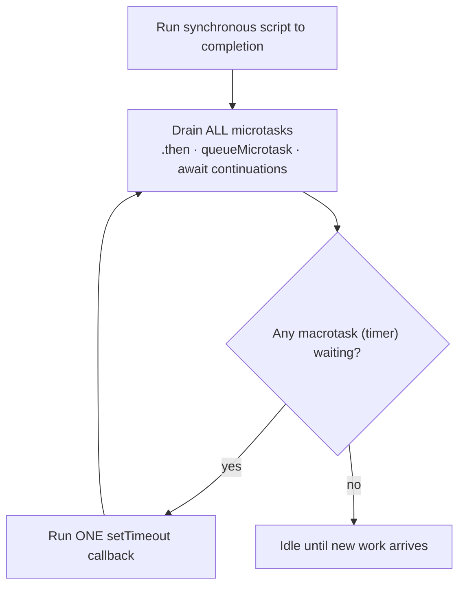
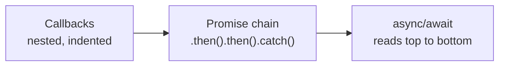
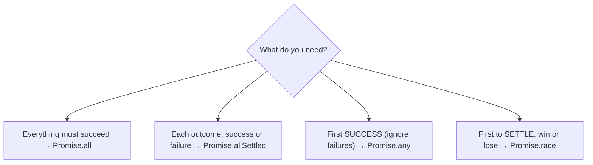
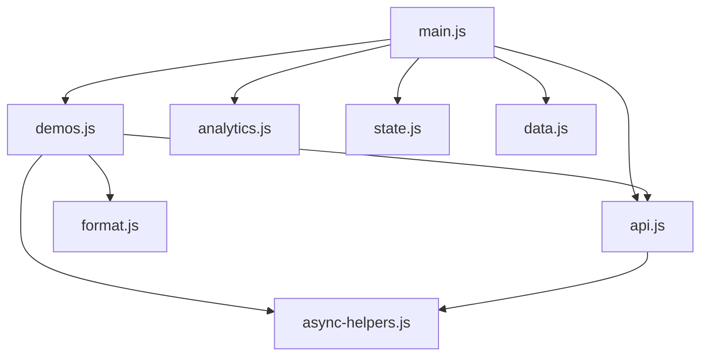

# Lab 5: Async JavaScript, API Integration & Modules

**Difficulty: Advanced | ~60 min | Requires Labs 1-4 of this series**

## 1. Problem Statement / Use Case Overview

This is the **final lab**. It does two jobs at once: it teaches asynchronous JavaScript — the event loop, callbacks, Promises, `async`/`await`, `fetch`, retries, and parallel execution — and it **assembles everything from Labs 1-4 into one organized ShelfWise project**.

The dashboard needs to load a customer, then their posts, then their to-dos, from a real API. The old code had five problems:

1. **Three levels of nested callbacks** — each level indented deeper into "callback hell".
2. **Data loaded one item at a time** — every request waited for the previous one to finish.
3. **The sequential approach was needlessly slow** — five independent loads took five times as long as they had to.
4. **A "not found" response was treated as success** — `fetch()` does *not* reject on HTTP 404, so the error body was parsed as if it were a user.
5. **Everything lived in one giant JavaScript file** — data, formatting, updates, analytics, and async code tangled together.

The deliverable is a **working module set**: `main.js` imports small single-purpose modules for data, formatting, state, analytics, async helpers, and the API, then prints a complete live dashboard from real data.

## 2. Input Data

Two kinds of input:

**1. The local ShelfWise dataset** — `store` and `orders`, carried unchanged from Labs 3-4 (`data.js`):

```javascript
export const store = {
    name: 'ShelfWise Austin',
    address: { city: 'Austin', street: '5th Ave' },
    manager: { name: 'Maya', salary: 80000 },
    staff: [
        { id: 'e1', name: 'Maya', role: 'manager', skills: ['ops'] },
        { id: 'e2', name: 'Anshu', role: 'designer', skills: ['design'] },
        { id: 'e3', name: 'Sana', role: 'stock', skills: ['stock'] }
    ],
    products: [
        { id: 'w1', name: 'Widget', price: 30 },
        { id: 'g1', name: 'Gadget', price: 45 },
        { id: 'c1', name: 'Charger', price: 15 },
        { id: 'p1', name: 'Power Bank', price: 60 },
        { id: 's1', name: 'Smart Sensor', price: 25 }
    ],
    tags: ['new', 'popular', 'new']
};
```

`orders` (also in `data.js`) is the same six-order list from Lab 4.

**2. Live data from a real API** — the free **JSONPlaceholder** service, no API key required:

- `GET /users/1` → one customer (name, address, …)
- `GET /posts?userId=1` → 10 posts
- `GET /todos?userId=1` → 20 to-dos
- `GET /users/9999` → **HTTP 404** (used to prove the "not found" fix)

## 3. Processing

1. **Step 1 — Event Loop.** Predict the exact output order of ten mixed synchronous and asynchronous `console.log()` statements.
2. **Step 2 — Three Async Approaches.** Load user → posts → to-dos three ways: nested callbacks, a Promise chain, and `async`/`await` with proper error handling.
3. **Step 3 — Promise Utilities.** Build `delay()`, `failAfter()`, `timeout()`, and `retry()` from scratch.
4. **Step 4 — Sequential vs Parallel.** Load five items one-at-a-time, all-at-once, and with the "looks parallel but isn't" trap; measure each.
5. **Step 5 — Live User Dashboard.** `loadUserDashboard(userId)` fetches related data in parallel, handles a 404 without crashing, and retries failures up to three times.
6. **Step 6 — Promise Combinators.** Choose between `Promise.all`, `allSettled`, `any`, and `race` for four situations.
7. **Step 7 — Modularization.** Split the whole five-lab application into data / formatting / state / analytics / async-helpers / api / demos / main modules.

## 4. Output

Open the page (or click **Run Again**) — the dashboard prints all seven sections. Real output (verified in both Node 20 and Chrome):

```
Shelfwise — Lab 5: Async JavaScript, APIs & Modules

=== Step 1: Event Loop output order ===
1 script start
4 script end
8 async function body
10 last sync line
3 promise .then
5 queueMicrotask
9 after await
2 timeout 0
6 timeout callback
7 promise inside timeout

=== Step 2: Three async approaches ===
   callbacks → Leanne Graham: 10 posts, 20 todos
   promise chain finally() ran
   promise chain → Leanne Graham: 10 posts, 20 todos
   async/await finally ran
   async/await → Leanne Graham: 10 posts, 20 todos

=== Step 3: Promise utilities ===
   delay(120) settled after ~120ms
   failAfter rejected: boom
   timeout(60, 200): resolved in time
   timeout(200, 60): Timed out after 60ms
   retry() → ok after 3 attempts

=== Step 4: Sequential vs parallel ===
   1) one at a time → 1000ms, 5 results
   2) all at once   → 200ms, 5 results
   3) the trap      → 0ms, 0 results (forEach never waited)

=== Step 5: Live user dashboard ===
   user 1 → Leanne Graham (Gwenborough): 10 posts, 20 todos, 11 done
   user 9999 → notFound=true (No dashboard for user 9999)

=== Step 6: Promise combinators ===
   all → A, B
   allSettled → fulfilled, rejected
   any → backup
   race → fast
   race as timeout → race timeout

=== Step 7: Complete ShelfWise dashboard ===
   orders 6 | revenue $430.00 | average $71.67 | units 14
   best seller Charger | top employee Maya
   state update: original Austin, updated Dallas | unique tags new, popular
   skills: original design → updated design+sales
   live user: Leanne Graham (Gwenborough) — 10 posts, 20 todos, 11 done
```

The four lines that prove the lab's fixes:

- **Step 1:** all four sync lines (`1, 4, 8, 10`) run first, then the microtasks (`3, 5, 9`), then the timers (`2, 6, 7`).
- **Step 4:** `one at a time → 1000ms` vs `all at once → 200ms` — five 200 ms jobs, parallelized. The trap reports `0ms, 0 results`.
- **Step 5:** `user 9999 → notFound=true` — a 404 became a clean value, not a crash.
- **Step 7:** the final dashboard combines **Lab 4 analytics** (`$430.00`, best seller Charger, top employee Maya) with **Lab 5 live API data** (Leanne Graham, 10 posts).

Timings vary by machine and network; the *shape* — roughly `5×` for sequential, `1×` for parallel — is what matters. Live values depend on the API and need internet access.

## 5. Tech Stack

- **HTML5** — host page loading the entry module
- **CSS3** — minimal `style.css`
- **JavaScript (ES2022, ES Modules)** — `import`/`export`, `async`/`await`, `fetch`, `Promise.all` / `allSettled` / `any` / `race`, `queueMicrotask`, optional chaining
- **Promise/async runtime** — the browser event loop, or Node 20 (which also has a global `fetch`)
- **API** — JSONPlaceholder (`https://jsonplaceholder.typicode.com`), no key required
- **Static server** — `python3 -m http.server` (ES modules need HTTP, not `file://`)

## 6. Underlying Concepts

### The event loop: sync first, then microtasks, then macrotasks

JavaScript runs one piece of code at a time on a single **call stack**. Asynchronous work is queued:

- **Synchronous code** runs to completion immediately.
- **Microtasks** — promise callbacks (`.then`, `await` continuations) and `queueMicrotask` — run *after the current sync block*, and **all** of them drain before any timer.
- **Macrotasks** — `setTimeout` callbacks — run **one at a time**, and the microtask queue is drained after each one.



That is why Step 1 prints `1, 4, 8, 10` (sync), then `3, 5, 9` (microtasks), then `2, 6, 7` (timers). The `7` inside the second timer is a microtask scheduled *by* a macrotask, so it runs before the next timer.

### Promise states

A Promise is always in one of three states: **pending**, **fulfilled**, or **rejected**. Once settled it never changes. `.then()` handles fulfillment, `.catch()` handles rejection, `.finally()` runs either way — as in Step 2's promise chain and `async`/`await` version.

### From callback hell to async/await

Three versions of the same three-step load, in increasing readability:



`async` functions always return a Promise, and `await` pauses *only* the async function — the rest of the program keeps running. That is why Step 1's `8` prints before `3`: the async IIFE runs synchronously up to its first `await`.

### `fetch` does not reject on HTTP errors

`fetch()` rejects **only** on network failure — DNS errors, offline, CORS. An HTTP **404 or 500 is a resolved promise**. You must check `response.ok` yourself and throw. This is the single most important bug fixed in Step 5:

```javascript
if (!response.ok) {
    if (response.status === 404) throw new NotFoundError(url);
    throw new Error(`HTTP ${response.status} for ${url}`);
}
```

### Choosing a combinator



`Promise.race` is also how you build a **timeout**: race the real work against a timer that rejects (see `timeout()` in Step 3).

### Sequential vs parallel, and the trap

`await` inside a `for` loop runs jobs **one at a time** — each waits for the previous. `Promise.all(jobs.map(job => job()))` starts them all first, then waits — total time is the *slowest* job, not the sum. The trap in Step 4 is `jobs.forEach(async job => { results.push(await job()); })`: `forEach` ignores the promise the async callback returns, so it neither parallelizes *nor waits* — it returns instantly with zero results.

### Modules

Each file is a module. `export` makes a value available; `import` pulls it in by relative path. The final tree is the answer to "one giant file":



## 7. Prerequisites

- Labs 1-4 of this series (declarations/scope, functions/`this`, destructuring/immutability, array methods/analytics)
- Internet access for the live API calls (Steps 2 and 5)
- No accounts, keys, or npm packages

## 8. Environment / Dependencies Setup

No installs. ES modules require an HTTP origin, so serve the folder:

```bash
cd "ADVANCE JAVASCRIPT/Lab 5"
python3 -m http.server 8000
# open http://localhost:8000/ and watch the page plus the DevTools console (F12)
```

**Node alternative** (same modules, same output). Add a `package.json` containing `{ "type": "module" }` to the folder, then:

```bash
node main.js
```

## 9. Step-wise Development Instructions

The project is eight small modules plus the host page. Build them in dependency order — `data` first, `main` last.

### `data.js` — the shared dataset

```javascript
// data.js — the shared ShelfWise dataset carried through Labs 1-4

export const store = {
    name: 'ShelfWise Austin',
    address: { city: 'Austin', street: '5th Ave' },
    manager: { name: 'Maya', salary: 80000 },
    staff: [
        { id: 'e1', name: 'Maya', role: 'manager', skills: ['ops'] },
        { id: 'e2', name: 'Anshu', role: 'designer', skills: ['design'] },
        { id: 'e3', name: 'Sana', role: 'stock', skills: ['stock'] }
    ],
    products: [
        { id: 'w1', name: 'Widget', price: 30 },
        { id: 'g1', name: 'Gadget', price: 45 },
        { id: 'c1', name: 'Charger', price: 15 },
        { id: 'p1', name: 'Power Bank', price: 60 },
        { id: 's1', name: 'Smart Sensor', price: 25 }
    ],
    tags: ['new', 'popular', 'new']
};

export const orders = [
    { id: 'o1', employeeId: 'e1', items: [{ productId: 'w1', qty: 2 }, { productId: 'g1', qty: 1 }] },
    { id: 'o2', employeeId: 'e3', items: [{ productId: 's1', qty: 1 }] },
    { id: 'o3', employeeId: 'e2', items: [{ productId: 'c1', qty: 5 }] },
    { id: 'o4', employeeId: 'e1', items: [{ productId: 'p1', qty: 1 }] },
    { id: 'o5', employeeId: 'e3', items: [{ productId: 'g1', qty: 3 }] },
    { id: 'o6', employeeId: 'e2', items: [{ productId: 'w1', qty: 1 }] }
];
```

Nothing new here — Lab 3's `store` and Lab 4's `orders`, now behind an `export`.

### `format.js` — display helpers and the logger

```javascript
// format.js — display helpers and the cross-environment logger

export const money = (amount) => `$${Number(amount).toFixed(2)}`;

export const title = (text) => text.charAt(0).toUpperCase() + text.slice(1);

// Renders into #output in the browser and falls back to the console in Node.
export function log(message) {
    if (typeof document === 'undefined') {
        console.log(message);
        return;
    }
    const line = document.createElement('div');
    line.textContent = message;
    document.getElementById('output').append(line);
}
```

`log` is the one environment-aware helper: it draws into the page in a browser, and writes to the console under Node (where there is no `document`). Everything else is pure.

### `state.js` — Lab 3's pure updates

```javascript
// state.js — pure, immutable state updates (Lab 3) reused by the dashboard

export const deepClone = (value) => JSON.parse(JSON.stringify(value));

export const snapshot = (state) => deepClone(state);

export const changeCity = (state, city) => ({
    ...state,
    address: { ...state.address, city }
});

export const addSkill = (state, staffId, skill) => ({
    ...state,
    staff: state.staff.map(member => (
        member.id === staffId ? { ...member, skills: [...member.skills, skill] } : member
    ))
});

export const uniqueTags = (state) => [...new Set(state.tags)];
```

Spread-based updates that return a new store — the immutability habit from Lab 3, now a module the dashboard can import.

### `analytics.js` — Lab 4's report

```javascript
// analytics.js — the Lab 4 report, now a module other modules can import

export const productOf = (store, id) => store.products.find(p => p.id === id);

export const orderValue = (order, store) => order.items.reduce(
    (total, item) => total + (productOf(store, item.productId)?.price ?? 0) * item.qty, 0);

export function report(orders, store) {
    const orderCount = orders.length;
    const totalRevenue = orders.reduce((sum, order) => sum + orderValue(order, store), 0);
    const bestSeller = orderCount === 0 ? null : store.products
        .map(product => ({
            name: product.name,
            qty: orders.flatMap(order => order.items)
                .filter(item => item.productId === product.id)
                .reduce((sum, item) => sum + item.qty, 0)
        }))
        .reduce((best, product) => (product.qty > best.qty ? product : best));
    const topEmployee = orderCount === 0 ? null : store.staff
        .map(member => ({
            name: member.name,
            revenue: orders.filter(order => order.employeeId === member.id)
                .reduce((sum, order) => sum + orderValue(order, store), 0)
        }))
        .reduce((top, member) => (member.revenue > top.revenue ? member : top));
    return {
        orderCount,
        totalRevenue,
        averageOrderValue: orderCount ? +(totalRevenue / orderCount).toFixed(2) : 0,
        bestSeller: bestSeller ? bestSeller.name : null,
        topEmployee: topEmployee ? topEmployee.name : null,
        unitsSold: orders.flatMap(order => order.items).reduce((sum, item) => sum + item.qty, 0)
    };
}
```

The only change from Lab 4 is the leading `export` and adding `unitsSold`. `store.employees` became `store.staff` to match the Lab 3 dataset.

### `async-helpers.js` — Promises, built from scratch (Step 3)

```javascript
// async-helpers.js — Promise utilities, built from scratch (Step 3) plus the
// three loaders used in Step 4 to compare sequential and parallel execution.

export const delay = (ms) => new Promise(resolve => setTimeout(resolve, ms));

export const failAfter = (ms, reason = 'failed') => new Promise((_, reject) => {
    setTimeout(() => reject(new Error(reason)), ms);
});

export function timeout(promise, ms) {
    const bomb = new Promise((_, reject) => {
        setTimeout(() => reject(new Error(`Timed out after ${ms}ms`)), ms);
    });
    return Promise.race([promise, bomb]);
}

export async function retry(fn, { attempts = 3, waitMs = 50, retryOn = () => true } = {}) {
    let lastError;
    for (let attempt = 1; attempt <= attempts; attempt += 1) {
        try {
            return await fn();
        } catch (error) {
            lastError = error;
            if (attempt === attempts || !retryOn(error)) break;
            await delay(waitMs);
        }
    }
    throw lastError;
}

export async function measure(label, fn) {
    const started = Date.now();
    const value = await fn();
    return { label, ms: Date.now() - started, value };
}

export async function loadOneByOne(jobs) {
    const results = [];
    for (const job of jobs) {
        results.push(await job());
    }
    return results;
}

export const loadAllAtOnce = (jobs) => Promise.all(jobs.map(job => job()));

export async function loadTheTrap(jobs) {
    const results = [];
    jobs.forEach(async (job) => {
        results.push(await job());
    });
    return results;
}
```

- `delay`/`failAfter` are the raw material: a Promise plus a timer.
- `timeout` uses `Promise.race` — whichever settles first wins, and a slow job loses to the bomb.
- `retry` loops, awaits between attempts, and accepts a `retryOn` predicate so **permanent** errors (404) can skip retrying.
- The three loaders are the Step 4 experiment: sequential `for…await`, true parallel `Promise.all`, and the `forEach` trap.

### `api.js` — real API integration (Step 5)

```javascript
// api.js — real API integration against JSONPlaceholder (Step 5)

import { retry } from './async-helpers.js';

const BASE = 'https://jsonplaceholder.typicode.com';

export class NotFoundError extends Error {
    constructor(url) {
        super(`Not found: ${url}`);
        this.name = 'NotFoundError';
        this.status = 404;
    }
}

// fetch() only rejects on network failure. An HTTP 404/500 is a *resolved*
// promise, so we have to inspect response.ok and throw ourselves.
export async function fetchJson(url) {
    const response = await fetch(url);
    if (!response.ok) {
        if (response.status === 404) throw new NotFoundError(url);
        throw new Error(`HTTP ${response.status} for ${url}`);
    }
    return response.json();
}

export const getUser = (id) => fetchJson(`${BASE}/users/${id}`);
export const getPosts = (userId) => fetchJson(`${BASE}/posts?userId=${userId}`);
export const getTodos = (userId) => fetchJson(`${BASE}/todos?userId=${userId}`);

const isPermanent = (error) => error instanceof NotFoundError;

export async function loadUserDashboard(userId, { attempts = 3 } = {}) {
    try {
        const [user, posts, todos] = await Promise.all([
            retry(() => getUser(userId), { attempts, retryOn: error => !isPermanent(error) }),
            retry(() => getPosts(userId), { attempts, retryOn: error => !isPermanent(error) }),
            retry(() => getTodos(userId), { attempts, retryOn: error => !isPermanent(error) })
        ]);
        return {
            notFound: false,
            user: user.name,
            city: user.address.city,
            posts: posts.length,
            todos: todos.length,
            done: todos.filter(todo => todo.completed).length
        };
    } catch (error) {
        if (error instanceof NotFoundError) {
            return { notFound: true, message: `No dashboard for user ${userId}` };
        }
        throw error;
    }
}
```

Three things to study: the `!response.ok` guard (fix #4), `Promise.all` over independent requests (fix #3), and `retry` with `retryOn: !isPermanent` so a 404 fails fast while a flaky network is retried up to three times. A 404 returns a clean `{ notFound: true }` object instead of throwing.

### `demos.js` — Steps 1-6

```javascript
// demos.js — the teaching demos for Steps 1-6, kept out of the entry file on
// purpose: a main file that connects modules should not also hold every example.

import { log } from './format.js';
import {
    delay, failAfter, timeout, retry, measure,
    loadOneByOne, loadAllAtOnce, loadTheTrap
} from './async-helpers.js';
import { getUser, getPosts, getTodos, loadUserDashboard } from './api.js';

export function runEventLoopDemo() {
    log('\n=== Step 1: Event Loop output order ===');
    log('1 script start');
    setTimeout(() => log('2 timeout 0'), 0);
    Promise.resolve().then(() => log('3 promise .then'));
    log('4 script end');
    queueMicrotask(() => log('5 queueMicrotask'));
    setTimeout(() => {
        log('6 timeout callback');
        Promise.resolve().then(() => log('7 promise inside timeout'));
    }, 0);
    (async () => {
        log('8 async function body');
        await null;
        log('9 after await');
    })();
    log('10 last sync line');
}
```

Ten statements, one teaching goal: the four `log` calls *without* wrappers print first (`1, 4, 8, 10`), then microtasks (`3, 5, 9`), then timers (`2, 6, 7`).

```javascript
const getUserCb = (id, cb) => getUser(id).then(user => cb(null, user)).catch(cb);
const getPostsCb = (id, cb) => getPosts(id).then(posts => cb(null, posts)).catch(cb);
const getTodosCb = (id, cb) => getTodos(id).then(todos => cb(null, todos)).catch(cb);

export function loadTheCallbackWay(userId, done) {
    getUserCb(userId, (userError, user) => {
        if (userError) return done(userError);
        getPostsCb(user.id, (postsError, posts) => {
            if (postsError) return done(postsError);
            getTodosCb(user.id, (todosError, todos) => {
                if (todosError) return done(todosError);
                done(null, `${user.name}: ${posts.length} posts, ${todos.length} todos`);
            });
        });
    });
}
```

`loadTheCallbackWay` is **callback hell** on purpose — three levels deep, with an error check at each. The `.then/.catch` adapters turn the promise API into callback style so the nesting is visible.

```javascript
export const loadThePromiseWay = (userId) => getUser(userId)
    .then(user => Promise.all([getPosts(user.id), getTodos(user.id)])
        .then(([posts, todos]) => `${user.name}: ${posts.length} posts, ${todos.length} todos`))
    .finally(() => log('   promise chain finally() ran'));

export async function loadTheAsyncWay(userId) {
    try {
        const user = await getUser(userId);
        const [posts, todos] = await Promise.all([getPosts(user.id), getTodos(user.id)]);
        return `${user.name}: ${posts.length} posts, ${todos.length} todos`;
    } catch (error) {
        return `FAILED: ${error.message}`;
    } finally {
        log('   async/await finally ran');
    }
}
```

Same result, two styles. The chain uses `.then().finally()`; the async version reads top to bottom with `try/catch/finally` — the version the lab calls "proper error handling".

```javascript
export async function runPromiseUtilities() {
    log('\n=== Step 3: Promise utilities ===');
    const started = Date.now();
    await delay(120);
    log(`   delay(120) settled after ~${Date.now() - started}ms`);
    await failAfter(40, 'boom').then(
        () => log('   failAfter resolved (unexpected)'),
        error => log(`   failAfter rejected: ${error.message}`)
    );
    await timeout(delay(60), 200).then(() => log('   timeout(60, 200): resolved in time'));
    await timeout(delay(200), 60).catch(error => log(`   timeout(200, 60): ${error.message}`));
    let tries = 0;
    const flaky = () => {
        tries += 1;
        return tries < 3 ? failAfter(20, `hiccup ${tries}`) : Promise.resolve('ok');
    };
    log(`   retry() → ${await retry(flaky, { attempts: 3, waitMs: 30 })} after ${tries} attempts`);
}
```

Exercises every utility: `delay` measures itself, `failAfter` is caught, `timeout` is shown in both directions, and `flaky` fails twice so `retry` has something to retry.

```javascript
export async function runSequentialVsParallel() {
    log('\n=== Step 4: Sequential vs parallel ===');
    const makeJobs = () => Array.from({ length: 5 }, (_, i) => () => delay(200).then(() => `item ${i + 1}`));
    const sequential = await measure('one at a time', () => loadOneByOne(makeJobs()));
    const parallel = await measure('all at once', () => loadAllAtOnce(makeJobs()));
    const trap = await measure('the trap', () => loadTheTrap(makeJobs()));
    log(`   1) one at a time → ${sequential.ms}ms, ${sequential.value.length} results`);
    log(`   2) all at once   → ${parallel.ms}ms, ${parallel.value.length} results`);
    log(`   3) the trap      → ${trap.ms}ms, ${trap.value.length} results (forEach never waited)`);
}
```

`makeJobs` builds five fresh 200 ms jobs per method (fresh because a job can only run once). `measure` wraps each in a timer. Expect roughly `1000ms / 200ms / 0ms`.

```javascript
export async function runCombinators() {
    log('\n=== Step 6: Promise combinators ===');
    log(`   all → ${(await Promise.all([delay(30).then(() => 'A'), delay(20).then(() => 'B')])).join(', ')}`);
    const settled = await Promise.allSettled([delay(10).then(() => 'kept'), failAfter(10, 'lost')]);
    log(`   allSettled → ${settled.map(result => result.status).join(', ')}`);
    log(`   any → ${await Promise.any([failAfter(10, 'down'), delay(30).then(() => 'backup')])}`);
    log(`   race → ${await Promise.race([delay(10).then(() => 'fast'), delay(40).then(() => 'slow')])}`);
    await Promise.race([delay(200), failAfter(40, 'race timeout')])
        .catch(error => log(`   race as timeout → ${error.message}`));
}

export async function runLiveDashboard() {
    log('\n=== Step 5: Live user dashboard ===');
    const dashboard = await loadUserDashboard(1);
    log(`   user 1 → ${dashboard.user} (${dashboard.city}): ` +
        `${dashboard.posts} posts, ${dashboard.todos} todos, ${dashboard.done} done`);
    const missing = await loadUserDashboard(9999);
    log(`   user 9999 → notFound=${missing.notFound} (${missing.message})`);
}
```

Four combinators, four distinct outcomes; then the live dashboard with a good id and a missing id side by side.

```javascript
export async function runAsyncDemos() {
    runEventLoopDemo();
    await delay(80);
    log('\n=== Step 2: Three async approaches ===');
    await new Promise(resolve => loadTheCallbackWay(1, (error, text) => {
        log(`   callbacks → ${error ? `FAILED: ${error.message}` : text}`);
        resolve();
    }));
    log(`   promise chain → ${await loadThePromiseWay(1)}`);
    log(`   async/await → ${await loadTheAsyncWay(1)}`);
    await runPromiseUtilities();
    await runSequentialVsParallel();
    await runLiveDashboard();
    await runCombinators();
}
```

The orchestrator. The `delay(80)` lets the event-loop demo's timers flush before Step 2 starts, and the callback demo is wrapped in a `new Promise` so `runAsyncDemos` can `await` it.

### `main.js` — the entry point (Step 7)

```javascript
// main.js — the ShelfWise entry point. It connects the modules from all five
// labs and prints the complete live dashboard; the demos live in demos.js.

import { log, title, money } from './format.js';
import { store, orders } from './data.js';
import { report } from './analytics.js';
import { changeCity, uniqueTags, snapshot, addSkill } from './state.js';
import { loadUserDashboard } from './api.js';
import { runAsyncDemos } from './demos.js';

export async function runShelfWise() {
    log(`${title('shelfwise')} — Lab 5: Async JavaScript, APIs & Modules`);

    await runAsyncDemos();

    log('\n=== Step 7: Complete ShelfWise dashboard ===');
    const analytics = report(orders, store);
    log(`   orders ${analytics.orderCount} | revenue ${money(analytics.totalRevenue)} | ` +
        `average ${money(analytics.averageOrderValue)} | units ${analytics.unitsSold}`);
    log(`   best seller ${analytics.bestSeller} | top employee ${analytics.topEmployee}`);
    const updated = changeCity(store, 'Dallas');
    log(`   state update: original ${store.address.city}, updated ${updated.address.city} | ` +
        `unique tags ${uniqueTags(store).join(', ')}`);
    const original = snapshot(store);
    const skilled = addSkill(store, 'e2', 'sales');
    log(`   skills: original ${original.staff[1].skills.join('+')} → updated ${skilled.staff[1].skills.join('+')}`);
    const live = await loadUserDashboard(1);
    log(`   live user: ${live.user} (${live.city}) — ${live.posts} posts, ` +
        `${live.todos} todos, ${live.done} done`);
}

if (typeof document !== 'undefined') {
    document.getElementById('runBtn').addEventListener('click', runShelfWise);
}

runShelfWise().catch(error => log(`FATAL: ${error.message}`));
```

Look how small `main.js` is — that is the point of the whole lab. It imports five modules and calls them: analytics from Lab 4, state from Lab 3, helpers/API from Lab 5. The `.catch` on the final call is the last line of defense, so an unexpected failure prints instead of vanishing.

### `index.html` — the host page

```html
<!DOCTYPE html>
<html lang="en">
<head>
    <meta charset="UTF-8">
    <title>Lab 5: Async JavaScript, APIs &amp; Modules</title>
    <link rel="stylesheet" href="style.css">
</head>
<body>
    <h1>ShelfWise — Live Dashboard &amp; Shipping Modules</h1>
    <p class="subtitle">Real data is fetched from an API. Every line is also logged to the DevTools console (F12).</p>
    <button id="runBtn">Run Again</button>
    <div id="output"></div>
    <script type="module" src="main.js"></script>
</body>
</html>
```

`type="module"` is what enables `import`/`export` in the browser — and why the page must be served over HTTP.

## 10. Optional Exercise

Swap the data source and add a hard timeout. Replace JSONPlaceholder with a different public API (for example `https://api.github.com/users/octocat`), and wrap the `loadUserDashboard` requests in the `timeout()` helper from Step 3 so any single request that takes longer than 5 seconds fails fast:

1. Add a `getGithubUser(username)` function to `api.js` that calls `fetchJson`.
2. Wrap the calls in `timeout(...)` — a slow API must reject with `Timed out after 5000ms`, not hang forever.
3. Verify both paths: a real username returns data, and a non-existent username produces a `NotFoundError` that `loadUserDashboard`-style code catches as `notFound: true`.
4. Confirm your module still runs with `node main.js` (add `{ "type": "module" }` to a `package.json`) and in the browser.

## 11. What We Learnt

- **Synchronous code runs first; then all microtasks drain; then one macrotask at a time** — the event loop rule behind Step 1's order.
- **A Promise is pending → fulfilled or rejected, once** — `.then`/`.catch`/`.finally` observe it.
- **`async`/`await` is a readable wrapper over Promises** — and an `async` function returns a Promise, which is why it can be awaited.
- **`fetch()` rejects only on network failure**; check `response.ok` yourself to catch 404/500 (the "not found treated as success" bug).
- **`delay`, `failAfter`, `timeout`, and `retry` are all built from `new Promise` + `setTimeout` + `Promise.race`** — no library needed.
- **Parallel beats sequential for independent work** — `Promise.all` over five 200 ms jobs took ~200 ms, not ~1000 ms.
- **`forEach(async …)` is a trap** — it neither parallelizes nor waits; `Promise.all(jobs.map(...))` is the correct fan-out.
- **Pick the combinator by intent**: `all` (all must succeed), `allSettled` (independent outcomes), `any` (first success), `race` (first settled / timeouts).
- **Modules replace the giant file** — `data`, `format`, `state`, `analytics`, `async-helpers`, `api`, `demos`, and a thin `main`.
- **The five labs are cumulative**: Lab 2/3 utilities feed Lab 4 analytics, Lab 4 analytics feeds the Lab 5 dashboard, and Lab 5 assembles them all into one import graph.
