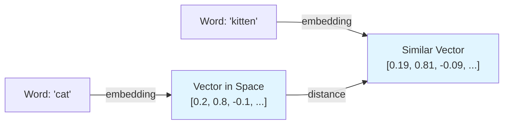
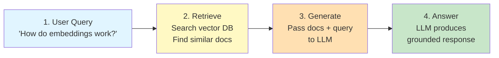

# Labs Project — Governing Principles & Development Guidelines

**Scope:** This document governs every lab produced under this project. A "lab" is a self-contained learning unit made of a notebook (`.ipynb`) or Python script (`.py`) or HTML/CSS/JS files and a companion markdown file (`.md`), plus any supporting files the lab genuinely needs. These principles apply to every lab, every author, every time — they are the definition of "done" and "consistent" for this catalog.

**Amendments:** If a principle stops making sense for a real lab, that's a signal to revise this document, not to quietly break the rule. Propose the change, update this file, note the version/date below.

`v1.0 — initial governing document`
`v2.0 — removed the Lab Tracker requirement (Excel/CSV gate log) from Section 2 and the Pre-Publish Checklist`
`v2.1 — Mermaid diagrams are now a default requirement for any flow/pipeline/architecture concept in Section 7, not optional`
`v2.2 — every notebook must begin with a single `!pip install` cell (CQ-10) installing all required modules so learners can install dependencies directly`
`v3.0 — every lab now ships a required assignment file (`lab-<slug>-assignment.md`) with knowledge-check exercises and an answer key (UX-7)`
`v4.0 — Testing Standards removed from this document; the five-gate validation workflow now lives in AGENTS.md, with TEST.md as the companion testing guide`

---

## 1. The Canonical Lab Structure

**Lab file formats:** Every lab consists of:
- A **markdown file** (`.md`) — the narrative, instructions, and explanations (required for all labs)
- A **code file** — one of:
  - `.ipynb` (Jupyter notebook) for exploratory, visual, or step-by-step learning
  - `.py` (Python script with comments/markdown as docstrings) for clean, production-like code labs
  - `.html` + `.css` + `.js` (HTML/CSS/JavaScript) for web development and frontend labs
- An **assignment file** (`lab-<topic-slug>-assignment.md`) — a set of exercises that let learners test their knowledge after completing the lab (required for all labs)
- Any supporting files genuinely needed (data files, config, etc.)

All code file formats follow the same 12-section structure.

Every lab's `.md` file follows this section order, exactly. A learner who's done three labs should be able to navigate a fourth without re-learning where things live.

| # | Section | What goes here | Length guidance |
|---|---------|----------------|------------------|
| 1 | **Lab Title** | Short, descriptive, matches file name | One line |
| 2 | **Problem Statement / Use Case Overview** | What real problem this lab solves, in plain terms | 3–6 sentences |
| 3 | **Input Data** | What data goes in, format, source (sample/synthetic/real), size | Short paragraph or bullets |
| 4 | **Processing** | What happens to the data — the pipeline/steps at a conceptual level | Short paragraph or bullets |
| 5 | **Output** | What the learner should see when it works — describe it concretely | Short paragraph, screenshot/sample output encouraged |
| 6 | **Tech Stack** | Every library, model, API, and service used, with version | Bullet list |
| 7 | **Underlying Concepts** | The theory needed to understand *why*, not just *how* | **Hard cap: 2 pages** |
| 8 | **Prerequisites** | Prior labs, background knowledge, accounts/API keys needed | Bullet list, or "None" |
| 9 | **Environment / Dependencies Setup** | Exact steps to get a clean environment running | Copy-pasteable commands |
| 10 | **Step-wise Development Instructions** | The actual build, in code blocks, each explained (see Code Quality below) | Bulk of the lab |
| 11 | **Optional Exercise** | A concrete stretch task — swap one component for another (e.g., "swap Weaviate for Milvus, GPT-4 for Llama 3") | 1–3 sentences, always phrased as an action, not a suggestion |
| 12 | **What We Learnt** | Recap of concepts and skills, tying back to Section 7 | 4–8 bullets |

No lab skips a section. If a section genuinely doesn't apply (e.g., no prerequisites), state that explicitly rather than omitting the heading — an absent heading looks like a mistake; "None" looks intentional.

---

## 2. Code Quality Principles

### Universal Code Quality Rules (Apply to All Difficulty Levels)

**CQ-1. Hard line limit scales by difficulty level.**
This is a teaching constraint, not a style preference — beyond the ceiling for your difficulty level, a learner loses the plot. If the real build needs more, split it into a numbered lab series (`Lab 2a`, `Lab 2b`...) rather than stretching one notebook past the limit. Line limits by difficulty: Beginner 80–110, Intermediate 110–150, Advanced 150–180 (see below).

**CQ-2. Every code block is explained, not just labeled.**
Each block in Section 10 is preceded or followed by markdown explaining *what it does and why it's there*. Explanation depth varies by difficulty level (see below). Assume the learner may not know the library, not just the concept.

**CQ-3. One logical step per cell.**
Load data, chunk it, embed it, store it, query it — each gets its own cell. This lets a learner run and inspect incrementally instead of debugging a wall of code.

**CQ-4. No unexplained magic.**
If a helper function or library call hides real complexity (a `.fit()`, a chained API call, a config object with many fields), the markdown explains what it's abstracting. A learner should never have to go read external docs just to understand what a line in *this* lab does.

**CQ-5. Consistent, idiomatic style.**
Standard formatting for the language (PEP8 for Python, HTML/CSS/JS best practices, etc.), descriptive variable names (`chunked_docs`, not `x2`), and no dead code left in from earlier drafts.

**CQ-6. Reproducible by construction.**
Dependency versions are pinned (Section 6 and the setup step, Section 9). No reliance on hidden local state, undocumented files, or "works on my machine" steps.

**CQ-7. Secrets are never hardcoded.**
API keys and credentials are read from environment variables or a `.env` file, with a placeholder and a one-line instruction for how the learner supplies their own.

**CQ-8. Restart-and-run-all always works.**
A notebook must run top to bottom in a fresh kernel with no manual steps skipped or reordered. This is the single most common way labs silently rot — enforce it every time, not just at first publish.

**CQ-9. Minimize helper functions — use inline code instead.**
Every helper function you define requires learners to understand what it does, often by reading code that's separated from where it's used. Where possible, write code inline even if it's slightly longer. Only use a helper function if (a) it's called multiple times in the lab, or (b) it abstracts a concept that's important to teach separately. Inline code is harder to write but easier for learners to follow and modify.

**CQ-10. Every notebook starts with a `!pip install` cell.**
The first code cell installs every module the lab needs in a single line — `!pip install <module1> <module2> ...` — with pinned versions, so a learner can run the first cell and install everything directly. This mirrors Section 9 but makes the notebook runnable from a fresh kernel without reading markdown first.

**For HTML/CSS/JS labs:** Include a `<link rel="stylesheet" href="style.css">` tag in the HTML `<head>` and a `<script src="script.js"></script>` tag before `</body>`. Document any CDN dependencies (e.g., Bootstrap, Font Awesome) in Section 9.

---

### Code Quality by Difficulty Level

The rules above apply to all labs. These standards scale the *depth* and *verbosity* of explanation by who the learner is.

#### Beginner Labs

**Target:** Learner is new to the core concept, may lack background in the subject domain, needs hand-holding.

**Line limit:** 80–110 lines (tighter than intermediate/advanced).

**Explanation style:**
- Every code block preceded by a prose explanation of what you're about to see.
- Inline comments on almost every line or logical pair of lines.
- More time spent explaining *why* a line exists than what it does — context-setting matters here.
- Library calls explained at the surface level: what does `.fit()` do? The notebook should say, not defer to library docs.
- Variable names extra-descriptive (`user_query_embedding`, not `q_emb`).

**Code construction:**
- Use high-level libraries and helper functions liberally — the goal is clarity, not showing how to build from first principles.
- Prefer `.fit_transform()` or library abstractions over custom loops when both are viable.
- Error handling is basic but present (try/except for file I/O, API calls).
- No "gotcha" code patterns or Python-specific idioms that require prior language knowledge.

**Example (good beginner code):**
```python
# Load our sample data: 50 short product reviews
# We'll analyze the sentiment (positive/negative/neutral) of each one
reviews = load_reviews_from_csv("data/reviews.csv")
print(f"Loaded {len(reviews)} reviews")

# Initialize the sentiment model — this loads a pre-trained model from Hugging Face
# The model is ~500MB, so this takes ~10 seconds the first time
model = load_sentiment_model("distilbert-base-uncased-finetuned-sst-2-english")

# Run the model on each review and collect the results
sentiments = []
for review_text in reviews:
    result = model(review_text)
    sentiments.append(result)

# Show the results
for review, sentiment in zip(reviews, sentiments):
    print(f"'{review[:50]}...' → {sentiment['label']}")
```

#### Intermediate Labs

**Target:** Learner knows the basics of the subject, is building real-world skills, can connect concepts across multiple pieces.

**Line limit:** 110–150 lines.

**Explanation style:**
- Code blocks preceded by a markdown paragraph explaining the approach, not the syntax.
- Inline comments on non-obvious lines or complex logic, but not on every line.
- Library calls explained at the *purpose* level: what does this do for the pipeline? (not how to read the docs).
- Variable names concise but unambiguous (`embeddings`, not `e`; `query_vector`, not `qv`).
- Assumes some prior knowledge of the domain (e.g., "vector embeddings" doesn't need a full explanation, just how they're used here).

**Code construction:**
- Mix of library abstractions and custom logic — show the learner where they can swap components.
- Error handling is explicit and instructive (e.g., "if no results, try broadening the search").
- Slightly more sophisticated patterns (list comprehensions, context managers) are fine if explained.
- Performance considerations emerge but aren't the focus.

**Example (good intermediate code):**
```python
# Split documents into overlapping chunks so we don't lose meaning at boundaries.
# We'll use 1024-token chunks with 128-token overlap.
chunked_docs = []
for doc in documents:
    chunks = chunk_text(doc, chunk_size=1024, overlap=128)
    chunked_docs.extend(chunks)

# Embed all chunks using the OpenAI API.
# This batches requests for efficiency (OpenAI can handle up to 50 at a time).
embeddings = embed_batch(chunked_docs, model="text-embedding-3-small", batch_size=50)

# Store chunks + embeddings in Weaviate for semantic search.
# We're using Weaviate's built-in vectorizer bypass — we pre-computed the vectors.
for chunk, embedding in zip(chunked_docs, embeddings):
    store.add_document(content=chunk, vector=embedding)
```

#### Advanced Labs

**Target:** Learner is experienced in the domain, interested in production patterns and nuance, can handle complexity and wants depth.

**Line limit:** 150–180 lines (can approach ceiling).

**Explanation style:**
- Code blocks preceded by a technical explanation of design decisions — why this approach, what are the tradeoffs, what would you do differently at scale?
- Inline comments only on subtle or non-standard patterns; straightforward code is assumed readable.
- Library and architectural patterns assumed known; explanation focuses on *how this lab applies them*, not basics.
- Variable names follow domain conventions (`doc_id`, `top_k`, `recall@100`).
- Rationale for performance choices, testing strategies, and edge cases is part of the narrative.

**Code construction:**
- Custom implementations shown where they illuminate the concept (e.g., a custom retrieval ranking strategy).
- Error handling is comprehensive — edge cases and failure modes are visible.
- Performance optimization is discussed (batching, caching, indexing considerations).
- Advanced patterns are fair game if they serve the concept (async/await, decorators, metaclasses if relevant).

**Example (good advanced code):**
```python
# Implement a two-stage retrieval + reranking pipeline for high-recall search.
# Stage 1: BM25 for keyword recall, Stage 2: Cross-encoder for semantic precision.
# This trades speed for accuracy — suitable for latency-tolerant use cases like reporting.

def retrieve_and_rerank(query, top_k_bm25=50, top_k_final=10):
    """
    Retrieve candidate docs via BM25 (high recall), then rerank with cross-encoder.
    Args:
        query: user search string
        top_k_bm25: how many candidates to retrieve from BM25
        top_k_final: how many to return after reranking
    """
    # Stage 1: BM25 retrieval — fast, keyword-aware
    candidates = bm25.retrieve(query, k=top_k_bm25)
    
    # Stage 2: Rerank with cross-encoder for semantic relevance
    # Cross-encoders are slower but give better ranking than similarity scores
    scores = cross_encoder.rank(query, [c.text for c in candidates])
    
    # Sort by cross-encoder score and return top-k
    ranked = sorted(zip(candidates, scores), key=lambda x: x[1], reverse=True)
    return [doc for doc, score in ranked[:top_k_final]]
```

---

### Categorizing Labs by Difficulty & Subject Matter

Use this framework to decide whether a lab is Beginner, Intermediate, or Advanced.

#### Difficulty Signals

**Beginner if:**
- The concept is a first introduction to a topic (e.g., "What is a vector embedding?", "First steps with RAG").
- Prerequisites are minimal or foundational (Python syntax, basic data structures).
- Implementation uses high-level APIs with minimal custom code.
- Learners need heavy hand-holding through the narrative.
- The goal is *understanding*, not applying in production.

**Intermediate if:**
- The concept assumes some background (e.g., "Building a RAG system" assumes you know what retrieval and generation are).
- Prerequisites include prior labs or equivalent experience.
- Implementation mixes library abstractions with custom logic to show how pieces fit together.
- The goal is *skill-building* — applying known concepts to a new problem.
- Learners can handle abstraction and connect concepts across multiple pieces.

**Advanced if:**
- The concept is a specialization or optimization of a known topic (e.g., "Scaling RAG with hybrid search and reranking", "Autonomous agent design patterns").
- Prerequisites are substantial (deep knowledge of the domain, familiarity with production systems).
- Implementation shows design decisions, tradeoffs, and patterns used in production code.
- The goal is *mastery* — understanding the *why* behind design choices and how to adapt them.
- Learners are comfortable with complexity and want nuance.

#### Subject Matter Categorization

For a given topic, check these factors to place it on the difficulty scale:

| Factor | Beginner | Intermediate | Advanced |
|--------|----------|--------------|----------|
| **Prior knowledge needed** | Language syntax, basic data structures | Domain fundamentals (e.g., "embeddings exist") | Production experience, advanced domain patterns |
| **Concept novelty** | First time seeing this idea | Applying known idea to a new context | Specialization or optimization of known idea |
| **Code complexity** | Mostly library calls, high-level abstractions | Mix of library + custom, some algorithm logic | Custom implementations, design patterns, tradeoffs |
| **Real-world applicability** | Educational toy; not production-ready | Can be production-ready with scaling | Already production-shaped; focuses on nuance |
| **Typical learner goal** | "I want to understand X" | "I want to build with X" | "I want to optimize/specialize X" |

#### How to Label Labs

**1. Add a header line under the Lab Title (see UX-6)** with the difficulty, time estimate, and prerequisites. This makes self-selection easy for learners.

---

## 3. User Experience Consistency

**UX-1. Structural consistency is non-negotiable.**
Every lab uses the exact 12-section template in Section 1, in the same order, with the same headings. Consistency here is what lets a learner navigate lab 12 as confidently as lab 1.

**UX-2. Consistent voice: instructional, second-person, jargon-defined.**
Write as "you will build...", not "one might construct...". Any term not obvious to a newcomer gets defined in Section 7 the first time it's used.

**UX-3. Consistent depth of explanation across labs.**
If one lab explains code line-by-line, all labs do. A learner shouldn't get lucky with a well-explained lab and then hit a sparse one — depth of explanation is a catalog-wide standard, not an author's personal style.

**UX-4. Consistent file naming.**
Use one of these naming conventions with matching slugs in the same folder:
- `lab-<topic-slug>.ipynb` + `lab-<topic-slug>.md` (for Jupyter notebooks)
- `lab-<topic-slug>.py` + `lab-<topic-slug>.md` (for Python scripts)
- `lab-<topic-slug>.html` + `lab-<topic-slug>.css` + `lab-<topic-slug>.js` + `lab-<topic-slug>.md` (for HTML/CSS/JS labs)

All labs also include `lab-<topic-slug>-assignment.md`. Predictable naming lets learners (and tooling) navigate the catalog without guessing.

**UX-5. Consistent framing of Section 11 and 12.**
The Optional Exercise is always phrased as a concrete action ("Now change X to Y"), never a vague suggestion ("you could also explore..."). "What We Learnt" always ties back explicitly to the concepts named in Section 7, so the loop closes.

**UX-6. Consistent difficulty and time signaling.**
Add a short header line under the Lab Title stating estimated time and prerequisite level (e.g., `~40 min · Intermediate · Requires Lab 3`), so learners can self-select before committing time.

**UX-7. Every lab ships with an assignment.**
Every lab includes a `lab-<topic-slug>-assignment.md` file of exercises that let learners test their knowledge after completing the lab. The assignment is **required** and is separate from Section 11's Optional Exercise: it is a standalone practice sheet of 5–10 exercises scaled to the lab's difficulty, mixing concept questions, short code tasks, and applied tasks. It ends with an answer key (with brief explanations, not just answers) so learners can self-check. Exercises must be doable from the lab alone and attemptable without re-running the notebook.

---

## 4. Performance Requirements

**PF-1. Runtime budget: ~30–45 minutes end-to-end, including setup.**
This covers reading, environment setup, running the code, and the optional exercise. If a real build exceeds this comfortably, split it into a lab series rather than letting one lab run long.

**PF-2. Compute footprint is disclosed upfront.**
Section 6 or 8 states plainly whether the lab needs a GPU, how much RAM is realistic, and whether it runs fine on a laptop CPU. No learner should discover a hardware requirement halfway through.

**PF-3. Cost is disclosed for anything that isn't free.**
If a lab calls a paid LLM API or hosted vector DB, state the approximate cost of one full run-through, and default to the cheapest model/tier that still teaches the concept. Free/local alternatives are noted where reasonable.

**PF-4. Data and models are sized to teach, not to impress.**
Use the smallest dataset and lightest model that make the concept visible. Teaching "what is a vector database" doesn't need a million-document corpus — a few hundred rows that a learner can inspect by eye is more valuable than scale for its own sake.

**PF-5. Setup itself is not the bottleneck.**
Dependency installation is one command against one pinned requirements/environment file (Section 9) — not a scattered series of `pip install`s discovered mid-notebook. The notebook's first cell repeats this as a single `!pip install ...` line (see CQ-10) so the lab runs from a fresh kernel without reading Section 9 first. If setup takes more than a couple of minutes, that's a defect to fix, not a fact of life.

---

## 5. Visualizing Concepts with Mermaid Diagrams

Section 7 (Underlying Concepts) should teach the *why* behind a lab's code. **Use Mermaid diagrams as the default way to explain any system, flow, relationship, or decision tree in your labs** — a diagram can make a concept click in a way prose alone can't. Include at least one Mermaid diagram whenever the lab involves a pipeline, architecture, workflow, or any multi-step process. Treat the diagram as a standard part of the lab, not an optional extra.

### When to Use Mermaid Diagrams

**Default: use a Mermaid diagram when any of the following applies.**

- **System architectures:** Showing how components connect (e.g., "a RAG system: documents → vector DB → retriever → LLM → output").
- **Data pipelines:** Visualizing transformations (e.g., "raw text → chunking → embedding → indexing → search").
- **Decision trees:** Explaining branching logic (e.g., "how does the system decide which tool to call?").
- **Workflows and processes:** Showing sequential or parallel steps (e.g., "retrieval pipeline: BM25 → semantic scoring → ranking").
- **Relationships and hierarchies:** Illustrating connections (e.g., "entity relationships in a knowledge graph").
- **State machines:** Showing states and transitions (e.g., "agent state during multi-hop reasoning").
- **Comparisons:** Side-by-side or flow-based comparisons (e.g., "BM25 vs semantic search vs hybrid").

### When NOT to Use Mermaid

- For trivial concepts (if prose explains it in one sentence, don't diagram it).
- If the diagram would be so complex that it needs more explanation than the prose it replaces.
- For output or results (those belong in Section 5, with actual screenshots or tables).
- For code structure (inline comments in the code itself are clearer).

### How to Add Mermaid to a Lab

Mermaid diagrams are written in markdown code blocks and render automatically in most markdown viewers (GitHub, GitLab, Jupyter, etc.).

**Basic syntax:**
```markdown
## Understanding Vector Embeddings

Words and phrases can be represented as points in high-dimensional space:



This shows how semantic similarity is measured by vector distance.
```

### Mermaid Diagram Types Useful for Labs

**1. Flowcharts (graph TB/LR)** — Best for pipelines and workflows
- Use for: data processing, decision flows, system architecture
- Example: Load → Chunk → Embed → Index → Query

**2. Sequence Diagrams** — Best for interactions between components
- Use for: user → system → database flows, API calls, multi-step processes
- Example: User query → Retriever → LLM → Output

**3. State Diagrams** — Best for state machines and agent logic
- Use for: agent states, workflow states, decision outcomes
- Example: Idle → Processing → Retrieving → Generating → Done

**4. Graph Diagrams** — Best for relationships and hierarchies
- Use for: knowledge graphs, concept relationships, module dependencies
- Example: Document → Chunks → Embeddings → Index

**5. Class Diagrams** — Best for object relationships (rarely needed)
- Use for: if your lab involves OOP concepts worth visualizing

### Best Practices for Mermaid in Labs

- **Keep it simple.** A diagram with 5–7 nodes is readable. More than 10 usually means you need multiple smaller diagrams.
- **Use labels clearly.** Every node should be self-explanatory; don't assume learners will guess what "X" means.
- **Use colors intentionally.** Color coding (input, processing, output, decision) helps learners scan the diagram.
- **Precede with context.** Always explain in prose what the diagram is about before showing it. A diagram without context is confusing.
- **Follow with explanation.** After the diagram, explain the key insight or relationship it illustrates.
- **Make it self-contained.** The diagram should make sense to a learner seeing it for the first time, without reading external docs.

### Example: Good Use of Mermaid in a Lab

**Section 7 (Underlying Concepts) example:**

```
## How Retrieval-Augmented Generation Works

RAG systems combine retrieval and generation in three steps:



**Why this matters:** Without retrieval, the LLM only knows what's in its training data. By retrieving relevant documents first, RAG lets the LLM answer questions about *your* data, not just generic knowledge.

### Testing Diagrams

When you test your lab (the five gates in AGENTS.md), verify:
- **The diagram renders.** Open the markdown in GitHub/GitLab/Jupyter and confirm it displays.
- **The diagram is accurate.** Does it truthfully represent the concept? Ask your reviewer: "Does this diagram match how the code actually works?"
- **The diagram adds clarity.** Could a beginner understand this concept better because of the diagram, or would prose alone be clearer?

---

## 6. Pre-Publish Checklist

Every lab must clear this list. Test-gate items below are executed per the five-gate workflow in `AGENTS.md`.

- [ ] Follows 12-section template (Section 1, headings intact)
- [ ] File format: `.ipynb`, `.py`, or `.html`/`.css`/`.js` + `.md` file (matching slug name)
- [ ] Code respects line limit: Beginner ≤110, Intermediate ≤150, Advanced ≤180
- [ ] Every code block explained; non-obvious lines commented
- [ ] Helper functions minimized — inline code preferred
- [ ] Runs clean in fresh environment (Gate 1 passes)
- [ ] Output verified against Section 5 (Gate 2 & 3 pass)
- [ ] Optional Exercise tested and working (Gate 4 passes)
- [ ] Second person reviewed end-to-end (Gate 5 passes)
- [ ] File names follow `lab-<topic-slug>.{ipynb|py|html}` and `lab-<topic-slug>.md` (with matching `.css` and `.js` for HTML labs)
- [ ] Difficulty header + time estimate under title
- [ ] Compute/cost requirements disclosed
- [ ] Mermaid diagram present for any pipeline/flow/architecture concept in Section 7, and renders correctly
- [ ] First code cell runs `!pip install` for all required modules (HTML/CSS/JS labs: CDN dependencies documented in Section 9)
- [ ] Assignment file `lab-<topic-slug>-assignment.md` exists with exercises and an answer key

---

## Governance

This constitution supersedes any ad hoc convention adopted for an individual lab. Where a specific lab's plan conflicts with a principle above, the principle wins unless this document is amended first.

**Amendment process:** A change to any principle requires (1) a written rationale for the change, (2) review by a second person before it's adopted, and (3) an explicit compatibility note on whether already-published labs now violate the amended principle and, if so, a remediation plan (re-publish, flag, or grandfather with a stated reason).

**Versioning policy:** This document is versioned independently using semantic versioning (`MAJOR.MINOR.PATCH`):
- **MAJOR** — a principle is removed or redefined in a way that invalidates previously compliant labs.
- **MINOR** — a new principle or materially expanded rule is added.
- **PATCH** — wording, clarification, or non-semantic correction.

Each amendment updates the version footer below and MUST be accompanied by a summary of what changed.

**Compliance review:** The Pre-Publish Checklist (Section 6) is the enforcement point. Any lab that fails a checklist item is not published until it passes.

**Version**: 4.0.0 | **Ratified**: 2026-08-05 | **Last Amended**: 2026-08-07
