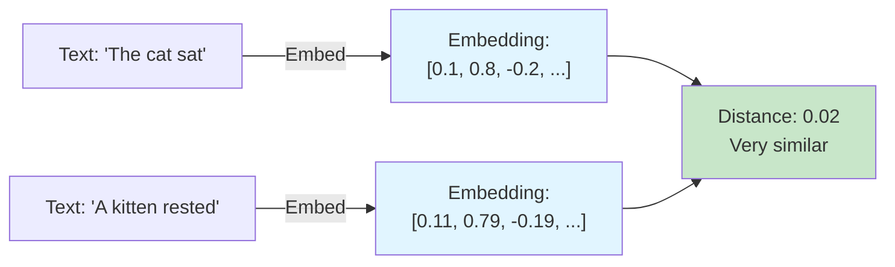
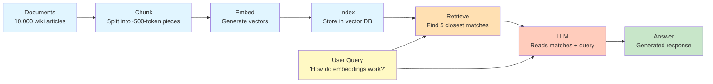
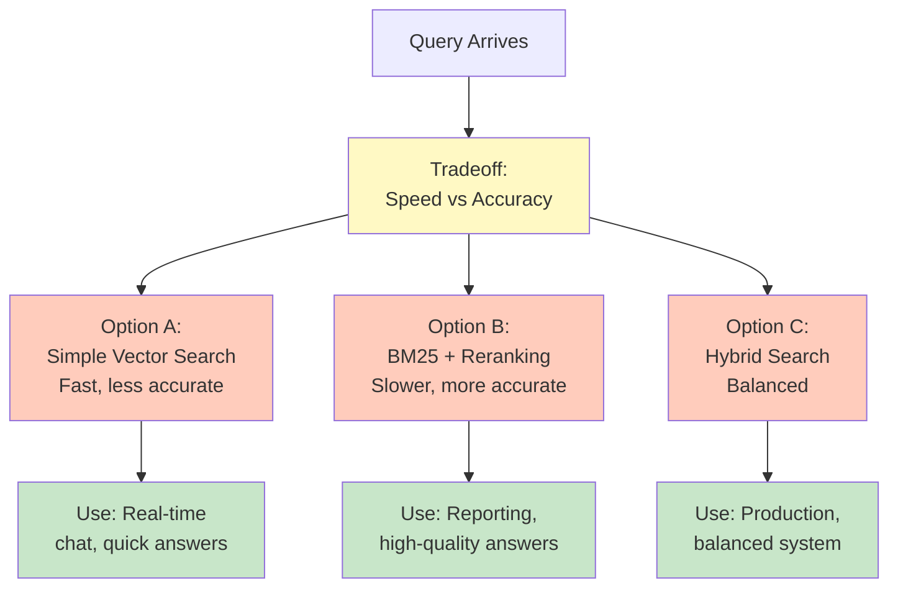

# Development Guidelines — How to Actually Build a Lab

`CONSTITUTION.md` defines the rules. This document is the practical companion —
concrete steps, examples, and things to watch out for while you're actually
writing a lab. If something here ever seems to contradict the constitution, the
constitution wins; flag it so this doc can be fixed.

## Quick Start: Building a Lab in 6 Steps

1. **Scope it before you write code.** Choose notebook format (`.ipynb` for exploratory/visual, `.py` for production-like code, or `.html`/`.css`/`.js` for web development labs). Difficulty level sets line limit: Beginner ≤110, Intermediate ≤150, Advanced ≤180. Plan a series split if you'll exceed it.

2. **Draft Sections 1–9 first.** Title, problem, input/processing/output, tech stack, concepts, prerequisites, setup. Do this in markdown before coding.

3. **Build code one step per cell/section.** Load → transform → embed → store → query. Each step is separate, explained as you go.

4. **Write the Optional Exercise as you build.** Try it before publishing; exercises often need tweaks.

5. **Write the assignment file (`lab-<slug>-assignment.md`)** with exercises that test the lab's key concepts, plus an answer key. Attempt every exercise yourself before shipping.

6. **Restart & Run All in clean environment.** Fresh venv/container built from your Section 9 instructions only.

7. **Walk the Pre-Publish Checklist**, item by item, before shipping.

## Writing Each Section Well

- **Problem Statement:** Ground it in a real scenario ("a support team needs to
  search 10,000 past tickets by meaning, not keyword") rather than an abstract
  capability ("demonstrates semantic search"). Learners retain concepts better
  when they're anchored to a use case.
- **Underlying Concepts (2-page cap):** Write it last, after the lab is built —
  it's easier to explain a concept once you've implemented it. Use one concrete
  analogy if the concept is abstract (e.g., "a vector embedding is like a GPS
  coordinate for meaning"). Cut anything a learner doesn't need to understand
  *this* lab's code.
- **Tech Stack:** List exact versions, not just names (`langchain==0.2.1`, not
  "LangChain"). If you're not sure why a version matters, it's because an
  untested version bump is exactly what breaks a lab six months later.
- **Optional Exercise:** Phrase it as a direct instruction with named
  alternatives — "Swap the vector DB from Weaviate to Milvus" not "try a
  different vector DB if you want." Specificity is what makes it actually
  attemptable.

## Writing the Assignment File

Every lab ships with `lab-<topic-slug>-assignment.md` — a standalone set of exercises that lets learners test what they just learned, without re-running the lab.

**What goes in it:**
- **5–10 exercises**, scaled to difficulty (Beginner: 5–7, Intermediate: 7–9, Advanced: 9–10).
- **A mix of question types:** concept questions ("What does an embedding capture?"), short code tasks ("Write a function that chunks text into ~500-token pieces"), and applied tasks ("Given the RAG pipeline, add a reranker step").
- **An answer key at the end** with brief explanations, not just answers — learners self-check, so the *reasoning* matters.
- **References to the lab, not repeats.** Point exercises back at the relevant section ("see Section 7") instead of re-explaining the concept.

**Rules:**
- Exercises must be **doable from the lab alone** — no outside reading required.
- Attempt **every exercise yourself** before publishing and verify the answer key (fold this into your Gate 5 review).
- Learners can attempt the assignment **without re-running the notebook**; any code-based exercise should run in a scratch file.
- The assignment is **not** the Section 11 Optional Exercise — it's a broader knowledge check.

## Choosing and Signaling Difficulty Level

Before you write a line of code, decide: is this a Beginner, Intermediate, or
Advanced lab? This shapes everything else.

**Ask yourself:**
- Is this the *first* time a learner will see this concept, or are they building
  on existing knowledge?
- How much domain background do they need to understand the code?
- Is the code mostly high-level library calls (Beginner) or a mix of custom +
  library (Intermediate) or mostly custom + design decisions (Advanced)?
- What's the realistic learner goal — understanding, skill-building, or mastery?

**Examples of the decision:**
- "What are embeddings?" → Beginner (first exposure, heavy explanation).
- "Building semantic search" → Intermediate (assumes you know what embeddings
  are, focuses on the build).
- "Optimizing embedding retrieval at scale" → Advanced (assumes you've built
  semantic search, focuses on production patterns).

**Once you decide, use it:**
- **Line limit:** Beginner ≤110, Intermediate ≤150, Advanced ≤180
- **Explanation density:** Beginner more prose/comments; Intermediate balanced; Advanced concise
- **Code style:** Beginner avoids fancy Python; Intermediate clear idioms; Advanced shows sophisticated patterns if instructive
- **Library usage:** Beginner high-level abstractions; Intermediate mix; Advanced custom implementations where instructive
- **Helper functions:** Minimize. Write inline unless called multiple times or teaching a separate concept
- **File format:** `.ipynb` for exploratory labs; `.py` for production-like code labs; `.html`/`.css`/`.js` for web development labs

**Then label it:**
```
Difficulty: Beginner | ~30 min | No prerequisites
```
Be honest about your target level.

## Code Style, With Examples

**Weak comment (describes syntax, not intent):**
```python
# loop through docs
for doc in docs:
    chunks.append(splitter.split(doc))
```

**Better (explains why, at the learner's level):**
```python
# Split each document into ~500-token chunks. Embedding models have a context
# limit, and smaller chunks give more precise retrieval later — a full 20-page
# doc embedded as one vector would blur together unrelated sections.
for doc in docs:
    chunks.append(splitter.split(doc))
```

**Weak cell granularity (several steps buried in one cell):**
```python
docs = load_docs("data/")
chunks = chunk_documents(docs)
embeddings = embed(chunks)
store.add(embeddings)
```

**Better (one step per cell, each with its own explanation above it):**
Split the four lines above into four cells, each preceded by a sentence
explaining that specific step. If a learner wants to inspect `chunks` before
embedding, they should be able to run to that point and stop.

## Minimizing Helper Functions

Every helper function creates a cognitive load on the learner — they see a call
like `chunked_docs = chunk_documents(docs)` and need to either (a) find and read
the function definition, or (b) trust that it does what the name suggests. Both
interrupt the learning flow.

**Default: inline code.** Even if it's 5 lines, write it out:

```python
# Split each document into chunks
chunked_docs = []
for doc in documents:
    doc_chunks = doc.split_by_tokens(max_tokens=512)
    chunked_docs.extend(doc_chunks)
```

This is clearer for a learner than:

```python
chunked_docs = chunk_documents(documents)  # What does this do? Go read the function...
```

**Use a helper function only if:**
- It's called **multiple times** in the lab (e.g., `process_text()` used in three different cells).
- OR it teaches a **separate concept** worth isolating (e.g., a custom scoring function that's the whole point of an advanced lab).

**For helper functions you do define:**
- Define it early (top cells), with a clear docstring.
- Use it multiple times so the learner sees why you abstracted it.
- Explain in markdown *why* you extracted this into a function (usually "we use this pattern three times, so...").

## First Cell: `!pip install` the Dependencies

**Every notebook's first code cell installs everything the lab needs in one line**, so a learner can install all modules directly by running the first cell:

```python
!pip install openai==1.35.0 langchain==0.2.5 weaviate-client==4.6.2
```

- **One line, all modules.** Don't scatter installs through later cells — running the first cell leaves everything ready.
- **Pin versions** exactly as in Section 6 / Section 9 so the notebook and the setup instructions never drift.
- **`.py` script labs:** a script can't run `!pip` — keep installs in Section 9 via `requirements.txt` + `pip install -r requirements.txt`, and note that in the checklist.
- **HTML/CSS/JS labs:** Include a `<link rel="stylesheet" href="style.css">` tag in the HTML `<head>` and a `<script src="script.js"></script>` tag before `</body>`. Document any CDN dependencies (e.g., Bootstrap, Font Awesome) in Section 9.
- **Explain the cell.** One sentence right under it, e.g., "This installs the exact versions of every library used in this lab."
- **Gate 2 test includes it.** When you `Restart & Run All`, the `!pip install` cell runs first and must succeed in a fresh environment (which your Gate 1 environment is).

## Testing, in Practice

The Constitution defines five gates (TS-1 through TS-5). Walk them in order, one at a time. Don't skip a gate or test out of order — each gate depends on the previous one passing.

### Gate 1: Fresh Environment Setup
Start with a truly clean slate. This is where most labs fail silently:
- **What to do:** Open a new terminal, new venv, or a container. Pretend you've never installed anything for this project. Copy Section 9's instructions *word-for-word* and run them.
- **What breaks most:** Missing a dependency, forgetting to pin a version, assuming a system library is pre-installed, or hardcoding a path that only exists on your machine.
- **How to fix:** Update Section 9 to include the missing step, test again.

**Example: Gate 1 failure and fix**
```
Author tests, runs: pip install langchain weaviate-client
Gate 1 test runs: pip install -r requirements.txt
Result: ModuleNotFoundError: No module named 'weaviate'

Fix: Add weaviate-client to requirements.txt (it wasn't pinned), 
re-test Gate 1. Now it passes.
```

### Gate 2: Restart & Run All

**For `.ipynb` files:** Kernel → Restart & Clear Output, then Cell → Run All.

**For `.py` files:** Execute the script end-to-end with `python script.py` (or `python -m script` if it's a module).

**For HTML/CSS/JS files:** Open the HTML file in a browser (or use a local server like `python -m http.server`). Open browser DevTools (F12) and check the Console tab for any JavaScript errors. Verify the page renders correctly without visual glitches. Test all interactive elements (buttons, forms, animations).

Watch it run without touching anything. Common failures:
- Variables/imports from earlier cells missing
- Hardcoded paths like `/Users/yourname/data.csv` (use relative paths)
- Dependencies not pinned in Section 9

**Example fix:** Use `Path(__file__).parent / "data/reviews.csv"` for relative paths.

### Gate 3: Output Verification
After Gate 2, look at what the notebook actually printed/displayed. Compare to Section 5.

**What goes wrong:** You write Section 5 from memory ("the output should show a table with sentiment scores") but the actual notebook shows something slightly different (a list of dicts, not a formatted table). Or the number of rows is different than you expected.

**How to fix:** Run a fresh Gate 2 to get the actual output, screenshot it if applicable, and update Section 5 to match what actually happens. Include sample output in Section 5 so future readers know what to expect.

### Gate 4: Optional Exercise Test
Actually do what Section 11 says. Don't just think "this should work." 

**Example: Gate 4 test**
```
Section 11 says: "Swap the vector DB from Weaviate to Milvus"

What Gate 4 does:
1. Modify the cell that initializes Weaviate to use Milvus instead
2. Re-run that cell and the cells that depend on it
3. Confirm it works

What Gate 4 finds:
- Milvus has a different API; initialization looks different
- The embedding insertion code needs a small tweak
- The retrieval code works as-is

What you do:
- Document these changes in your test report
- Consider updating Section 11 to note the initialization difference
- Or, if it's too different, change Section 11 to "swap to Pinecone instead" 
  (if Pinecone works cleanly)
```

**Why this matters:** An exercise that sounded good but fails is worse than no exercise. A learner who follows your instructions and hits a wall blames the lab.

### Gate 5: Reviewer Walkthrough
Have someone else (not you) do all four gates above. They:
- Read the markdown without running code first (catches confusing explanations).
- Set up the environment fresh (catches Gate 1 failures).
- Run the notebook (catches Gate 2 failures).
- Try the exercise (catches Gate 4 failures).
- Report any confusion, errors, or unclear sections.

**What reviewers often find that authors miss:**
- A step that feels obvious to you but is unexplained.
- An assumption you're making ("this is Python" or "you know what embeddings are") that isn't stated.
- A typo in Section 9 that broke setup but didn't break it on your machine because you had the package installed already.
- An explanation that's too terse for the stated difficulty level.

**Common reviewer feedback:**
- "This cell made me confused because..." → Clarify or add a comment.
- "I got stuck here..." → Fix the code or the instructions.
- "I didn't understand why you chose X over Y." → Add a comment explaining the choice.

Treat reviewer feedback as data. They're not critiquing you; they're showing you the gaps between what's in your head and what's on the page.

---

## Testing at Different Difficulty Levels

**Beginner labs:**
- Reviewer should be someone who knows the programming language but not the domain. Can they follow the code without constantly checking library docs?
- Ask reviewer: "Was every concept explained before it was used?" and "Did you ever feel lost?"

**Intermediate labs:**
- Reviewer should know the domain but maybe not have built this exact thing before. Can they understand the design choices? Could they adapt this to their own project?
- Ask reviewer: "Did the optional exercise feel realistic?" and "Would you know what to change if you wanted to use a different model/library?"

**Advanced labs:**
- Reviewer should be experienced in the domain. Are the tradeoffs visible? Could they extend this to production?
- Ask reviewer: "Are the limitations clear?" and "Could you take this and scale it?"

## Common Pitfalls

**Across all difficulty levels:**
- **Untested Optional Exercise.** The single most common gap — it's the section
  most likely to be written from assumption rather than verified.
- **Copy-pasted `requirements.txt` from another lab** without checking whether
  every pinned version is actually still needed or still compatible.
- **Debug prints and dead code left in** from earlier iterations of the build.
- **Underlying Concepts creeping past 2 pages** because it's tempting to explain
  everything adjacent to the topic, not just what this lab needs.
- **Cost/hardware requirements omitted** because the author's own machine
  already had a GPU or an API key with credits, so the gap wasn't visible to
  them.
- **Section skipped instead of marked "None."** Even "Prerequisites: None" is
  information; a missing heading looks like a mistake.

**Specific to difficulty level:**

*Beginner labs:*
- **Over-explaining obvious things** — "append adds an item to a list" — wastes
  space on facts a learner in a programming context already knows. Focus on the
  domain, not the syntax.
- **Under-explaining domain concepts** — "now we embed the text" without saying
  what an embedding *is* or why you'd want one. Beginners are new to the topic,
  not necessarily new to programming.
- **Mixing difficulty levels.** If you label it Beginner but use advanced Python
  idioms or assume they've done prior labs, learners will get lost. Stay in one
  lane.

*Intermediate labs:*
- **Too much hand-holding.** Once a learner knows the basics, over-explaining
  feels condescending and wastes their time. Trust them to connect dots across
  multiple cells.
- **Not enough context.** Intermediate labs should still explain *why* design
  choices matter — "we use batch_size=50 because the API has limits" is useful
  context, not fluff.

*Advanced labs:*
- **Underestimating the baseline.** If you label it Advanced, don't spend three
  cells on "here's how to load a CSV" — assume they've built things before.
- **Too little explanation of tradeoffs.** The whole point of an advanced lab is
  understanding the *why*. If you skip that, it's just code, not teaching.
- **Forgetting the learner is still learning.** "Advanced" doesn't mean "no
  explanation." It means explaining at a higher level of sophistication.

## Using Mermaid Diagrams to Explain Concepts

Section 7 (Underlying Concepts) is your chance to explain the *why* and *how* in theory before diving into code. **A well-placed diagram can save 500 words of explanation.**

### Default: Use a Mermaid Diagram

**Plan on including at least one Mermaid diagram in every lab.** A lab that explains any flow, pipeline, architecture, workflow, or relationship in prose should convert that into a diagram. Ask yourself:
- Can I explain this concept better as a flow, architecture, or relationship than as prose?
- Would a learner benefit from seeing how pieces connect visually?
- Is there a pipeline, workflow, or decision tree involved?

If yes to any of these — and that will be most labs — use Mermaid. Only skip it when the concept is trivial enough that a one-sentence explanation suffices.

### Example: Vector Embeddings (Beginner Lab)

**Weak explanation (prose only):**
> Vector embeddings are numerical representations of text. They capture semantic meaning so that similar texts have similar embeddings. An embedding is computed by an embedding model like OpenAI's `text-embedding-3-small`.

**Better explanation (prose + diagram):**

> Vector embeddings are numerical representations of text that capture semantic meaning. Similar texts produce similar embeddings.



> Notice the embeddings are close (small distance = similar meaning), even though the text is phrased differently. This is what makes semantic search possible — finding relevant documents by meaning, not just keywords.

### Example: RAG Pipeline (Intermediate Lab)

**Problem:** Explaining RAG is multi-step and learners need to understand the flow.

**Solution:** Show the architecture, then explain each stage.



**Stage 1 (setup, blue):** Prepare your documents. Stage 2 (build, yellow/orange): When a user asks a question, retrieve relevant documents. Stage 3 (generate, green): The LLM reads those documents and answers based on what it learned from them.

### Example: Difficulty Progression (Advanced Lab)

Show tradeoffs and decision points.



This tells the learner: there's no single "best" answer, it depends on your constraints.

### Checklist: Is Your Diagram Good?

- [ ] Renders in GitHub/GitLab/Jupyter (test it before publishing)
- [ ] 5–10 nodes max (fewer is usually better)
- [ ] Every node has a clear, understandable label
- [ ] Color coding (if used) is consistent and meaningful
- [ ] Followed by 1–2 sentences explaining what the diagram shows
- [ ] Adds clarity (not just decoration)
- [ ] Matches how the code actually works

---

## Quick-Reference Checklists

### Pre-Building Checklist
Before you write any code:

```
[ ] Difficulty level chosen (Beginner/Intermediate/Advanced)
[ ] Scope estimated — will it fit the line limit?
[ ] If too big, split into a series (Lab 2a, Lab 2b, etc.)
[ ] Using the 12-section structure from the constitution
[ ] Sections 1–9 drafted (title through setup)
[ ] Difficulty header line ready (e.g., "Difficulty: Intermediate | ~40 min")
```

### Testing Checklist (Five Gates)
After you build, test in order. Each gate must pass before moving to the next:

```
GATE 1: Fresh Environment Setup
  [ ] Clean environment created (not your dev machine)
  [ ] Section 9 instructions copied exactly
  [ ] All commands executed without error
  [ ] Environment ready to run notebook

GATE 2: Restart & Run All
  [ ] Notebook outputs cleared
  [ ] Kernel restarted
  [ ] "Run All" executed without manual intervention
  [ ] No cells failed
  [ ] Notebook completed successfully

GATE 3: Output Verification
  [ ] Actual output matches Section 5 description
  [ ] Screenshots/samples in Section 5 match visually
  [ ] No missing rows, columns, or major differences
  [ ] Section 5 updated if actual output differed

GATE 4: Optional Exercise
  [ ] Exercise performed exactly as Section 11 describes
  [ ] Modified cells ran without error
  [ ] Output is sensible
  [ ] Any gotchas documented

GATE 5: Reviewer Walkthrough
  [ ] Second person reviewed markdown
  [ ] Second person set up fresh environment
  [ ] Second person ran notebook successfully
  [ ] Second person completed Optional Exercise
  [ ] No blocking feedback remained unresolved
```

### Pre-Publish Checklist
Before submitting a lab:

```
STRUCTURE & FILES
  [ ] 12-section markdown (.md) file complete
  [ ] Code file: .ipynb, .py, or .html/.css/.js (match `lab-<topic-slug>` slug)
  [ ] Assignment file `lab-<topic-slug>-assignment.md` present with 5–10 exercises + answer key
  [ ] Every assignment exercise attempted and answer key verified
  [ ] Code ≤ limit: Beginner ≤110, Intermediate ≤150, Advanced ≤180
  [ ] Every block explained; non-obvious lines commented
  [ ] Helper functions minimized; inline code preferred

CONCEPTS & DIAGRAMS
  [ ] Section 7 (concepts) ≤2 pages
  [ ] Mermaid diagram(s) used for Section 7 concepts; render and are followed by prose

TESTING (All 5 Gates)
  [ ] Gate 1: Fresh environment setup passes
  [ ] Gate 2: Code runs top-to-bottom without errors
  [ ] Gate 3: Output matches Section 5
  [ ] Gate 4: Optional Exercise works
  [ ] Gate 5: Second person review complete

ENVIRONMENT & DISCLOSURE
  [ ] Compute/cost requirements disclosed
  [ ] Dependencies pinned (Section 6, 9)
  [ ] First code cell runs `!pip install` for all required modules (.py labs: `requirements.txt`; HTML/CSS/JS labs: CDN dependencies documented in Section 9)
  [ ] No hardcoded credentials

CONSISTENCY
  [ ] Difficulty header + time estimate under title
  [ ] Matches style/depth of peer labs at same difficulty
  [ ] Voice/tone consistent with catalog
```
