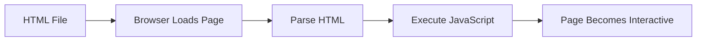

# Lab 1: JavaScript Basics, Variables & Operators

**Difficulty: Beginner | ~30 min | No prerequisites**

## 1. Problem Statement / Use Case Overview

JavaScript is the programming language that makes websites interactive and dynamic. While HTML provides structure and CSS provides styling, JavaScript adds behavior — handling user interactions, validating forms, updating content without reloading, and much more. In this lab, you'll learn the fundamental building blocks of JavaScript: variables, data types, operators, and basic syntax. These concepts are the foundation for everything you'll build with JavaScript.

## 2. Input Data

This lab doesn't require external data files. All examples use hardcoded values (numbers, strings, booleans) to demonstrate JavaScript concepts. You'll create your own variables and manipulate them using operators.

## 3. Processing

You'll work through JavaScript fundamentals in this order:
1. Write and run your first JavaScript code using `<script>` tags
2. Learn how to declare variables with `let`, `const`, and `var`
3. Understand different data types and how to check them
4. Use arithmetic operators for calculations
5. Compare values using comparison operators
6. Combine conditions with logical operators
7. Build strings using template literals

## 4. Output

When you run the JavaScript code in your browser, you'll see output in two places:
- **Browser Console** (F12 → Console): Shows all `console.log()` output
- **Web Page**: The HTML page displays a button and output area

The console will display messages showing variable values, calculation results, and comparison outcomes. You'll also see an error message when trying to reassign a `const` variable.

## 5. Tech Stack

- **HTML5**: For page structure
- **CSS3**: For styling (no external libraries needed)
- **JavaScript (ES6+)**: For all programming logic
- **Browser**: Any modern browser (Chrome, Firefox, Edge, Safari)

No external libraries or APIs are required.

## 6. Underlying Concepts

### How JavaScript Runs in a Browser

When you load an HTML file containing `<script>` tags, the browser's JavaScript engine reads and executes the code line by line. This happens in the same thread as the HTML parsing, which is why `<script>` tags are typically placed at the end of the `<body>` — so the HTML loads first.



### Variables: Containers for Data

Variables are named containers that store values. Think of them as labeled boxes:
- **`let`**: A box you can change — use when the value will be updated
- **`const`**: A box that's sealed — use when the value should never change
- **`var`**: The old way (avoid in modern code) — has confusing scoping rules

### Data Types: What JavaScript Knows

JavaScript recognizes several types of values:
- **String**: Text (e.g., `"Hello"`)
- **Number**: Integers and decimals (e.g., `25`, `3.14`)
- **Boolean**: True or false values
- **Undefined**: Variable declared but no value assigned
- **Null**: Intentional absence of value

The `typeof` operator tells you what type a variable holds.

### Operators: Performing Actions

Operators let you work with data:
- **Arithmetic**: `+`, `-`, `*`, `/`, `%` (remainder)
- **Comparison**: `===` (strict equality), `>`, `<`, `>=`, `<=`
- **Logical**: `&&` (AND), `||` (OR), `!` (NOT)

**Important**: Always use `===` (strict equality) instead of `==` (loose equality). `===` checks both value AND type.

### Template Literals: Building Strings

Template literals use backticks (`` ` ``) and `${variable}` syntax to embed variables directly in strings. This is cleaner than concatenating with `+`.

## 7. Prerequisites

None. This is the first JavaScript lab in the series.

## 8. Environment / Dependencies Setup

No setup required. You need:
- A modern web browser (Chrome, Firefox, Edge, or Safari)
- A text editor (VS Code, Sublime Text, or any editor)
- Basic understanding of HTML (helpful but not required)

## 9. Step-wise Development Instructions

### Step 1: Create the HTML File

Create a new file called `lab-javascript-basics-variables-operators.html` and add the basic HTML structure with a `<script>` tag:

```html
<!DOCTYPE html>
<html lang="en">
<head>
    <meta charset="UTF-8">
    <meta name="viewport" content="width=device-width, initial-scale=1.0">
    <title>Lab 1: JavaScript Basics</title>
</head>
<body>
    <h1>My First JavaScript Program</h1>
    <script>
        console.log("Hello, JavaScript!");
    </script>
</body>
</html>
```

Open this file in your browser, then open the Console (F12 → Console tab). You'll see "Hello, JavaScript!" displayed.

### Step 2: Declare Variables

Add variables using `let` and `const`:

```javascript
// let: value can change
let name = "Anshu";
let age = 20;

// const: value cannot change
const birthYear = 2006;

console.log(name);
console.log(age);
console.log(birthYear);
```

### Step 3: Check Data Types

Use `typeof` to see what type each variable is:

```javascript
console.log(typeof name);      // "string"
console.log(typeof age);       // "number"
console.log(typeof birthYear); // "number"
```

### Step 4: Use Arithmetic Operators

Perform calculations with two numbers:

```javascript
let a = 10;
let b = 3;

console.log(a + b);  // 13 (addition)
console.log(a - b);  // 7 (subtraction)
console.log(a * b);  // 30 (multiplication)
console.log(a / b);  // 3.333... (division)
console.log(a % b);  // 1 (remainder)
```

### Step 5: Compare Values

Use comparison operators to check relationships:

```javascript
let age = 20;

console.log(age === 20);  // true (strict equality)
console.log(age > 18);    // true
console.log(age < 18);    // false
```

### Step 6: Combine Conditions

Use logical operators to combine multiple conditions:

```javascript
let age = 20;
let hasID = true;

console.log(age >= 18 && hasID);  // true (both must be true)
console.log(age >= 18 || hasID);  // true (at least one true)
```

### Step 7: Build Strings with Template Literals

Use backticks and `${variable}` to embed variables in strings:

```javascript
let name = "Anshu";
let age = 20;

console.log(`My name is ${name} and I am ${age} years old.`);
```

### Step 8: Try to Reassign a Constant

This will demonstrate why `const` can't be reassigned:

```javascript
const birthYear = 2006;
birthYear = 2007;  // This will throw an error!
```

## 10. Optional Exercise

Modify the JavaScript code to create a simple calculator that:
1. Stores two numbers in variables
2. Calculates and displays their sum, difference, product, and quotient
3. Uses template literals to show the results as sentences like "The sum of 10 and 5 is 15"
4. Adds a third variable and calculates the average of all three numbers

## 11. What We Learnt

- **JavaScript runs inside the browser** using `<script>` tags in HTML files
- **`console.log()`** displays output in the browser's developer console
- **Variables** store data using `let` (changeable), `const` (unchangeable), and `var` (avoid)
- **Data types** include strings, numbers, booleans, undefined, and null
- **`typeof`** operator reveals a variable's data type
- **Arithmetic operators** (`+`, `-`, `*`, `/`, `%`) perform mathematical calculations
- **Comparison operators** (`===`, `>`, `<`) compare values and return booleans
- **Logical operators** (`&&`, `||`) combine multiple conditions
- **Template literals** (backticks with `${}`) make string building clean and readable
- **`const` prevents reassignment**, throwing an error if you try to change its value