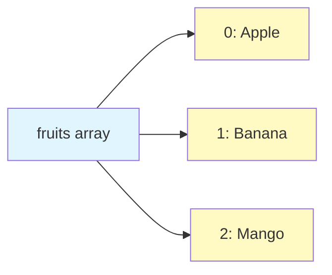
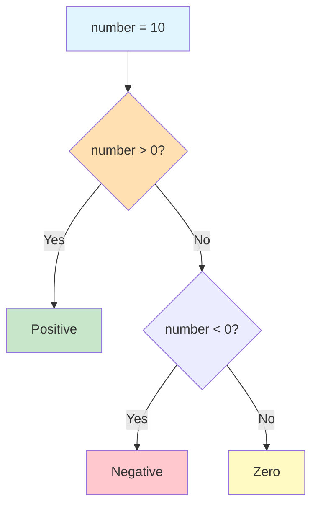

# Lab 2: Strings, Numbers, Arrays & Control Flow

**Difficulty: Beginner | ~40 min | Requires Lab 1**

## 1. Problem Statement / Use Case Overview

Real JavaScript programs need to manipulate text, work with collections of data, and make decisions. This lab introduces you to string methods for transforming text, the Math object for numeric operations, arrays for storing lists of values, and control flow structures (if/else, switch, for, while, break, continue) that let your code make decisions and repeat tasks. These are the everyday tools you'll use in every JavaScript project.

## 2. Input Data

This lab uses hardcoded values — strings, numbers, and a small array of five favorite foods. No external files or APIs are needed. You'll create your own data and manipulate it step by step.

## 3. Processing

You'll work through JavaScript fundamentals in this order:
1. Transform strings using `toUpperCase()`, `slice()`, and `includes()`
2. Use the `Math` object for rounding, random numbers, and finding maximums
3. Create arrays and access items by index
4. Add and remove items with `push()` and `pop()`
5. Make decisions with `if / else if / else`
6. Handle multiple specific values with `switch`
7. Repeat code with `for` and `while` loops
8. Control loop behavior with `break` and `continue`

## 4. Output

When you run the JavaScript code in your browser, the console (F12 → Console) will display:
- Uppercase and sliced strings, plus a true/false check
- Rounded numbers, a random value, and a maximum from a list
- Array items before and after push/pop operations
- Number classification (positive/negative/zero)
- Day-of-the-week lookup
- Counted output from loops, with break and continue demonstrations

## 5. Tech Stack

- **HTML5**: For page structure
- **CSS3**: For styling (no external libraries needed)
- **JavaScript (ES6+)**: For all programming logic
- **Browser**: Any modern browser (Chrome, Firefox, Edge, Safari)

No external libraries or APIs are required.

## 6. Underlying Concepts

### Strings: Working with Text

Strings are sequences of characters. JavaScript gives you built-in methods to transform them without changing the original:
- **`toUpperCase()`** — converts all characters to uppercase
- **`slice(start, end)`** — extracts a portion of the string (end index is exclusive)
- **`includes()`** — checks if a substring exists, returns `true` or `false`

### Math Object: Built-in Math Tools

JavaScript's `Math` object provides quick access to common operations:
- **`Math.round()`** — rounds to the nearest integer
- **`Math.random()`** — generates a random decimal between 0 (inclusive) and 1 (exclusive)
- **`Math.max()`** — finds the largest value among its arguments

### Arrays: Ordered Lists

An array is a list of values stored under one variable. Each item has a position (index) starting at 0.



- **`push()`** — adds an item to the end
- **`pop()`** — removes and returns the last item

### Control Flow: Making Decisions



- **`if / else if / else`** — checks conditions in order and runs the first matching block
- **`switch`** — compares a single value against multiple cases; use `break` to stop after a match

### Loops: Repeating Tasks

Loops let you run the same code multiple times:
- **`for`** — best when you know how many times to repeat
- **`while`** — best when you don't know the exact count
- **`break`** — stops the loop entirely
- **`continue`** — skips the current iteration and moves to the next

## 7. Prerequisites

- **Lab 1**: JavaScript Basics, Variables & Operators (variables, data types, operators, template literals)

## 8. Environment / Dependencies Setup

No setup required. You need:
- A modern web browser (Chrome, Firefox, Edge, or Safari)
- A text editor (VS Code, Sublime Text, or any editor)

## 9. Step-wise Development Instructions

### Step 1: Create the HTML File

Create `lab-javascript-strings-numbers-arrays-control-flow.html` with a basic page structure and a `<script>` tag pointing to the JS file:

```html
<!DOCTYPE html>
<html lang="en">
<head>
    <meta charset="UTF-8">
    <meta name="viewport" content="width=device-width, initial-scale=1.0">
    <title>Lab 2: Strings, Numbers, Arrays & Control Flow</title>
    <link rel="stylesheet" href="lab-javascript-strings-numbers-arrays-control-flow.css">
</head>
<body>
    <h1>Lab 2: Strings, Numbers, Arrays & Control Flow</h1>
    <button id="runBtn">Run Exercises</button>
    <pre id="output"></pre>
    <script src="lab-javascript-strings-numbers-arrays-control-flow.js"></script>
</body>
</html>
```

### Step 2: String Methods

Create the JS file. Start by demonstrating three string methods:

```javascript
const outputEl = document.getElementById('output');

function log(message) {
    console.log(message);
    outputEl.textContent += message + '\n';
}

log('=== Strings ===');
let name = "anshu";
log(name.toUpperCase());   // "ANSHU"

let course = "JavaScript";
log(course.slice(0, 4));   // "Java"
log(course.includes("Script")); // true
```

`toUpperCase()` converts text to uppercase. `slice(0, 4)` extracts characters from index 0 up to (but not including) index 4. `includes()` checks if the substring exists.

### Step 3: Math Object

Use `Math` for rounding, random numbers, and finding maximums:

```javascript
log('\n=== Math Object ===');
log(Math.round(4.7));       // 5
log(Math.random());         // random number between 0 and 1
log(Math.max(10, 50, 20));  // 50
```

`Math.round()` rounds to the nearest integer. `Math.random()` gives a decimal between 0 and 1. `Math.max()` picks the largest from a list.

### Step 4: Arrays — Create, Push, Pop

Create an array of foods, then add and remove items:

```javascript
log('\n=== Arrays ===');
let foods = ["Pizza", "Pasta", "Burger", "Sushi", "Tacos"];
log(foods[0]); // "Pizza" — first item (index 0)

foods.push("Ramen");   // adds to end
log(foods);            // shows updated array

foods.pop();           // removes last item
log(foods);            // "Ramen" is gone
```

Arrays start at index 0. `push()` adds to the end; `pop()` removes from the end.

### Step 5: if / else

Classify a number as positive, negative, or zero:

```javascript
log('\n=== if / else ===');
let number = 10;
if (number > 0) {
    log("Positive");
} else if (number < 0) {
    log("Negative");
} else {
    log("Zero");
}
```

JavaScript checks each condition top to bottom and runs the first block that matches.

### Step 6: switch

Map a number to a day name:

```javascript
log('\n=== switch ===');
let day = 2;
switch (day) {
    case 1: log("Monday"); break;
    case 2: log("Tuesday"); break;
    case 3: log("Wednesday"); break;
    default: log("Invalid day");
}
```

`switch` compares `day` against each `case`. The `break` stops execution after a match — without it, code "falls through" to the next case.

### Step 7: for Loop

Count from 1 to 5:

```javascript
log('\n=== for Loop ===');
for (let i = 1; i <= 5; i++) {
    log(i);
}
```

The `for` loop has three parts: `let i = 1` (start), `i <= 5` (continue while true), `i++` (increase after each run).

### Step 8: while Loop

Same counting with a `while` loop:

```javascript
log('\n=== while Loop ===');
let i = 1;
while (i <= 5) {
    log(i);
    i++;
}
```

A `while` loop keeps running as long as its condition is true. Always update the variable inside the loop to avoid infinite loops.

### Step 9: break and continue

Stop at 5 with `break`; skip 3 with `continue`:

```javascript
log('\n=== break ===');
for (let i = 1; i <= 10; i++) {
    if (i === 5) break;
    log(i); // 1, 2, 3, 4
}

log('\n=== continue ===');
for (let i = 1; i <= 5; i++) {
    if (i === 3) continue;
    log(i); // 1, 2, 4, 5
}
```

`break` exits the loop immediately. `continue` skips the rest of the current iteration and jumps to the next one.

## 10. Optional Exercise

Modify the code to:
1. Create an array of five numbers instead of foods
2. Use `push()` and `pop()` to change the array
3. Use a `for` loop with `continue` to skip even numbers
4. Use `if/else` to classify each remaining number as "small" (≤ 5) or "large" (> 5)

## 11. What We Learnt

- **String methods** (`toUpperCase()`, `slice()`, `includes()`) transform and inspect text
- **`Math` object** provides `round()`, `random()`, and `max()` for common operations
- **Arrays** store ordered lists; access items by index starting at 0
- **`push()` adds** to the end of an array; **`pop()` removes** from the end
- **`if / else if / else`** makes decisions by checking conditions in order
- **`switch`** handles multiple specific values cleanly with `case` and `break`
- **`for` loops** repeat code a known number of times
- **`while` loops** repeat code as long as a condition is true
- **`break`** stops a loop entirely; **`continue`** skips to the next iteration
