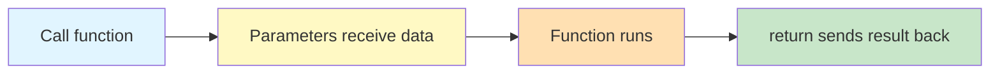
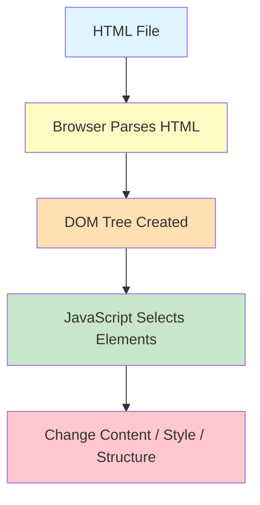

# Lab 3: Functions, Objects & DOM — Mini Project

**Difficulty: Beginner | ~40 min | Requires Lab 2**

## 1. Problem Statement / Use Case Overview

Writing all your code in one flat sequence doesn't scale. Functions let you organize logic into reusable blocks. Objects let you group related data together. The DOM lets JavaScript reach into an HTML page and change what the user sees. This lab brings all three together — you'll learn functions, arrow functions, objects, methods, JSON, DOM selection, content changes, style changes, and click events — then apply everything in a Click Counter mini project.

## 2. Input Data

No external files needed. All data is created inside the code — strings, numbers, objects, and JSON built from scratch. The mini project uses a simple HTML page with a button and a paragraph.

## 3. Processing

You'll work through JavaScript concepts in this order:
1. Write reusable functions with parameters and return values
2. Use arrow functions for shorter syntax
3. Create objects with key-value pairs and methods
4. Convert objects to JSON and back
5. Select HTML elements with `querySelector()`
6. Change text, HTML, and style on the page
7. Respond to click events with `addEventListener()`
8. Build a Click Counter that updates on every click

## 4. Output

When you open the HTML file in your browser:
- The console shows function results, object properties, and JSON strings
- The page displays a heading, a button, and a counter that increments on each click
- The counter text updates from "Clicks: 0" to "Clicks: 1", "Clicks: 2", and so on

## 5. Tech Stack

- **HTML5**: For page structure
- **CSS3**: For styling (no external libraries needed)
- **JavaScript (ES6+)**: For all programming logic
- **Browser**: Any modern browser (Chrome, Firefox, Edge, Safari)

No external libraries or APIs are required.

## 6. Underlying Concepts

### Functions: Reusable Logic

A function is a block of code you give a name to. You can call it whenever you need it, and you can send it data (parameters) and get data back (return value).



- **Parameters** let you pass data into a function
- **`return`** sends a value back to wherever the function was called
- **Arrow functions** (`() => {}`) are a shorter way to write functions

### Objects: Grouping Related Data

An object stores data as key-value pairs. Instead of separate variables, you keep everything under one name:

- Access values with **dot notation** (`person.name`)
- A function inside an object is called a **method**
- **`this`** refers to the object itself inside a method

### JSON: Data Format

JSON (JavaScript Object Notation) is the standard format for exchanging data:
- **`JSON.stringify()`** — converts an object to a JSON string
- **`JSON.parse()`** — converts a JSON string back to an object

### DOM: Changing the Web Page

The browser builds a tree of your HTML called the Document Object Model. JavaScript can read and modify this tree:



- **`querySelector()`** — selects an element using CSS selectors
- **`textContent`** — changes the text inside an element
- **`innerHTML`** — changes the HTML inside an element
- **`style`** — changes CSS properties directly

### Events: Responding to Users

Events let JavaScript react to what the user does. The most common event is a click:

- **`addEventListener("click", function)`** — runs a function when the element is clicked

## 7. Prerequisites

- **Lab 1**: JavaScript Basics, Variables & Operators
- **Lab 2**: Strings, Numbers, Arrays & Control Flow

## 8. Environment / Dependencies Setup

No setup required. You need:
- A modern web browser (Chrome, Firefox, Edge, or Safari)
- A text editor (VS Code, Sublime Text, or any editor)

## 9. Step-wise Development Instructions

### Step 1: Create the HTML File

Create `lab-javascript-functions-objects-dom.html`:

```html
<!DOCTYPE html>
<html lang="en">
<head>
    <meta charset="UTF-8">
    <meta name="viewport" content="width=device-width, initial-scale=1.0">
    <title>Lab 3: Functions, Objects & DOM</title>
    <link rel="stylesheet" href="lab-javascript-functions-objects-dom.css">
</head>
<body>
    <h1 id="title">Lab 3: Functions, Objects & DOM</h1>
    <button id="runBtn">Run Exercises</button>
    <pre id="output"></pre>

    <h2>Click Counter</h2>
    <p id="count">Clicks: 0</p>
    <button id="counterBtn">Click Me</button>

    <script src="lab-javascript-functions-objects-dom.js"></script>
</body>
</html>
```

### Step 2: Functions — Basic, Parameters, Return

Create the JS file. Start with three kinds of functions:

```javascript
const outputEl = document.getElementById('output');

function log(message) {
    console.log(message);
    outputEl.textContent += message + '\n';
}

// Basic function — no parameters, no return
function greet() {
    console.log("Hello!");
}

// Function with parameters
function greetName(name) {
    console.log(`Hello ${name}`);
}

// Function with return value
function add(a, b) {
    return a + b;
}

log('=== Functions ===');
greet();                // calls greet, prints "Hello!"
greetName("Anshu");     // prints "Hello Anshu"
let result = add(10, 20);
log(result);            // 30
```

A function runs only when you call it. `return` sends a value back; without it, the function returns `undefined`.

### Step 3: Arrow Functions

Arrow functions are shorter syntax for the same thing:

```javascript
log('\n=== Arrow Functions ===');
const multiply = (a, b) => a * b;
log(multiply(4, 5));    // 20
```

`const multiply = (a, b) => a * b` does the same as a full function but in one line.

### Step 4: Objects and Methods

Objects store related data. A function inside an object is a method:

```javascript
log('\n=== Objects ===');
let person = {
    name: "Anshu",
    age: 20,
    city: "Indore",
    introduce: function() {
        return `My name is ${this.name}`;
    }
};

log(person.name);           // "Anshu"
log(person.age);            // 20
log(person.introduce());    // "My name is Anshu"
```

`this.name` refers to the object's own `name` property.

### Step 5: JSON — Stringify and Parse

Convert objects to JSON strings and back:

```javascript
log('\n=== JSON ===');
let jsonData = JSON.stringify(person);
log(jsonData);

let newPerson = JSON.parse(jsonData);
log(newPerson.name);        // "Anshu"
```

`JSON.stringify()` turns an object into a string. `JSON.parse()` turns it back.

### Step 6: DOM — Select and Change Content

Select an element and change what it shows:

```javascript
log('\n=== DOM ===');
let title = document.querySelector("#title");
title.textContent = "Functions, Objects & DOM";
```

`querySelector("#title")` finds the element with `id="title"`. `textContent` replaces its text.

### Step 7: Changing Style

Change CSS properties directly from JavaScript:

```javascript
title.style.color = "blue";
```

### Step 8: Click Events — The Mini Project

Add a click listener to the counter button:

```javascript
log('\n=== Click Counter ===');
let count = 0;
const counterBtn = document.querySelector("#counterBtn");
const countText = document.querySelector("#count");

counterBtn.addEventListener("click", function() {
    count++;
    countText.textContent = `Clicks: ${count}`;
});
```

Every time the button is clicked, `count` increases by 1 and the paragraph updates.

## 10. Optional Exercise

Modify the Click Counter to:
1. Add a "Reset" button that sets the counter back to 0
2. Change the counter text color to red when the count is above 10
3. Create a second object with different properties and display its values on the page

## 11. What We Learnt

- **Functions** organize reusable logic — call them by name with parameters and get results back with `return`
- **Arrow functions** provide shorter syntax: `const fn = (a, b) => a + b`
- **Objects** group related data as key-value pairs, accessed with dot notation
- **Methods** are functions inside objects — use `this` to refer to the object
- **`JSON.stringify()`** converts objects to JSON strings; **`JSON.parse()`** converts them back
- **`querySelector()`** selects HTML elements using CSS selectors
- **`textContent`** changes text; **`innerHTML`** changes HTML; **`style`** changes CSS
- **`addEventListener()`** makes elements respond to user actions like clicks
- **The DOM** is the browser's tree representation of HTML that JavaScript can read and modify
