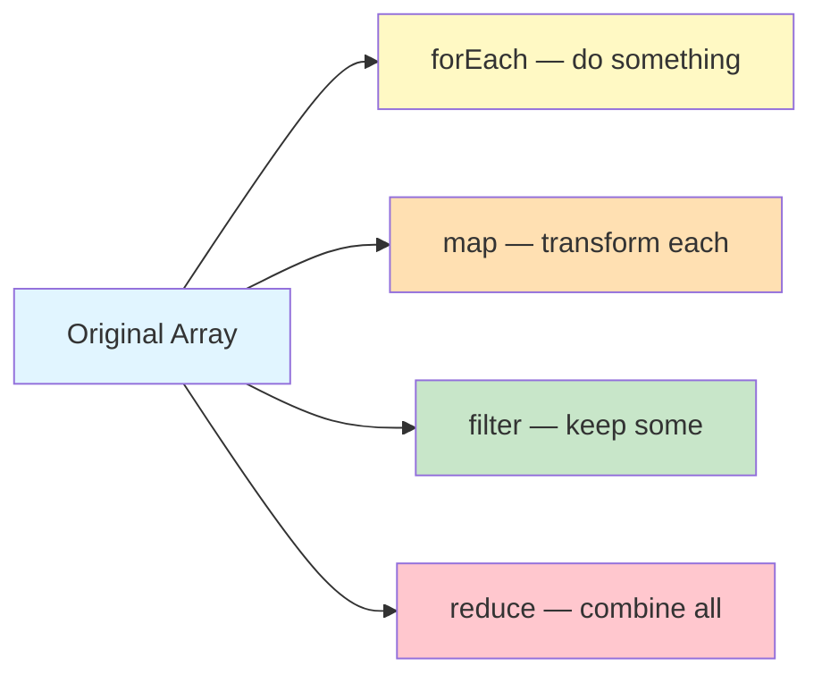

# Lab 4: Arrays & Array Methods

**Difficulty: Beginner | ~40 min | Requires Lab 2**

## 1. Problem Statement / Use Case Overview

Lab 2 taught you how to create arrays and loop through them with `for` and `while`. But writing loops manually for every task is slow and error-prone. JavaScript provides powerful array methods — `forEach`, `map`, `filter`, `reduce`, and `find` — that handle common patterns in one line. This lab teaches you to think in terms of data transformations: take an array, do something to each item, filter out what you don't need, and combine the results. These methods are used in every real JavaScript project.

## 2. Input Data

This lab uses hardcoded arrays — numbers, strings, and objects. No external files or APIs are needed. You'll build your own data and transform it step by step.

## 3. Processing

You'll work through array methods in this order:
1. Loop through each item with `forEach()`
2. Transform every item with `map()`
3. Keep specific items with `filter()`
4. Combine items into a single value with `reduce()`
5. Find the first matching item with `find()`
6. Chain multiple methods together for complex transformations

## 4. Output

When you run the JavaScript code in your browser, the console (F12 → Console) will display:
- Each item printed by `forEach`
- A new array of doubled numbers from `map`
- A filtered array of even numbers from `filter`
- A single sum value from `reduce`
- The first matching item from `find`
- A chained result combining map and filter

## 5. Tech Stack

- **HTML5**: For page structure
- **CSS3**: For styling (no external libraries needed)
- **JavaScript (ES6+)**: For all programming logic
- **Browser**: Any modern browser (Chrome, Firefox, Edge, Safari)

No external libraries or APIs are required.

## 6. Underlying Concepts

### Array Methods: Thinking in Transformations

Instead of writing loops, array methods let you describe *what* you want done:



- **`forEach()`** — runs a function on each item (like a `for` loop, but cleaner)
- **`map()`** — transforms each item and returns a **new array**
- **`filter()`** — keeps items that pass a test, returns a **new array**
- **`reduce()`** — combines all items into a single value
- **`find()`** — returns the **first item** that matches a condition

### Key Difference from Lab 2

Lab 2 used `for` loops with manual index tracking. These methods hide the index — you focus on *what to do* with each item, not *how to loop*.

## 7. Prerequisites

- **Lab 2**: Strings, Numbers, Arrays & Control Flow (basic arrays, for/while loops, push/pop)

## 8. Environment / Dependencies Setup

No setup required. You need:
- A modern web browser (Chrome, Firefox, Edge, or Safari)
- A text editor (VS Code, Sublime Text, or any editor)

## 9. Step-wise Development Instructions

### Step 1: Create the HTML File

Create `lab-javascript-arrays-and-array-methods.html`:

```html
<!DOCTYPE html>
<html lang="en">
<head>
    <meta charset="UTF-8">
    <meta name="viewport" content="width=device-width, initial-scale=1.0">
    <title>Lab 4: Arrays & Array Methods</title>
    <link rel="stylesheet" href="lab-javascript-arrays-and-array-methods.css">
</head>
<body>
    <h1>Lab 4: Arrays & Array Methods</h1>
    <button id="runBtn">Run Exercises</button>
    <pre id="output"></pre>
    <script src="lab-javascript-arrays-and-array-methods.js"></script>
</body>
</html>
```

### Step 2: forEach — Loop Through Each Item

Create the JS file. Start with `forEach`:

```javascript
const outputEl = document.getElementById('output');

function log(message) {
    console.log(message);
    outputEl.textContent += message + '\n';
}

function runExercises() {
    outputEl.textContent = '';

    log('=== forEach ===');
    let colors = ["Red", "Green", "Blue"];
    colors.forEach(function(color) {
        log(color);
    });
```

`forEach` calls the function once for each item. You don't need an index variable — the item is passed directly.

### Step 3: map — Transform Each Item

`map` creates a new array by transforming every item:

```javascript
    log('\n=== map ===');
    let numbers = [1, 2, 3, 4, 5];
    let doubled = numbers.map(function(num) {
        return num * 2;
    });
    log(doubled);  // [2, 4, 6, 8, 10]
```

`map` does not change the original array — it returns a brand new one.

### Step 4: filter — Keep Specific Items

`filter` keeps items that pass a test:

```javascript
    log('\n=== filter ===');
    let scores = [85, 42, 93, 67, 71, 88];
    let passing = scores.filter(function(score) {
        return score >= 70;
    });
    log(passing);  // [85, 93, 71, 88]
```

The test function returns `true` to keep the item, `false` to discard it.

### Step 5: reduce — Combine Into One Value

`reduce` combines all items into a single result:

```javascript
    log('\n=== reduce ===');
    let prices = [10, 20, 30, 40];
    let total = prices.reduce(function(sum, price) {
        return sum + price;
    }, 0);
    log(total);  // 100
```

The first argument (`sum`) is the accumulator — it holds the running total. The second (`price`) is the current item. The `0` is the starting value.

### Step 6: find — Get First Match

`find` returns the first item that matches:

```javascript
    log('\n=== find ===');
    let users = ["Anshu", "Rahul", "Priya", "Karan"];
    let found = users.find(function(user) {
        return user.startsWith("P");
    });
    log(found);  // "Priya"
```

If no item matches, `find` returns `undefined`.

### Step 7: Method Chaining

Combine methods for powerful one-liners:

```javascript
    log('\n=== Chaining ===');
    let nums = [1, 2, 3, 4, 5, 6];
    let result = nums
        .filter(function(n) { return n % 2 === 0; })  // [2, 4, 6]
        .map(function(n) { return n * 10; });           // [20, 40, 60]
    log(result);  // [20, 40, 60]
```

Filter first, then transform. Each method returns an array, so you can chain the next one.

### Step 8: Arrow Function Shortcuts

All these methods work with arrow functions too:

```javascript
    log('\n=== Arrow Shortcuts ===');
    let words = ["hello", "world", "javascript"];
    let upper = words.map(w => w.toUpperCase());
    log(upper);  // ["HELLO", "WORLD", "JAVASCRIPT"]

    let short = words.filter(w => w.length <= 5);
    log(short);  // ["hello", "world"]
```

Arrow functions make chaining even cleaner.

    log('\n=== All exercises completed! ===');
}

document.getElementById('runBtn').addEventListener('click', runExercises);

runExercises();
```

## 10. Optional Exercise

Modify the code to:
1. Create an array of objects: `[{name: "Anshu", score: 85}, {name: "Rahul", score: 42}, {name: "Priya", score: 93}]`
2. Use `filter` to get only students with scores above 80
3. Use `map` to extract just their names into a new array
4. Use `reduce` to find the average score of all students

## 11. What We Learnt

- **`forEach()`** loops through each item without needing an index variable
- **`map()`** transforms every item and returns a new array — the original stays unchanged
- **`filter()`** keeps items that pass a test, discards the rest
- **`reduce()`** combines all items into a single value using an accumulator
- **`find()`** returns the first item matching a condition
- **Method chaining** lets you combine `filter` → `map` → `reduce` in one pipeline
- **Arrow functions** make array method callbacks short and readable
- **These methods replace manual `for` loops** for most real-world array work
