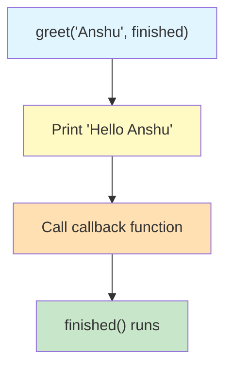
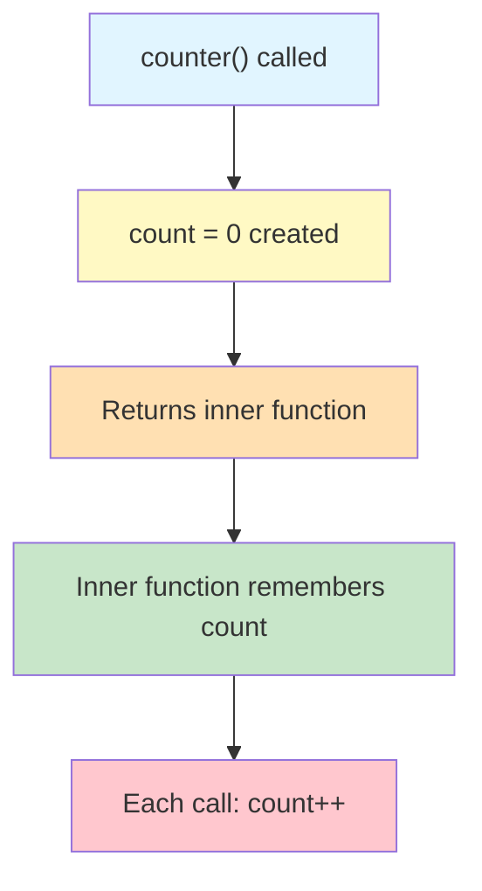
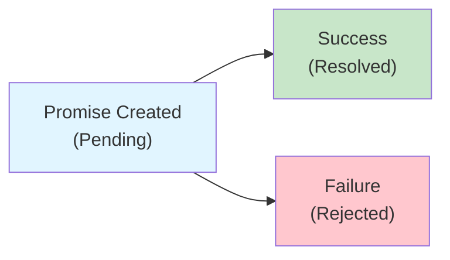

# Lab 5: Closures, Classes & Asynchronous JavaScript

**Difficulty: Beginner / Pre-React | ~45 min | Requires Lab 4**

## 1. Problem Statement / Use Case Overview

This is the final JavaScript lab before React. It covers the advanced concepts you need: callbacks for passing functions as arguments, closures for remembering data, ES6 classes for creating objects, Promises for handling delayed operations, async/await for clean asynchronous code, and the Fetch API for getting data from the internet. These concepts are used in every React application, and understanding them here makes the transition smooth.

## 2. Input Data

This lab uses hardcoded values for callbacks, closures, and classes. The Fetch API section uses a free public API (`https://type.fit/api/quotes`) to demonstrate real data retrieval. No API keys are needed.

## 3. Processing

You'll work through advanced JavaScript concepts in this order:
1. Pass functions as arguments using callbacks
2. Understand closures — inner functions that remember outer variables
3. Create blueprints for objects using ES6 classes
4. Divide code into modules with `import`/`export`
5. Handle delayed operations with Promises
6. Write clean async code with `async`/`await`
7. Fetch data from an API using `fetch()`
8. Handle errors gracefully with `try`/`catch`
9. Combine everything in a final project: fetch, process, and display API data

## 4. Output

When you run the JavaScript code in your browser, the console (F12 → Console) will display:
- Callback execution messages
- A closure counter incrementing: 1, 2, 3
- Class object descriptions
- Promise results after a delay
- API data fetched and processed with `map()` and `filter()`
- Error handling messages when requests fail

## 5. Tech Stack

- **HTML5**: For page structure
- **CSS3**: For styling (no external libraries needed)
- **JavaScript (ES6+)**: For all programming logic
- **Browser**: Any modern browser (Chrome, Firefox, Edge, Safari)
- **Free API**: `https://type.fit/api/quotes` (no API key required)

## 6. Underlying Concepts

### Callbacks: Functions as Arguments

A callback is a function you pass to another function so it can run later. This is the foundation of asynchronous JavaScript.



### Closures: Remembering Data

A closure happens when an inner function keeps access to variables from its outer function, even after the outer function has finished running.



### Classes: Blueprints for Objects

A class is a template for creating objects with shared properties and methods. The `constructor` runs when you create a new instance with `new`.

### Promises: Handling Delayed Operations

A Promise represents a value that isn't available yet. It starts **pending**, then becomes **resolved** (success) or **rejected** (failure).



### async/await: Clean Asynchronous Code

`async/await` lets you write asynchronous code that looks like regular synchronous code. `await` pauses until the Promise resolves.

### Fetch API: Getting Data from the Internet

`fetch()` sends a request to a URL and returns a Promise. Chain `.then()` or use `async/await` to handle the response.

### try/catch: Handling Errors

`try` wraps code that might fail. If it does, `catch` runs instead of crashing the program.

## 7. Prerequisites

- **Lab 1**: JavaScript Basics, Variables & Operators
- **Lab 2**: Strings, Numbers, Arrays & Control Flow
- **Lab 3**: Functions, Objects & DOM
- **Lab 4**: Arrays & Array Methods (forEach, map, filter, reduce)

## 8. Environment / Dependencies Setup

No setup required. You need:
- A modern web browser (Chrome, Firefox, Edge, or Safari)
- A text editor (VS Code, Sublime Text, or any editor)
- Internet connection (for the Fetch API section)

## 9. Step-wise Development Instructions

### Step 1: Create the HTML File

Create `lab-javascript-closures-classes-async.html`:

```html
<!DOCTYPE html>
<html lang="en">
<head>
    <meta charset="UTF-8">
    <meta name="viewport" content="width=device-width, initial-scale=1.0">
    <title>Lab 5: Closures, Classes & Async</title>
    <link rel="stylesheet" href="lab-javascript-closures-classes-async.css">
</head>
<body>
    <h1>Lab 5: Closures, Classes & Async</h1>
    <button id="runBtn">Run Exercises</button>
    <pre id="output"></pre>
    <script src="lab-javascript-closures-classes-async.js"></script>
</body>
</html>
```

### Step 2: Callbacks

Create the JS file. Start with a callback example:

```javascript
const outputEl = document.getElementById('output');

function log(message) {
    console.log(message);
    outputEl.textContent += message + '\n';
}

function greet(name, callback) {
    log("Hello " + name);
    callback();
}

log('=== Callbacks ===');
greet("Anshu", function() {
    log("Task completed!");
});
```

The second argument to `greet` is a function — it runs after the greeting.

### Step 3: Closures

Build a counter that remembers its own data:

```javascript
log('\n=== Closures ===');
function counter() {
    let count = 0;
    return function() {
        count++;
        log(count);
    };
}

const myCounter = counter();
myCounter();  // 1
myCounter();  // 2
myCounter();  // 3
```

`counter()` runs once and returns an inner function. That inner function still has access to `count` even though `counter()` is done.

### Step 4: Classes

Create a class with a constructor and method:

```javascript
log('\n=== Classes ===');
class Car {
    constructor(make, model) {
        this.make = make;
        this.model = model;
    }
    describe() {
        return `${this.make} ${this.model}`;
    }
}

const car1 = new Car("Toyota", "Camry");
log(car1.describe());  // "Toyota Camry"
```

`constructor` sets up the object when you use `new`. Methods are functions inside the class.

### Step 5: Modules (Concept)

Modules split code into separate files. In `car.js`:
```javascript
export class Car { /* ... */ }
```
In `main.js`:
```javascript
import { Car } from "./car.js";
```
This keeps projects organized — we'll use this pattern in React.

### Step 6: Promises

Create and handle a Promise:

```javascript
log('\n=== Promises ===');
const promise = new Promise((resolve) => {
    setTimeout(() => {
        resolve("Task completed!");
    }, 1000);
});

promise.then(function(result) {
    log(result);
});
```

`resolve()` marks the Promise as successful. `.then()` handles the result.

### Step 7: async/await

Rewrite the Promise with async/await:

```javascript
log('\n=== async/await ===');
async function run() {
    const result = await promise;
    log(result);
}
run();
```

`async` before the function lets you use `await` inside. `await` pauses until the Promise resolves.

### Step 8: Fetch API + try/catch

Fetch data from a free API and handle errors:

```javascript
log('\n=== Fetch API ===');
async function getQuotes() {
    try {
        const response = await fetch("https://type.fit/api/quotes");
        const data = await response.json();

        log(`Total quotes: ${data.length}`);

        const quotes = data.map(item => item.text);
        log(`First quote: ${quotes[0]}`);

        const longQuotes = data.filter(q => q.text.length > 100);
        log(`Quotes over 100 chars: ${longQuotes.length}`);
    } catch (error) {
        log("Error: " + error.message);
    }
}
getQuotes();
```

`fetch()` returns a Promise. `response.json()` parses the body. `try/catch` handles network errors.

### Step 9: Final Project — Combine Everything

The Fetch API example above IS the final project — it combines:
- **async/await** for clean asynchronous code
- **try/catch** for error handling
- **map()** from Lab 4 to transform data
- **filter()** from Lab 4 to select specific items

    log('\n=== All exercises completed! ===');
}

document.getElementById('runBtn').addEventListener('click', runExercises);

runExercises();
```

## 10. Optional Exercise

Modify the Fetch project to:
1. Change the API to `https://jsonplaceholder.typicode.com/users`
2. Use `map()` to extract just the user names
3. Use `filter()` to find users whose email ends with `.net`
4. Display the results on the page instead of the console

## 11. What We Learnt

- **Callbacks** let you pass functions as arguments for later execution
- **Closures** let inner functions remember variables from their outer function
- **ES6 classes** provide a clean syntax for creating objects with `constructor` and methods
- **Modules** (`import`/`export`) split code into separate files for organization
- **Promises** represent delayed operations with pending/resolved/rejected states
- **`.then()`** handles successful Promise results
- **`async/await`** makes asynchronous code read like synchronous code
- **`fetch()`** requests data from APIs and returns a Promise
- **`try/catch`** handles errors gracefully without crashing the program
- **Combining `fetch` + `map` + `filter`** lets you retrieve, transform, and select real-world data
