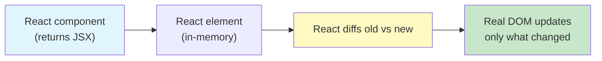
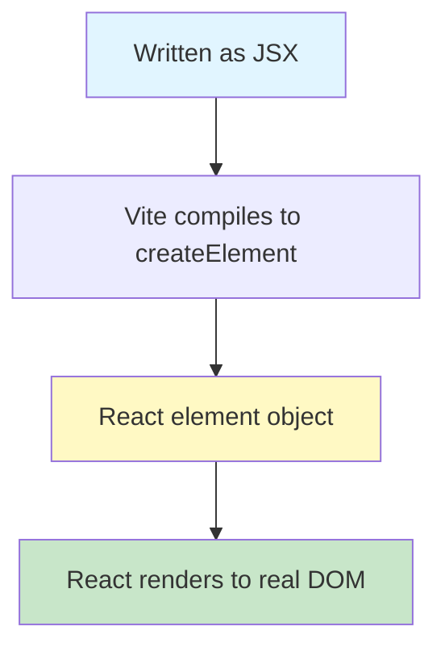
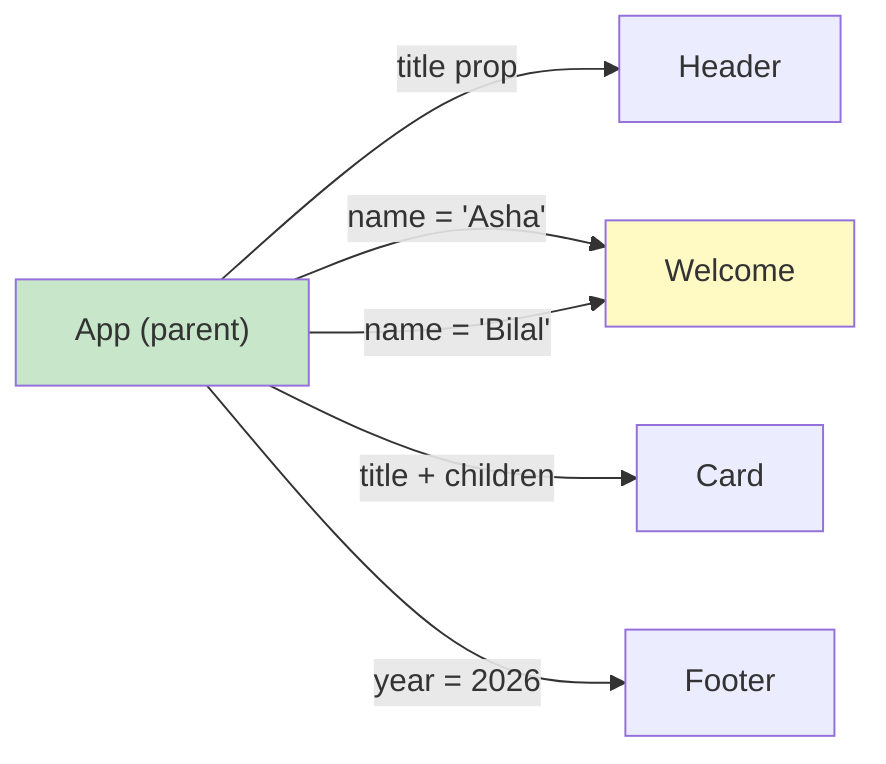
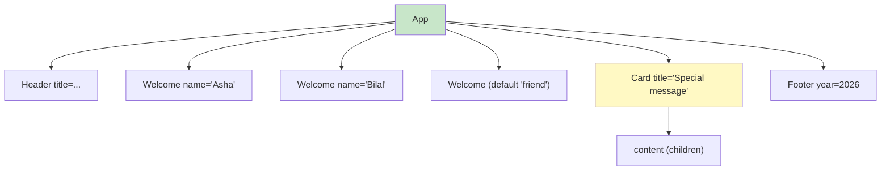

# Lab 1: JSX, Components, Rendering & Props

**Difficulty: Beginner | ~75 min | Requires basic HTML, CSS & JavaScript**

## 1. Problem Statement / Use Case Overview

You, as a new member of the ShelfWise frontend team, keep writing the same greeting blocks over and over using plain HTML. Every new staff page needs an "Asha", a "Bilal", a default guest view, a highlighted message card, and a page footer — and with plain HTML you would copy-paste the same markup into every screen. When a name changes, you have to find every copy and edit it by hand.

**React solves exactly this problem.** React is a JavaScript library for building user interfaces out of small, reusable pieces called **components**. You write each component once, give it data through **props** (short for *properties*), and React takes care of putting it into the page ("rendering"). Change one name, and every screen that uses that component updates.

In this lab you build a small ShelfWise crew-greeting page:

- A `Header` component that shows a page title.
- A reusable `Welcome` component rendered three times with **different names** (`"Asha"`, `"Bilal"`, and an optional default).
- A `Card` component whose content is filled in by whoever uses it.
- A `Footer` component, and an `App` component that combines all of them.

By the end you will understand what React is, why it exists, how JSX works, how components communicate with props, and how bigger screens are built by composing small components together.

## 2. Input Data

React components receive their data as **props** — a plain JavaScript object of `key: value` pairs written on the opening tag, exactly like HTML attributes. This lab passes the following data:

| Component | Props passed | Default-fallback behaviour |
|---|---|---|
| `Header` | `title` (string) | — |
| `Welcome` | `name` (string) | `name` is optional; falls back to `"friend"` |
| `Card` | `title` (string) + **children** (JSX) | — |
| `Footer` | `year` (number) | — |

The same `Welcome` component is given three different inputs, which is the whole point of reusability:

```jsx
<Welcome name="Asha" />
<Welcome name="Bilal" />
<Welcome />                 {/* no name → default */}
```

There is no network call and no server in this lab — the data is just the props you write on the tags.

## 3. Processing

- Step 0 — Create a new React project with Vite and start the dev server.
- Step 1 — Open `App.jsx`, delete the starter demo, and replace it with a heading and a paragraph **written in JSX**.
- Step 2 — Create `Welcome.jsx`, a reusable component that takes a `name` prop, and render it twice with different names.
- Step 3 — Make `name` optional so `<Welcome />` works too and shows a sensible default greeting.
- Step 4 — Create `Card.jsx` using `props.children` so content placed between `<Card> ... </Card>` automatically appears inside the card.
- Step 5 — Create `Header` and `Footer` components and **compose** everything inside `App.jsx`, using a React `Fragment` where the app needs to return multiple root elements.

## 4. Output

The default Vite starter page is your starting point: a dark-blue screen with the Vite and React logos and a clickable counter button. You replace that demo entirely.

After Step 5, the browser page shows your ShelfWise app. The visible text, top to bottom (captured from the running app while verifying this lab):

```
React Lab 1: JSX, Components & Props

Welcome to React
This heading and paragraph were both written in JSX.

Welcome, Asha!
Welcome, Bilal!
Welcome, friend!             ← the <Welcome /> with no name

Special message
Everything between the Card tags ends up inside the Card.

© 2026 React Lab 1 — built with components
```

The rendered DOM structure behind that text is:

```
<div id="root">
  <header class="page-header">
    <h1>React Lab 1: JSX, Components & Props</h1>
  </header>
  <main>
    <h2>Welcome to React</h2>
    <p>This heading and paragraph were both written in JSX.</p>
    <section class="crew">
      <h3>Welcome, Asha!</h3>
      <h3>Welcome, Bilal!</h3>
      <h3>Welcome, friend!</h3>          ← the <Welcome /> with no name
    </section>
    <section class="card">
      <h3 class="card-title">Special message</h3>
      <p>Everything between the Card tags ends up inside the Card.</p>
    </section>
  </main>
  <footer class="page-footer">
    <p>© 2026 React Lab 1 — built with components</p>
  </footer>
</div>
```

Key things to notice in the output:

- `Welcome, Asha!` and `Welcome, Bilal!` prove the **same component reused with different data**.
- `Welcome, friend!` proves the **default prop** kicked in for `<Welcome />`.
- `Special message` and the paragraph come from the **Card's `children`**.
- The heading, paragraph, card, and footer are all **composed** into one page by `App`.

## 5. Tech Stack

- **React 18.3.1** — the library (components, JSX compilation, rendering).
- **react-dom 18.3.1** — the bridge that puts React elements into the real DOM via `createRoot()`.
- **JSX** — the JavaScript-like syntax you write instead of `React.createElement` calls.
- **Vite 8** — the dev server and build tool that runs your project in the browser.
- **esbuild / @vitejs/plugin-react** — compile JSX into plain JavaScript automatically.
- **npm** — installs dependencies (`react`, `react-dom`).
- **Node.js 18+** — required to run npm and Vite.

There are three common ways to set up React, and this lab uses Vite:

| Setup | What it is | Star rating for beginners |
|---|---|---|
| **Vite** (this lab) | Fast, modern bundler; `npm create vite` scaffolds an app in seconds | ⭐⭐⭐ |
| **Create React App (CRA)** | Older all-in-one tool; no longer the recommended default | ⭐ |
| **CDN** (unpkg, no build) | Adds React via a `<script>` tag; great for a single HTML file, but no JSX without a build step or Babel | ⭐⭐ |

## 6. Underlying Concepts

### What React is and why we use it

React is a JavaScript library, not a framework. It builds the page from a tree of components and keeps it in sync with your data.

- **Declarative.** You describe the desired outcome (`<Welcome name="Asha" />`), not the steps to build it. React figures out how to update the DOM.
- **Component-based.** The UI is split into isolated, reusable pieces that communicate through props.
- **Fast DOM updates via the virtual DOM.** React keeps an in-memory copy of the UI. When a component renders again, React compares ("diffs") the old copy with the new one and touches only the changed parts of the real DOM — not the whole page.



### What JSX is

JSX looks like HTML but lives in `.jsx` files and is actually JavaScript. Before it reaches the browser, Vite transforms it into `React.createElement(...)` calls. A few rules matter from day one:

- A component returns **one root element**. To return several siblings, wrap them in a `<Fragment>` (`<> ... </>` gives slightly shorter syntax) or a single element like `<div>`.
- Use **`className`**, not `class` (because `class` is a JavaScript keyword).
- Values from JavaScript go inside curly braces: `<h3>Welcome, {name}!</h3>`.
- Tags that start with a **lowercase letter** are treated as HTML elements (`<div>`); tags that start with an **uppercase letter** are treated as your components (`<Card>`).
- Comments inside JSX need the `{/* ... */}` form.



### Function components

A **function component** is simply a JavaScript function that returns JSX. That is all there is to it:

```jsx
function Welcome() {
  return <h3>Welcome!</h3>;
}
```

### Props: the component input

Inside the component, `props` is an object. `<Welcome name="Asha" />` calls `Welcome` with `props = { name: 'Asha' }`. Convention: destructure the ones you need in the signature (`function Welcome({ name })`).



### Default prop values

Make a prop optional by giving the destructured parameter a default value. If the caller omits it, the default is used:

```jsx
function Welcome({ name = 'friend' }) {
  return <h3>Welcome, {name}!</h3>;
}
```

`<Welcome name="Asha" />` renders *Welcome, Asha!*, while `<Welcome />` renders *Welcome, friend!*. The older alternative, setting `Welcome.defaultProps = { ... }`, still works but is deprecated in React 18 — prefer the destructuring default.

### props.children

Content written **between** the opening and closing tags of a component is delivered to that component as the special `children` prop. Whatever the parent wraps between `<Card> ... </Card>` appears at the `{children}` spot:

```jsx
function Card({ title, children }) {
  return (
    <section className="card">
      <h3>{title}</h3>
      {children}
    </section>
  );
}
```

### Component composition

Composition means building bigger components out of smaller ones. `App` is the parent; `Header`, `Welcome`, `Card`, and `Footer` are its children. A component tree is a great mental model:



## 7. Prerequisites

- Comfortable reading HTML (`<div>`, `<h1>`–`<h3>`, `<p>`, `<section>`).
- Basic CSS (you will paste a small stylesheet, no need to write complex rules).
- Basic JavaScript: functions, object destructuring (`const { name } = props`), and `import`/`export` syntax.
- No previous React experience needed — this is the first React lab.

Software already on your machine:

- **Node.js 18+** (verified in Step 0 with `node -v`).
- **npm** (comes with Node).

## 8. Environment / Dependencies Setup

You need Node.js 18 (or newer) and npm. Check with:

```bash
node -v     # e.g. v20.20.2
npm -v      # e.g. 10.8.2
```

Create the project (Step 0 does this in detail) with:

```bash
npm create vite@latest react-lab-1 -- --template react
cd react-lab-1
npm install
```

Pin to **React 18** (what this lab teaches — the latest Vite template currently scaffolds React 19):

```bash
npm install react@^18.3.1 react-dom@^18.3.1
```

Start the dev server:

```bash
npm run dev
```

Open the printed URL (default `http://localhost:5173`). Vite hot-reloads the page whenever you save a file, so you never restart the server while editing.

The final project contains: `index.html`, `vite.config.js`, `package.json`, a `public/` folder, and a `src/` folder with your components. `node_modules/` (installed dependencies) is large and is never committed or shared — Vite's `.gitignore` already excludes it.

## 9. Step-wise Development Instructions

### Step 0 — Create the React project with Vite

Open a terminal in your work folder and run the three commands from Section 8. The `-- --template react` flag answers Vite's "choose a template" question automatically, so the scaffolding runs non-interactively:

```bash
npm create vite@latest react-lab-1 -- --template react
cd react-lab-1
npm install
npm install react@^18.3.1 react-dom@^18.3.1
npm run dev
```

You should see something like:

```
  VITE v8.3.0  ready in 300 ms
  ➜  Local:   http://localhost:5173/
```

Open `http://localhost:5173/` — you will see the default Vite starter page: a dark-blue screen with the Vite and React logos and a clickable counter button.

### Step 1 — Replace the starter with your own JSX

Open `src/App.jsx` in VS Code. Delete the starter demo (the counter button and Vite logos) and replace the whole file with:

```jsx
import Header from './Header.jsx';
import Welcome from './Welcome.jsx';
import Card from './Card.jsx';
import Footer from './Footer.jsx';

function App() {
  return (
    <>
      <Header title="React Lab 1: JSX, Components & Props" />

      <main>
        <h2>Welcome to React</h2>
        <p>This heading and paragraph were both written in JSX.</p>

        <section className="crew">
          <Welcome name="Asha" />
          <Welcome name="Bilal" />
          <Welcome />
        </section>

        <Card title="Special message">
          <p>Everything between the Card tags ends up inside the Card.</p>
        </Card>
      </main>

      <Footer year={2026} />
    </>
  );
}

export default App;
```

Notes:

- The `<h2>` and `<p>` are your **JSX heading and paragraph** from the lab requirements.
- The top-level `<> ... </>` is a **fragment** — `App` returns several siblings and must wrap them in one root, but we do not want an extra `<div>` around everything.
- `Header`, `Welcome`, `Card` and `Footer` are used **before they exist** — that is fine, we create them next. If you look at the page now, you will get "is not defined" errors; keep going.

The other `src` file that must exist is `main.jsx` (Vite already created it). It is the entry point: it finds `<div id="root">` in `index.html` and mounts the app with React 18's `createRoot`:

```jsx
import { StrictMode } from 'react';
import { createRoot } from 'react-dom/client';
import App from './App.jsx';
import './index.css';

createRoot(document.getElementById('root')).render(
  <StrictMode>
    <App />
  </StrictMode>
);
```

Leave `main.jsx` exactly as it is. `StrictMode` is a development helper from React that double-invokes renders to surface bugs; it changes nothing in production output.

### Step 2 — Create `src/Welcome.jsx` (reusable, with a `name` prop)

Create the file `src/Welcome.jsx`:

```jsx
function Welcome({ name }) {
  return <h3>Welcome, {name}!</h3>;
}

export default Welcome;
```

How it works:

- `({ name })` is **destructuring in the parameter list** — it unwraps `props.name` from the props object.
- `{name}` inside the JSX is a **JavaScript expression**, evaluated and inserted into the output.

Because `App` writes `<Welcome name="Asha" />` and `<Welcome name="Bilal" />`, the *same* component renders two different headings. That reuse — one component, many inputs — is the core benefit of props. Try it in the browser: both lines appear.

### Step 3 — Make `name` optional (default props)

Take off `name` from one usage — `<Welcome />` already does this in `App.jsx`. Right now it renders `Welcome, undefined!`. Fix it with a default value in the component:

```jsx
function Welcome({ name = 'friend' }) {
  return <h3>Welcome, {name}!</h3>;
}
```

Now `<Welcome />` renders *Welcome, friend!* while the named ones still show *Asha* and *Bilal*. The default is only used when the prop is missing or `undefined` — passing an empty string `name=""` would still print an empty greeting.

### Step 4 — Create `src/Card.jsx` (props.children)

Create `src/Card.jsx`:

```jsx
function Card({ title, children }) {
  return (
    <section className="card">
      <h3 className="card-title">{title}</h3>
      {children}
    </section>
  );
}

export default Card;
```

The trick is `{children}`. In `App.jsx`, the content *between* `<Card>` and `</Card>`:

```jsx
<Card title="Special message">
  <p>Everything between the Card tags ends up inside the Card.</p>
</Card>
```

…is passed to `Card` as the `children` prop, and it is rendered exactly where `{children}` sits. The card is a **wrapper** — different users can put different content inside it while the card chrome (border, title) stays the same.

### Step 5 — Compose `Header` and `Footer`, and finish `App`

Create `src/Header.jsx`:

```jsx
function Header({ title }) {
  return (
    <header className="page-header">
      <h1>{title}</h1>
    </header>
  );
}

export default Header;
```

Create `src/Footer.jsx`:

```jsx
function Footer({ year }) {
  return (
    <footer className="page-footer">
      <p>&copy; {year} React Lab 1 — built with components</p>
    </footer>
  );
}

export default Footer;
```

Back in `App.jsx` these are already imported and placed inside the fragment, so the page now reads, top to bottom:

1. `Header` — page title (from the `title` prop).
2. `main` — the JSX heading, paragraph, three re-used `Welcome`s, and the `Card` with its children.
3. `Footer` — the copyright line (from the `year` prop).

Finally, style it. Replace `src/index.css` with:

```css
:root {
  font-family: 'Segoe UI', Roboto, Helvetica, Arial, sans-serif;
  line-height: 1.6;
  color: #1f2933;
  background: #f4f6f8;
}

body {
  margin: 0;
}

#root {
  max-width: 720px;
  margin: 0 auto;
  padding: 24px;
}

.page-header {
  background: #1e3a5f;
  color: #ffffff;
  padding: 20px 24px;
  border-radius: 8px;
}

.page-header h1 {
  margin: 0;
  font-size: 1.4rem;
}

.crew {
  margin: 20px 0;
  padding: 16px;
  background: #ffffff;
  border-radius: 8px;
  box-shadow: 0 1px 3px rgba(0, 0, 0, 0.12);
}

.crew h3 {
  margin: 4px 0;
}

.card {
  background: #ffffff;
  border: 2px solid #e2b93b;
  border-radius: 8px;
  padding: 16px 20px;
  margin: 20px 0;
}

.card-title {
  margin: 0 0 8px;
  color: #9a7d12;
}

.page-footer {
  text-align: center;
  color: #52606d;
}
```

Save every file. The page now shows the full ShelfWise layout from Section 4, and every change appears instantly thanks to Vite hot reload.

## 10. Optional Exercise

Extend `Welcome` with a second optional prop, `city`, that renders a location line:

- `city` must have a default of `"an unknown city"`.
- The output should read `Welcome, Asha! — from Mumbai` when used as `<Welcome name="Asha" city="Mumbai" />`.
- `<Welcome />` should still work and read `Welcome, friend! — from an unknown city`.

One clean way is to render a single `<h3>` that includes both props — the component still returns exactly one root element, so no fragment is needed:

```jsx
function Welcome({ name = 'friend', city = 'an unknown city' }) {
  return <h3>Welcome, {name}! — from {city}</h3>;
}
```

Update `App.jsx` to pass `city="Mumbai"` to Asha and `city="Karachi"` to Bilal, then check the browser shows:

```
Welcome, Asha! — from Mumbai
Welcome, Bilal! — from Karachi
Welcome, friend! — from an unknown city
```

This proves you can have any number of optional props and that defaults only fill the gaps.

## 11. What We Learnt

- **React is a JS library** that builds UIs from small reusable components and keeps the DOM in sync through a virtual DOM diff.
- **Vite** scaffolds a React project in seconds (`npm create vite`), runs a hot-reloading dev server, and compiles JSX.
- **JSX looks like HTML but is JavaScript** — use `className` not `class`, wrap expressions `{}`, and let Vite compile it to `createElement` calls.
- **A function component is just a function returning JSX**, and it must return a single root element (use a fragment `<> ... </>` for several siblings).
- **Props come in as a plain object** and are read-only; destructuring in the signature (`function Welcome({ name })`) is the idiomatic way to use them.
- **Props flow one way — parent to child.** `App` sends data down; children never push data up (state, in later labs, handles the reverse need).
- **Default props** make values optional — `({ name = 'friend' })` fills the gap only when the prop is missing.
- **`props.children`** renders whatever sits between a component's tags, letting you build reusable wrapper components like `Card`.
- **Composition** is how real apps scale: `App` composes `Header`, `Welcome`, `Card`, and `Footer` into one screen instead of one giant HTML file.