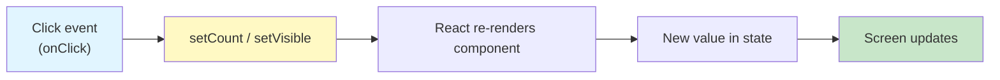
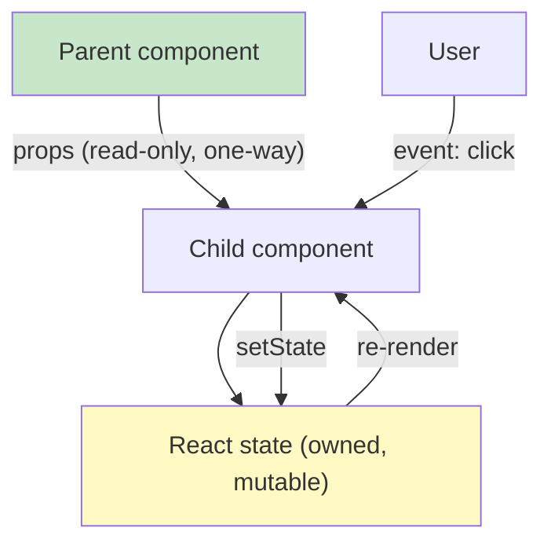
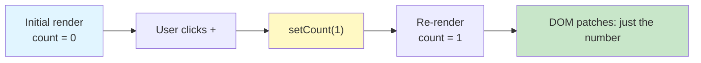
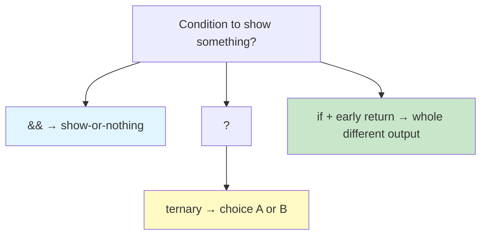

# Lab 2: State & Events — Making Components Interactive

**Difficulty: Beginner | ~40 min | Requires Lab 1**

## 1. Problem Statement / Use Case Overview

In Lab 1 your ShelfWise page never reacted to anything — it was pure **static** UI: the same greeting, the same card, the same footer on every reload. But a real store dashboard has to *respond*. A shelf-count badge goes up when staff add stock, down when stock is removed, and a "restock needed" warning should appear only when the count gets too high. A "store closed" notice needs a button that shows and hides it.

That reacting part is called **state** — data that lives inside a component and changes over time. When state changes, React automatically **re-renders** the component so the screen always matches the data. The user clicks, an **event** fires, React updates state, and the UI redraws.

In this lab you build two small but genuinely interactive components:

- **`Counter`** — a shelf-count console with `-`, `+`, and `Reset` buttons, plus a warning message that appears only when the count is over 5.
- **`ToggleText`** — a "store announcement" section with a `Show` / `Hide` button driven by a boolean state value.

You place both on the same page to prove something important: **each component keeps its own independent state**, and clicking one never disturbs the other.

## 2. Input Data

This lab has no server, no API, and no props from the outside. The *input data* is the **initial state you declare inside each component**:

| Component | State variable | Initial value | Type |
|---|---|---|---|
| `Counter` | `count` | `0` | number |
| `ToggleText` | `visible` | `true` | boolean |

That initial value is the component's starting point on first render. From then on, the data is changed by the user through events:

- Clicking `+` adds `1` to `count`.
- Clicking `-` subtracts `1`.
- Clicking `Reset` sets `count` back to `0`.
- Clicking `Hide` / `Show` flips `visible` between `false` and `true`.

There are no props flowing in here at all — this is the key difference from Lab 1, where every component was fed from outside via `<Welcome name="Asha" />`. State is data *owned by* the component itself.

## 3. Processing

- **Step 1 — `Counter`:** Build a component that stores `count` with `useState(0)` and renders `Count: 0` plus `-` and `+` buttons. Wire the buttons with `onClick` event handlers that call React's state updater (`setCount`).
- **Step 2 — Reset:** Add a `Reset` button whose handler calls `setCount(0)`, snapping the count back to its starting value.
- **Step 3 — Conditional message:** Show a message only when `count > 5`, using React's `&&` conditional-rendering trick. (You also meet the two other techniques — the ternary and the `if` statement — in the concepts section.)
- **Step 4 — `ToggleText`:** Build a component with a boolean state value (`visible`) whose button flips it with `!visible`, and render a paragraph only when `visible` is `true`. This uses the **ternary** for the button label and `&&` for the paragraph.
- **Step 5 — Independent state:** Render `Counter` and `ToggleText` side by side in `App` (composed like Lab 1) and verify that clicking one never changes the other.



## 4. Output

The default Vite starter page (dark-blue screen with logos and a counter) is replaced entirely. The **initial** page, top to bottom (captured from the running app while verifying this lab):

```
React Lab 2: State & Events

Click the buttons. Counter and ToggleText each keep their own state —
changing one never affects the other.

Counter
Count: 0
-  +  Reset

ToggleText
Hide
This paragraph is rendered by a boolean in state. Click "Hide" and it
disappears — but the state is still there, waiting.
```

The initial DOM structure behind that text:

```
<div id="root">
  <main class="lab">
    <h1>React Lab 2: State & Events</h1>
    <p class="intro">Click the buttons. ...</p>
    <section class="console">
      <h2>Counter</h2>
      <p class="count">Count: 0</p>
      <div class="buttons">
        <button>-</button>
        <button>+</button>
        <button class="reset">Reset</button>
      </div>
      <!-- no .message paragraph yet — count is not > 5 -->
    </section>
    <section class="console">
      <h2>ToggleText</h2>
      <button>Hide</button>
      <p>This paragraph is rendered by a boolean in state. ...</p>
    </section>
  </main>
</div>
```

What you should see while interacting (verified by clicking in a running app):

1. Click `+` six times → **`Count: 6`** and a yellow warning appears: **`More than 5 — keep it fun!`**.
2. Click `+` again → `Count: 7`, message still there.
3. Click `-` once → `Count: 5` and the message **disappears** (5 is not greater than 5).
4. Click `Reset` → `Count: 0`, message gone.
5. In the ToggleText box, click **`Hide`** → paragraph vanishes and the button now reads **`Show`**. Click **`Show`** → paragraph returns.
6. Clicking Counter buttons **never** hides the paragraph, and toggling Show/Hide **never** changes the count — that is independent state in action.

## 5. Tech Stack

- **React 18.3.1** — provides the `useState` hook and re-rendering.
- **react-dom 18.3.1** — mounts the app into the DOM via `createRoot()`.
- **JSX** — the syntax you write for markup, event handlers, and conditional rendering.
- **Vite 8** — dev server with hot reload; recompiles and refreshes the page on every save.
- **npm** — installs `react` and `react-dom`.
- **Node.js 18+** — required to run npm and Vite.

Everything else (CSS, the browser) is unchanged from Lab 1. The only new thing is the `useState` hook, which ships inside React itself — no extra install.

## 6. Underlying Concepts

### State vs props — the two ways a component gets data

- **Props** (Lab 1) are *passed in from outside*, by a parent component, at creation time. They are **read-only** — the component can never change its own props.
- **State** is *owned by the component itself*. It starts from a value you choose, and the component — through event handlers — is the only thing that may change it.

Think of props as your **ID card** (given to you, you cannot edit it) and state as your **notepad** (your own, you scribble on it and it changes over time).



### `useState` — the state hook

`useState` is a **hook**: a built-in React function that "hooks" a component up to state. It returns an array with exactly two slots:

```jsx
const [count, setCount] = useState(0);
//       ^         ^          ^
//  current value  updater   initial value
```

- The **first slot** (`count`) is the current value. Read it, never write to it.
- The **second slot** (`setCount`) is the *only* function that changes it. Call `setCount(newValue)` with the new value.

### Updating state and re-rendering

When you call `setCount(6)`, React schedules a **re-render**: it re-runs the component function, which reads the *new* `count` and produces fresh JSX. The browser then diffs old vs. new DOM and patches only what changed.



### Event handling with `onClick`

In JSX, events are **camelCase attributes** that hold a function:

```jsx
<button onClick={() => setCount(count + 1)}>+</button>
```

`onClick` is the prop; the arrow function is the **event handler**. When the browser fires a click, React calls your handler, which calls the updater, which triggers the re-render. The handler is an arrow function written *inline* — a real function that declares its own block, or a named handler, works too:

```jsx
<button onClick={handleAdd}>+</button>   {/* same thing, using a named function */}
```

### Why state must never be modified directly

You might be tempted to write `count = count + 1`. **Never do that.** Two reasons:

1. React re-renders **only** when you call the updater. Directly assigning `count` changes the variable in memory but React never notices, so the screen stays stale.
2. The updater goes through React's scheduler, which batches updates and re-renders consistently. Skipping it breaks that contract.

**Rule of thumb: if a value changes and you want the screen to follow, put it in state and only change it via its updater.**

### Conditional rendering — three techniques

JSX can't contain `if` statements directly (it's a markup expression), so React gives you three idiomatic ways:

- **`&&` operator** — "show when true", for a single element that may be absent:
  ```jsx
  {count > 5 && <p className="message">More than 5 — keep it fun!</p>}
  ```
  When `count > 5` is `true`, React renders the `<p>`. When it's `false`, React renders nothing. This appears in both components below.
- **Ternary operator** — "one of two things", for choosing between two alternatives:
  ```jsx
  <button>{visible ? 'Hide' : 'Show'}</button>
  ```
  Choosing the label "Hide" when `visible` is `true`, "Show" otherwise — used inside `ToggleText`.
- **`if` statement** — "early return", when one branch means *completely different* output. Because the whole component is just a function, you can `return` early:
  ```jsx
  if (count === 0) {
    return <p>Tap a button to begin.</p>;
  }
  return <p>You are at {count}.</p>;
  ```
  You will not need the `if` version in this lab — `&&` and the ternary cover both buttons — but keep it in mind for Lab 3.



### Independent state

Each component that calls `useState` owns its own copy of that state. `Counter`'s `count` and `ToggleText`'s `visible` live in **separate memories**. Re-rendering `Counter` after a click re-runs *Counter's* function only — React leaves the rendered output of `ToggleText` untouched. That is why the two stay independent on the same page.

## 7. Prerequisites

- Lab 1 completed — you can already create a Vite project, write function components, and compose them with props.
- Same tooling as Lab 1: **Node.js 18+**, **npm**, and the `react-lab-1` Vite project you built (or any working React 18 project from Section 8).

## 8. Environment / Dependencies Setup

You need the same environment as Lab 1. If your `react-lab-1` project is still around, you can reuse it by only replacing the `src` files — the dependencies are identical.

To start fresh, run exactly the Lab 1 commands:

```bash
npm create vite@latest react-lab-2 -- --template react
cd react-lab-2
npm install
npm install react@^18.3.1 react-dom@^18.3.1
npm run dev
```

Open the printed URL (default `http://localhost:5173`). Hot reload refreshes the page on every save, so you never restart the server.

The final project contains the same files as Lab 1: `index.html`, `vite.config.js`, `package.json`, and a `src/` folder holding `main.jsx` (unchanged), your new component files, and `index.css`.

## 9. Step-wise Development Instructions

### Step 1 — `Counter` with `useState`

In your `src/` folder, create `Counter.jsx`:

```jsx
import { useState } from 'react';

function Counter() {
  // count is the current value, setCount is the only way to change it
  const [count, setCount] = useState(0);

  return (
    <section className="console">
      <h2>Counter</h2>
      <p className="count">Count: {count}</p>
      <div className="buttons">
        <button onClick={() => setCount(count - 1)}>-</button>
        <button onClick={() => setCount(count + 1)}>+</button>
      </div>
    </section>
  );
}

export default Counter;
```

- `useState(0)` gives you the pair: current `count` (starts at `0`) and its updater `setCount`.
- Each button's `onClick` calls the updater with a **new value** — the current count plus/minus one. When that runs, React re-renders `Counter` with the new number.
- `{count}` in the JSX is the same expression pattern you met in Lab 1 — it just prints the live state value now.

### Step 2 — Add `Reset`

Add a third button to `Counter`:

```jsx
<button className="reset" onClick={() => setCount(0)}>Reset</button>
```

`setCount(0)` sends the count straight back to its initial value — no need for a loop or a special function, because the updater accepts *any* new value, not just `count + 1`. Place it inside the `.buttons` div, after the `+` button.

### Step 3 — The conditional message with `&&`

Still in `Counter`, add one more line **inside** the `<section>`, after the `.buttons` div:

```jsx
{count > 5 && <p className="message">More than 5 — keep it fun!</p>}
```

- Reads: *"if `count > 5` is true, render this `<p>`; otherwise render nothing."*
- React evaluates the left side first; if it's `false`, the whole line produces nothing and no paragraph appears in the DOM at all (you saw this in the Section 4 DOM dump — the message node is simply absent at `count = 0`).
- The ternary (`var1 ? a : b`) and the `if` early-return are the other two tools for conditional rendering — you will use the ternary in Step 4 and can revisit the `if` form in Section 6 when output branches diverge more.

### Step 4 — `ToggleText` with a boolean state value

Create `ToggleText.jsx`:

```jsx
import { useState } from 'react';

function ToggleText() {
  // visible is a boolean; the button flips it between true and false
  const [visible, setVisible] = useState(true);

  return (
    <section className="console">
      <h2>ToggleText</h2>
      <button onClick={() => setVisible(!visible)}>
        {visible ? 'Hide' : 'Show'}
      </button>
      {visible && (
        <p>
          This paragraph is rendered by a boolean in state. Click "Hide" and it
          disappears — but the state is still there, waiting.
        </p>
      )}
    </section>
  );
}

export default ToggleText;
```

- `useState(true)` starts with the paragraph **shown**.
- `!visible` is the logical **NOT** — it flips `true` to `false` and back, so each click toggles.
- The **ternary** picks the button label: Hide while visible, Show while hidden.
- The **`&&`** renders the paragraph only while `visible` is `true`. When hidden, the `<p>` is not in the DOM — only the button remains.

### Step 5 — Compose both in `App` (independent state)

Replace `src/App.jsx` so it imports and renders both interactive components, plus a short intro line (compose them exactly as you composed `Header`, `Welcome`, `Card`, and `Footer` in Lab 1 — here a `<main>` wrapper gives the layout its single root):

```jsx
import Counter from './Counter.jsx';
import ToggleText from './ToggleText.jsx';

function App() {
  return (
    <main className="lab">
      <h1>React Lab 2: State & Events</h1>
      <p className="intro">
        Click the buttons. Counter and ToggleText each keep their own state —
        changing one never affects the other.
      </p>
      <Counter />
      <ToggleText />
    </main>
  );
}

export default App;
```

`main.jsx` (the entry point from the Vite scaffold) needs **no changes** — it already creates the root with `createRoot` and renders `<App />` inside `StrictMode`, as you left it in Lab 1.

### Style it — replace `src/index.css`

```css
:root {
  font-family: 'Segoe UI', Roboto, Helvetica, Arial, sans-serif;
  line-height: 1.6;
  color: #1f2933;
  background: #f4f6f8;
}

body {
  margin: 0;
}

.lab {
  max-width: 720px;
  margin: 0 auto;
  padding: 24px;
}

.lab h1 {
  color: #1e3a5f;
}

.intro {
  color: #52606d;
}

.console {
  background: #ffffff;
  border-radius: 8px;
  box-shadow: 0 1px 3px rgba(0, 0, 0, 0.12);
  padding: 20px 24px;
  margin: 20px 0;
}

.console h2 {
  margin: 0 0 8px;
  color: #1e3a5f;
}

.count {
  font-size: 1.6rem;
  font-weight: 600;
  margin: 8px 0 12px;
}

.buttons button {
  font-size: 1rem;
  margin-right: 8px;
  padding: 8px 16px;
  border: none;
  border-radius: 6px;
  background: #1e3a5f;
  color: #ffffff;
  cursor: pointer;
}

.buttons .reset {
  background: #d64545;
}

.message {
  margin-top: 14px;
  padding: 10px 14px;
  background: #fff3cd;
  border-radius: 6px;
  color: #7a5d00;
}
```

Save everything. Now run the interaction checklist from Section 4: click `+` six times until the warning appears, drop it back with `-`, `Reset` to zero, and toggle the paragraph on and off — and confirm the two boxes never interfere.

## 10. Optional Exercise

Cap the counter at the top: when `count === 10`, the `+` button must be **disabled** and the message must switch to a victory line.

1. Give the `+` button a `disabled` attribute backed by state, using a **ternary-free** boolean expression — `disabled={count === 10}`.
2. Make the message itself use a ternary: "Top! You reached 10 — perfect score." when `count === 10`, otherwise the original "More than 5 — keep it fun!".

```jsx
<button disabled={count === 10} onClick={() => setCount(count + 1)}>+</button>
{count > 5 && (
  <p className="message">
    {count === 10
      ? 'Top! You reached 10 — perfect score.'
      : 'More than 5 — keep it fun!'}
  </p>
)}
```

Click `+` ten times and verify `Count: 10` with the `+` button greyed out (browser disabled styling) and the "Top!" message showing. A disabled button fires no `onClick`, so the value cannot climb past 10; `-` and `Reset` still work, and dropping back below 10 re-enables `+` and restores the original message.

This is the same ternary technique you used for the `Show`/`Hide` label, now applied with a *condition that state itself decides* — a preview of how real apps gate buttons and flow with state.

## 11. What We Learnt

- **State vs props:** props are read-only data a parent passes in; state is data the component owns and can change. Lab 1's components could only receive; today's can *react*.
- **`useState` returns a pair** — the current value and its updater (`const [count, setCount] = useState(0)`). The updater is the only legal way to change the value.
- **Updating state triggers re-rendering** — call `setCount(...)` and React re-runs the component, diffs, and patches just the changed DOM.
- **Events are camelCase JSX props holding functions** — `onClick={() => setCount(count + 1)}` wires a click to a state change.
- **Never mutate state directly** — `count = count + 1` bypasses React's scheduler, so the UI never updates. Always go through the updater.
- **Conditional rendering has three forms** — `&&` for show-or-nothing, the ternary for choose-one-of-two, and `if` with early return for entirely different output. This lab used the first two.
- **Boolean state toggles UI** — a single `true`/`false` value (`visible`) with `!visible` is enough to show and hide content.
- **State is per-component and independent** — Counter's clicks never touch ToggleText's paragraph, because each `useState` call owns its own slice of memory.