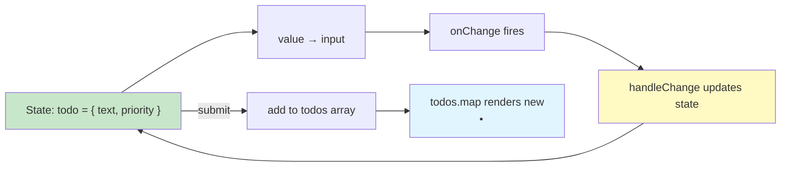
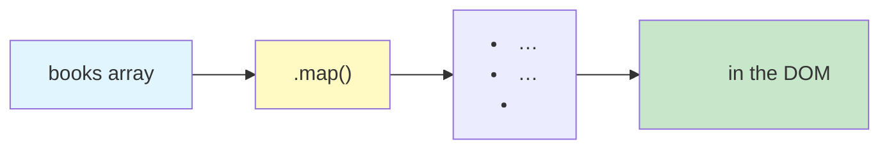
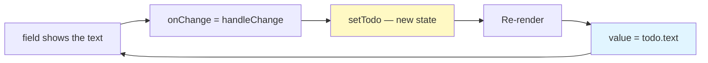

# Lab 3: Lists, Keys & Forms

**Difficulty: Beginner | ~45 min | Requires Lab 2**

## 1. Problem Statement / Use Case Overview

So far your ShelfWise screens have at most two fixed widgets. Real UIs are full of **collections** — a stock list, an order list, a team directory — and real apps need **forms** — "restock this item", "submit a request", "add a note". Writing each book as its own `<li>` by hand is fine for five items and absurd for fifty. And a form whose value lives only in the browser is useless to React: the app must *know* what the user typed.

Two core React skills fix both problems:

- **Rendering lists with `.map()`** — take an array of records and turn each one into JSX automatically, tagging each element with a **`key`** so React can keep track of it.
- **Controlled components** — forms where React state *is* the source of truth for every input, select, and textarea. React listens to each field's `onChange`, updates state, and feeds the value straight back.

In this lab you build:

- **`BookList`** — a static list of five favorite books rendered with `.map()` and unique `key`s.
- **`TodoForm`** — a fully **controlled** todo form: a text input and a **priority dropdown** (`Low` / `Medium` / `High`), both managed by **one shared `onChange` handler** that uses each field's `name`. Submitting adds the todo to a state-held array, clears the input, and re-renders the growing list below the form.

## 2. Input Data

Two kinds of data appear here.

**Static sample data** — the five books, declared once as a plain array of objects in `BookList.jsx`:

```js
const books = [
  { id: 1, title: 'Clean Code' },
  { id: 2, title: 'The Pragmatic Programmer' },
  { id: 3, title: "You Don't Know JS" },
  { id: 4, title: 'Eloquent JavaScript' },
  { id: 5, title: 'Refactoring' },
];
```

| Field | Type | Purpose |
|---|---|---|
| `id` | number | a **stable, unique key** for the list element |
| `title` | string | the text shown in the `<li>` |

**Form state** — owned by `TodoForm`, starting empty:

| State | Initial value | Shape |
|---|---|---|
| `todos` | `[]` | array of `{ id, text, priority }` records, grows on every submit |
| `todo` | `{ text: '', priority: 'Low' }` | the draft being typed *right now* in the form |

Each submitted todo gets `id: Date.now()` — the current timestamp in milliseconds, a quick and collision-proof-enough unique id for this lab (in Lab 4 you'll meet better identity strategies).

## 3. Processing

- **Step 1 — `BookList`:** Declare the five-book array, then render it with `books.map(book => <li key={book.id}>{book.title}</li>)` inside a `<ul>`, so JSX generates the whole list instead of you hand-writing five `<li>`s.
- **Step 2 — `TodoForm`:** Set up two pieces of state (`todos` and `todo`), and make the text input **controlled**: `value={todo.text}` + `onChange={handleChange}`.
- **Step 3 — Submit handler:** `handleSubmit` calls `e.preventDefault()` (stop the page reload), ignores empty text, appends `{ id, text, priority }` to `todos` with the spread pattern `[...todos, newTodo]`, then clears the text field.
- **Step 4 — Display todos:** Render `todos.map(...)` below the form as `<li>`s with unique keys, so the list grows live after every submit.
- **Step 5 — Multiple inputs:** Add the `<select name="priority">` dropdown and let **one** `handleChange` manage both fields by reading `e.target.name` (the `name` attribute) and the computed-property trick `{ ...todo, [e.target.name]: e.target.value }`.



## 4. Output

Replace the Vite starter page entirely. The **initial** page (captured from the running app while verifying this lab):

```
React Lab 3: Lists, Keys & Forms

A static book list rendered with .map(), and a todo form that is fully
controlled by React state.

My Five Favorite Books
Clean Code
The Pragmatic Programmer
You Don't Know JS
Eloquent JavaScript
Refactoring

Todo Form
Low
Medium
High
Add todo
```

The initial DOM structure:

```
<div id="root">
  <main class="lab">
    <h1>React Lab 3: Lists, Keys & Forms</h1>
    <p class="intro">A static book list rendered with .map(), ...</p>
    <section class="console">
      <h2>My Five Favorite Books</h2>
      <ul>
        <li>Clean Code</li>
        <li>The Pragmatic Programmer</li>
        <li>You Don't Know JS</li>
        <li>Eloquent JavaScript</li>
        <li>Refactoring</li>
      </ul>
    </section>
    <section class="console">
      <h2>Todo Form</h2>
      <form>
        <input type="text" name="text" placeholder="What needs doing?" value="">
        <select name="priority">Low / Medium / High</select>
        <button type="submit">Add todo</button>
      </form>
      <ul></ul>                      ← empty: nothing submitted yet
    </section>
  </main>
</div>
```

What happens while using it (all verified by actually typing and clicking in Chrome):

1. **Books list:** the five `<li>`s already sit on screen — `.map()` produced them from the array, no hand-written `<li>`s.
2. **Typing** "Buy milk": the input shows it instantly (controlled round trip).
3. **Choosing** Medium from the dropdown: the select reads "Medium".
4. **Clicking Add todo:** a new `<li>Buy milk — Medium</li>` appears below the form, the **input is cleared**, and the dropdown **keeps** its value.
5. Submitting with an **empty** input does nothing — the guard rejects it.
6. Adding "Rewrite notes" and "Call dentist — High" grows the list in order:
   - `Buy milk — Medium`
   - `Rewrite notes — Medium`
   - `Call dentist — High`

## 5. Tech Stack

- **React 18.3.1** — `useState` for the form and list state.
- **react-dom 18.3.1** — mounting and rendering via `createRoot()`.
- **JSX** — markup, `.map()` contents, and event props (`onChange`, `onSubmit`).
- **Vite 8** — dev server with hot reload.
- **npm / Node.js 18+** — dependency install and runner.

Nothing new to install — lists and forms are built purely from React Core.

## 6. Underlying Concepts

### Rendering a collection with `.map()`

`arr.map(fn)` runs `fn` on every item and returns a new array of results. In JSX you map **records to JSX elements**:

```jsx
{books.map((book) => (
  <li key={book.id}>{book.title}</li>
))}
```

React renders one `<li>` per book. This is the same idea as `console.log`ging each item — but the output is reusable UI instead of text. The whole `<ul>` is generated from data, so changing the array (reorder, add, delete) is the only edit you make.

### Keys — the identity tag every list element needs

React reuses existing DOM nodes when a list re-renders. **`key`** tells React *which item is which*, so it can match old and new items instead of rebuilding the whole list.

- Give key the item's own **stable unique id** (`book.id`), not `index`.
- **Why not index?** The index is just "position". If you insert, remove, or reorder items, positions shift and React pairs the wrong old/new items — a silent source of bugs (wrong rows keeping wrong state, for example).
- Keys must be **unique among siblings** and are a props-only hint React reads for reconciliation — they **never** appear in the DOM, and you can't read them with `props` inside the component.



### What makes a component "controlled"

A **controlled component** is one whose displayed value is *owned by React state*, not by the browser:

```jsx
<input value={todo.text} onChange={handleChange} />
```

- `value` pins the field to state.
- `onChange` (fires on every keystroke / selection) feeds what the user typed back into state.
- State updates → re-render → `value` is set again.

Nothing the user types ever lives only "in the DOM" — state is the single source of truth. (The opposite, an **uncontrolled** field with no `value` prop where the browser owns the text, is an anti-pattern in this course because React can't see the data.)



### `onSubmit` and `preventDefault`

Forms in React still do what browser forms do — including **native page reload on submit**. You stop that with the submit handler:

```jsx
function handleSubmit(e) {
  e.preventDefault();            // no page reload — this is a React app now
  if (!todo.text.trim()) return; // guard: ignore empty drafts
  setTodos([...todos, { id: Date.now(), text: todo.text, priority: todo.priority }]);
  setTodo({ ...todo, text: '' }); // clear the text field, keep the priority
}
```

- `onSubmit={handleSubmit}` fires when the form is submitted (the `Add todo` button has `type="submit"`, so clicking it submits).
- `e.preventDefault()` blocks the reload that would wipe your whole React app.
- The **spread pattern** `[...todos, newTodo]` builds a brand-new array containing the old items plus the new one — you never mutate `todos` (mirroring Lab 2: state is only changed through its updater, never by editing in place).

### Managing multiple inputs with one handler

Two fields, one `onChange`: the `name` attribute is the field's key inside the state object.

```jsx
<input name="text" value={todo.text} onChange={handleChange} />
<select name="priority" value={todo.priority} onChange={handleChange} />

function handleChange(e) {
  setTodo({ ...todo, [e.target.name]: e.target.value });
}
```

- `e.target.name` is `"text"` or `"priority"` depending on which field changed.
- `[e.target.name]` is **computed property syntax**: the object property *named by the string*. `{ ...todo, text: 'Buy milk' }` when the text field changed; `{ ...todo, priority: 'High' }` when the dropdown did.
- Adding a third field later costs exactly two lines: its JSX and its `name` attribute — the handler never grows.

## 7. Prerequisites

- **Lab 1 and Lab 2 completed.** You know function components, props, `useState`, `onClick`, and the `&&` conditional from the last lab.
- Same tooling: **Node.js 18+**, **npm**, and the `react-lab-1` / `react-lab-2` Vite project you already have (reuse either by replacing `src`).

## 8. Environment / Dependencies Setup

The setup is identical to Labs 1 and 2 — reuse a working project, or scaffold a fresh one:

```bash
npm create vite@latest react-lab-3 -- --template react
cd react-lab-3
npm install
npm install react@^18.3.1 react-dom@^18.3.1
npm run dev
```

Open the printed URL (default `http://localhost:5173`). Hot reload refreshes on every save.

## 9. Step-wise Development Instructions

### Step 1 — `BookList`: render a list with `.map()` and keys

Create `src/BookList.jsx`. The array lives at the top of the file; the component maps it into `<li>`s:

```jsx
const books = [
  { id: 1, title: 'Clean Code' },
  { id: 2, title: 'The Pragmatic Programmer' },
  { id: 3, title: "You Don't Know JS" },
  { id: 4, title: 'Eloquent JavaScript' },
  { id: 5, title: 'Refactoring' },
];

function BookList() {
  return (
    <section className="console">
      <h2>My Five Favorite Books</h2>
      <ul>
        {books.map((book) => (
          <li key={book.id}>{book.title}</li>
        ))}
      </ul>
    </section>
  );
}

export default BookList;
```

- Inside the `{ ... }` expression, `books.map(...)` returns one `<li>` per book, so React renders the full `<ul>` in one pass.
- `key={book.id}` gives each `<li>` a stable identity (Section 6). Try reordering the array to watch the DOM update — the keys keep React's matching correct.
- The `key` is the whole difference between "a list that works" and "a list that silently misbehaves": never use the index of `map` here.

### Step 2 — `TodoForm`: two pieces of state, one controlled input

Create `src/TodoForm.jsx`. First the state and the shared change handler:

```jsx
import { useState } from 'react';

function TodoForm() {
  // todos is the finished list; todo is the draft being typed right now
  const [todos, setTodos] = useState([]);
  const [todo, setTodo] = useState({ text: '', priority: 'Low' });

  // one shared handler: the input's name decides which field to update
  function handleChange(e) {
    setTodo({ ...todo, [e.target.name]: e.target.value });
  }
```

- `todos` holds every submitted todo; `todo` is only the *draft* being typed.
- `handleChange` updates whichever field changed (Step 5 explains `[e.target.name]`).

Now the return JSX with the controlled text input:

```jsx
  return (
    <section className="console">
      <h2>Todo Form</h2>
      <form onSubmit={handleSubmit}>
        <input
          type="text"
          name="text"
          placeholder="What needs doing?"
          value={todo.text}
          onChange={handleChange}
        />
```

The input is **controlled**: `value={todo.text}` and `onChange={handleChange}`. Every keystroke goes `change → handleChange → setTodo → re-render → value`, so React always knows the draft.

### Step 3 — The submit handler

Add the handler that turns a draft into a real todo:

```jsx
  function handleSubmit(e) {
    e.preventDefault();
    if (!todo.text.trim()) return;
    setTodos([...todos, { id: Date.now(), text: todo.text, priority: todo.priority }]);
    setTodo({ ...todo, text: '' });
  }
```

Walking through it:

- `e.preventDefault()` — stops the browser's default form behavior (page reload), which would destroy the React app.
- `if (!todo.text.trim()) return;` — a guard: a blank (or space-only) draft is ignored instead of becoming an empty todo.
- `setTodos([...todos, {...}])` — the **spread append**: a fresh array with all old todos plus the new one, given an `id` from `Date.now()`.
- `setTodo({ ...todo, text: '' })` — clears the text field while **keeping** the chosen priority.

### Step 4 — Display the todos

Render the growing list below the form with `.map()` and keys:

```jsx
      <ul>
        {todos.map((t) => (
          <li key={t.id}>
            {t.text} — {t.priority}
          </li>
        ))}
      </ul>
    </section>
  );
}

export default TodoForm;
```

- `todos` starts `[]`, so the `<ul>` is empty on first paint.
- After the first submit, one `<li>` appears; after the third, three do — each with `key={t.id}`, the todo's own stable id.
- The `—` is the em-dash separator producing `Buy milk — Medium`.

### Step 5 — Multiple inputs with one shared handler

The `<select>` dropdown: same `value` + `onChange` + `name` recipe as the text input:

```jsx
        <select name="priority" value={todo.priority} onChange={handleChange}>
          <option value="Low">Low</option>
          <option value="Medium">Medium</option>
          <option value="High">High</option>
        </select>
        <button type="submit">Add todo</button>
      </form>
```

And the piece that makes *both* fields work with *one* handler — the computed-property update in `handleChange`:

```jsx
setTodo({ ...todo, [e.target.name]: e.target.value });
```

`e.target.name` is the string `"text"` or `"priority"`; `[e.target.name]` makes that string the object property. Change on the text input → `{ ..., text: newText }`; change on the select → `{ ..., priority: newPriority }`. The handler stays one function no matter how many fields you add.

### Wire it up — `App` and `index.css`

Replace `src/App.jsx` with a composition of the two sections (the `main` element is the single root, exactly like Lab 2's layout):

```jsx
import BookList from './BookList.jsx';
import TodoForm from './TodoForm.jsx';

function App() {
  return (
    <main className="lab">
      <h1>React Lab 3: Lists, Keys & Forms</h1>
      <p className="intro">
        A static book list rendered with .map(), and a todo form that is fully
        controlled by React state.
      </p>
      <BookList />
      <TodoForm />
    </main>
  );
}

export default App;
```

Replace `src/index.css`:

```css
:root {
  font-family: 'Segoe UI', Roboto, Helvetica, Arial, sans-serif;
  line-height: 1.6;
  color: #1f2933;
  background: #f4f6f8;
}

body {
  margin: 0;
}

.lab {
  max-width: 720px;
  margin: 0 auto;
  padding: 24px;
}

.console {
  background: #ffffff;
  border-radius: 8px;
  box-shadow: 0 1px 3px rgba(0, 0, 0, 0.12);
  padding: 20px 24px;
  margin: 20px 0;
}

form {
  display: flex;
  flex-wrap: wrap;
  gap: 8px;
  margin-bottom: 12px;
}

form input,
form select,
form button {
  padding: 8px 10px;
  border: 1px solid #cbd2d9;
  border-radius: 6px;
  font-size: 1rem;
}

form input[type='text'] {
  flex: 1 1 180px;
}

form button {
  border: none;
  background: #1e3a5f;
  color: #ffffff;
  cursor: pointer;
}
```

`main.jsx` stays exactly as the scaffold created it. Save everything and run the Section 4 checklist: type a todo, pick a priority, submit, watch the `<li>` appear and the input clear — then try submitting an empty form (nothing happens) and add two more todos.

## 10. Optional Exercise

Let the user remove a todo. Give every rendered `<li>` a small delete button that calls `setTodos` with the **filtered** array:

```jsx
<ul>
  {todos.map((t) => (
    <li key={t.id}>
      {t.text} — {t.priority}
      <button onClick={() => setTodos(todos.filter((x) => x.id !== t.id))}>✕</button>
    </li>
  ))}
</ul>
```

- `.filter((x) => x.id !== t.id)` returns a **new array** of every todo **except** the one whose button was clicked — the immutable cousin of the `[...todos, newTodo]` spread, removing instead of appending.
- Because it returns a new array (it never mutates `todos`), the updater re-renders with the item gone, and the remaining keys stay valid.

Add three todos, then delete the middle one and the first one — verify only the right items disappear, the text and priority of the survivors are untouched, and ordering is preserved.

## 11. What We Learnt

- **`.map()` turns arrays into lists:** `books.map(book => <li>…)` generates one JSX element per record — no hand-written `<li>`s.
- **Every list element needs a `key`** — its own stable id, never the `map` index — so React can match old and new items correctly when the list re-renders.
- **A controlled component is state-shaped:** `value` pins the field to React state and `onChange` feeds user input back into it; the DOM is never the source of truth.
- **`onSubmit` + `preventDefault`** stop the browser reload and hand submission to your handler. `type="submit"` makes the button trigger it.
- **Append with the spread, never mutate:** `[...todos, newTodo]` builds a fresh array; state is only ever changed through its updater.
- **One handler for many fields:** `name` + computed property `[e.target.name]` routes any field's change to the right slice of state — add a field with two lines, not a new handler.
- **Strings are trimmed and guards are cheap:** `!todo.text.trim()` skips blank drafts before they reach the list.
- **`Date.now()` as an id** is a quick unique key for new records — stable per item, colliding-free enough for a notebook app.