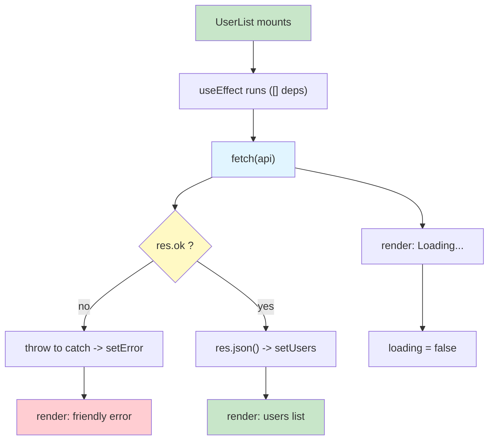
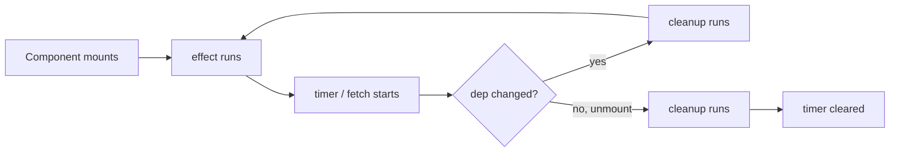

# Lab 4: useEffect & Fetching Data from an API

**Difficulty: Beginner | ~50 min | Requires Lab 3**

## 1. Problem Statement / Use Case Overview

Everything you built in Labs 1–3 was **self-contained**: props in, JSX out,
state that React manages internally. Real apps always need things that live
*outside* React — the current wall-clock time, or a list of users hosted on
some distant server. These are called **side effects**: work that doesn't just
compute the next render, but reaches out into the world (a timer, a network
request, browser storage) and brings data back.

React gives your component a dedicated tool for this: **`useEffect`**. It runs
your side-effecting code at the right moments — when the component first
appears, and when the things your effect depends on change — and it lets you
**clean up** after itself, so a timer or a request can never leak and keep
running on a removed component.

In this lab you build two live widgets for the ShelfWise dashboard:

- **`Clock`** — a ticking clock that uses `useEffect` + `setInterval` to update
  every second, with a `clearInterval` **cleanup** so the timer dies with the
  component.
- **`UserList`** — a **Team Directory** that `fetch`es users from the free
  `jsonplaceholder.typicode.com/users` API, runs the request **once on mount**
  (empty dependency array), shows **`Loading...`** while waiting, handles a
  **failed request gracefully** with a friendly message instead of crashing,
  and finally renders each teammate's **name and email** as a list.

## 2. Input Data

**`Clock`** — no input data at all. The only data is `now` in state, initialised
with the current `Date` and refreshed by the interval every second.

**`UserList`** — the input is a **live HTTP response** from:

```
GET https://jsonplaceholder.typicode.com/users
```

JSONPlaceholder (free, no key) returns an array of objects when it succeeds:

| Field used | Type | Example from the real response |
|---|---|---|
| `id` | number | `1` |
| `name` | string | `"Leanne Graham"` |
| `email` | string | `"Sincere@april.biz"` |

The response is an **array**, which is exactly what `.map()` (Lab 3) expects —
that pairing drives Step 5. There is no input from the user; the "data in" is
whatever the server answers, and handling *that* uncertainty (loading, success,
failure) is the whole point of the lab.

## 3. Processing

- **Step 1 — `Clock`:** put `now` in state and start a `setInterval` inside
  `useEffect` that calls `setNow(new Date())` every second. Return a
  **cleanup** that calls `clearInterval(id)` so the timer stops when the
  component unmounts.
- **Step 2 — `UserList` component:** declare three pieces of state — `users`
  (array), `loading` (boolean, starts `true`), `error` (string or `null`) —
  then call `fetch(url)` inside a `useEffect` whose dependency array is **`[]`**
  (runs once, on mount). Check `res.ok`, `.catch()` stores the error message.
- **Step 3 — the error branch:** the render is a three-way `&&` branch —
  `Loading...` while `loading`, a friendly `Could not load users: ...` line when
  `error` is set (so a failure never crashes the app), otherwise the list.
- **Step 4 — `App.jsx` wiring:** render `<Clock />` and `<UserList />` inside
  the `<main>` shell with the intro paragraph.
- **Step 5 — styling:** `index.css` gives the two `section.console` cards their
  clean dashboard look, a large `tabular-nums` clock, and muted `.status`
  text for loading / error messages.


## 4. Output

The page (captured from the running app while verifying this lab):

```
React Lab 4: useEffect & Fetching Data

A ticking clock driven by an interval effect, and a user directory
fetched from a live API with loading and error states.

Clock
11:56:18 AM

Team Directory
Loading...
```

The **Clock** row refreshes every second (`11:56:18 AM` -> `11:56:19 AM` -> ...),
and `Loading...` is replaced almost immediately by the fetched directory:

```
Team Directory
Leanne Graham — Sincere@april.biz
Ervin Howell — Shanna@melissa.tv
Clementine Bauch — Nathan@yesenia.net
Patricia Lebsack — Julianne.OConner@kory.org
Chelsey Dietrich — Lucio_Hettinger@annie.ca
Mrs. Dennis Schulist — Karley_Dach@jasper.info
Kurtis Weissnat — Telly.Hoeger@billy.biz
Nicholas Runolfsdottir V — Sherwood@rosamond.me
Glenna Reichert — Chaim_McDermott@dana.io
Clementina DuBuque — Rey.Padberg@karina.biz
```

(all 10 users from the API, one `<li>` each, in `Name — email` form).

The final DOM structure of the directory section:

```
<section class="console">
  <h2>Team Directory</h2>
  <ul>
    <li><strong>Leanne Graham</strong> — Sincere@april.biz</li>
    <li><strong>Ervin Howell</strong> — Shanna@melissa.tv</li>
    ... (8 more) ...
  </ul>
</section>
```

What you should see while interacting:

1. On first paint: **`Loading...`** (brief — the request is fast, but the state
   machine always shows it until the response lands).
2. After the response: the ten `<li>` rows appear and the clock keeps ticking.
3. **Failure path:** when verification deliberately pointed the app at a URL
   that returns 404, the screen showed `Could not load users: Request failed
   with status 404` — no crash, clock still ticking. If the network is offline
   entirely, the message is `Could not load users: Failed to fetch`.
4. Watch the Network panel in DevTools: in development the request fires twice
   on mount. That is React `StrictMode` deliberately double-running effects to
   surface bugs; in production it mounts once.

## 5. Tech Stack

- **React 18.3.1** — `useState` + `useEffect` hooks.
- **react-dom 18.3.1** — mounting, rendering, and hook wiring.
- **JSX** — the markup and the conditional `&&` blocks.
- **Fetch API** — browser-native promises for the HTTP request; no library.
- **JSONPlaceholder API** — free test data source (`jsonplaceholder.typicode.com/users`),
  no API key required.

## 6. Underlying Concepts

### What a "side effect" is

A component's `render()` must be **pure**: given the same props and state, it
always returns the same JSX. Side effects are the escape hatch — the things a
component needs to do that have nothing to do with computing markup: starting a
timer, fetching from the network, saving to `localStorage`. React runs these
for you, outside the render, at controlled moments.

### `useEffect` and its dependency array

`useEffect(effect, deps)` runs `effect` **after** the browser has painted:

- `[]` (empty) — run once after the first render (mount).
- `[a, b]` — run once, and again every time `a` or `b` changes.
- no second argument — run after *every* render (rare, avoid).

The **cleanup** function you return from the effect runs *before* the next
effect run and *before* unmount. That ordering is what makes effects leak-free:
our interval is created, and the cleanup clears it.



### The loading / error / success state machine

Network data arrives asynchronously, so a component needs three renderable
states:

- **loading** — render `Loading...`, data not ready.
- **error** — render a friendly message, app does not crash.
- **success** — render the real list.

We model it with two booleans/flags (`loading`, `error`) plus the data array.
`loading` starts `true` and only becomes `false` in `.finally()` — so it is
always accurate, success or failure.

### Why the clock cleanup matters

Without `return () => clearInterval(id)`, mounting/unmounting the Clock would
leave invisible timers running forever, calling `setNow` on an unmounted
component. React 18 logs a warning for state updates on unmounted components,
and it is a classic memory leak. The cleanup is the whole point of the example.

## 7. Prerequisites

- Lab 3 completed (`.map()` with `key`, event handlers, props).
- React hooks `useState` in use (Labs 2–3).
- Comfortable with JS arrow functions and promise `.then/.catch/.finally`.
- A working Vite project identical to the one Lab 3 ended with
  (`main.jsx` importing `src/index.css` and rendering `<App />` in
  `StrictMode`, `src/App.jsx` already wired).
## 8. Environment / Dependencies Setup

Create the same Vite app as in Lab 3 (from scratch is cleanest):

```bash
npm create vite@8 lab4-effect-fetch -- --template react
cd lab4-effect-fetch
npm install
npm install react@18.3.1 react-dom@18.3.1
npm run dev
```

- Node.js 18+ is required (bundled `npm`).
- No other runtime dependencies — `fetch` is built into every modern browser.
- Versions in this lab were verified against React 18.3.1 / react-dom 18.3.1,
  Vite 8, Chrome.
- Delete the counter starter in `App.jsx`; the files below replace the starter
  contents.

## 9. Step-wise Development Instructions

### Step 1 — the `Clock` component

Create `src/Clock.jsx`:

```jsx
import { useState, useEffect } from 'react';

function Clock() {
  // now holds the current time; the interval keeps it fresh
  const [now, setNow] = useState(new Date());

  useEffect(() => {
    const id = setInterval(() => setNow(new Date()), 1000);
    // cleanup runs on unmount (and before the effect re-runs)
    return () => clearInterval(id);
  }, []);

  return (
    <section className="console">
      <h2>Clock</h2>
      <p className="clock">{now.toLocaleTimeString()}</p>
    </section>
  );
}

export default Clock;
```

`useState(new Date())` starts `now` at the current time. The effect starts a
1-second interval that replaces `now` — and the returned `clearInterval` is the
cleanup that stops it on unmount. Render `toLocaleTimeString()` so it reads
like `11:56:18 AM`.

### Step 2 — `UserList` state + the fetch effect

Create `src/UserList.jsx` with the three pieces of state and the effect:

```jsx
import { useState, useEffect } from 'react';

function UserList() {
  const [users, setUsers] = useState([]);
  const [loading, setLoading] = useState(true);
  const [error, setError] = useState(null);

  useEffect(() => {
    // [] means "run once, when the component mounts"
    fetch('https://jsonplaceholder.typicode.com/users')
      .then((res) => {
        if (!res.ok) throw new Error(`Request failed with status ${res.status}`);
        return res.json();
      })
      .then((data) => setUsers(data))
      .catch((err) => setError(err.message))
      .finally(() => setLoading(false));
  }, []);

  return (
    <section className="console">
      <h2>Team Directory</h2>
      {loading && <p className="status">Loading...</p>}
      {error && <p className="status">Could not load users: {error}</p>}
      {!loading && !error && (
        <ul>
          {users.map((user) => (
            <li key={user.id}>
              <strong>{user.name}</strong> — {user.email}
            </li>
          ))}
        </ul>
      )}
    </section>
  );
}

export default UserList;
```

Why each line:

- `fetch(url)` returns a **promise** for the HTTP response — it does not wait.
- `res.ok` is `true` for 200–299 only; a 404 is still a "completed" request, so
  we must throw manually. The thrown error skips to `.catch`.
- `.then((data) => setUsers(data))` stores the array (the real name and email
  fields we read at render).
- `.catch` stores the message in `error` — this branch handles both `res.ok`
  failures and `TypeError: Failed to fetch` when offline.
- `.finally(() => setLoading(false))` always runs last, so `loading` becomes
  `false` whether the request succeeded or failed.

### Step 3 — the error state (friendly instead of crash)

The render is a **three-way branch**: `loading` while waiting, `error` when the
request failed, otherwise the `<ul>`. Because `error` starts `null`, the middle
line renders nothing until an error actually arrives. Nothing throws, no
red-screen, the clock next to it keeps ticking.

### Step 4 — wire both into `App.jsx`

Replace `src/App.jsx`:

```jsx
import Clock from './Clock.jsx';
import UserList from './UserList.jsx';

function App() {
  return (
    <main className="lab">
      <h1>React Lab 4: useEffect & Fetching Data</h1>
      <p className="intro">
        A ticking clock driven by an interval effect, and a user directory
        fetched from a live API with loading and error states.
      </p>
      <Clock />
      <UserList />
    </main>
  );
}

export default App;
```

### Step 5 — add the styling

Replace `src/index.css`:

```css
:root {
  font-family: 'Segoe UI', Roboto, Helvetica, Arial, sans-serif;
  line-height: 1.6;
  color: #1f2933;
  background: #f4f6f8;
}

body {
  margin: 0;
}

.lab {
  max-width: 720px;
  margin: 0 auto;
  padding: 24px;
}

.console {
  background: #ffffff;
  border-radius: 8px;
  box-shadow: 0 1px 3px rgba(0, 0, 0, 0.12);
  padding: 20px 24px;
  margin: 20px 0;
}

.clock {
  font-size: 2rem;
  font-weight: 600;
  margin: 8px 0 0;
  font-variant-numeric: tabular-nums;
}

.status {
  color: #52606d;
  margin: 8px 0 0;
}

ul {
  padding-left: 20px;
  margin: 8px 0 0;
}

li {
  margin: 4px 0;
}
```

Save everything and check `http://localhost:5173` — the clock ticks, the
directory loads, and DevTools shows the requests under **Network** (twice on
mount, StrictMode).
## 10. Optional Exercise — a Retry button

Make the directory recover from a failure: add a "Try again" button that
re-runs the effect. The trick is to put a counter in the dependency array, so
changing it forces the effect to re-run.

Modify `src/UserList.jsx`:

1. Add a `tries` counter: `const [tries, setTries] = useState(0);`
2. Change the effect to depend on it — `}, []);` becomes `}, [tries]);`. Now the
   effect runs on mount **and every time `tries` changes**. Because it re-runs,
   it also needs to reset its own state: add `setLoading(true); setError(null);`
   as the first two lines inside the effect, so the UI returns to "waiting".
3. Show the button only while in the error branch:

```jsx
{error && (
  <div>
    <p className="status">Could not load users: {error}</p>
    <button type="button" onClick={() => setTries(tries + 1)}>Retry</button>
  </div>
)}
```

Clicking **Retry** bumps `tries`, the dependency change re-runs the effect, and
the request fires again.

**Verified:** intercepting the API in testing and failing the first request with
a 500, the app showed the message (mount actually fires the request twice under
StrictMode — both 500); after clicking Retry, a fresh request went out and all
10 users rendered. The recovery path works end to end.

## 11. What We Learnt

- Side effects are the work that lives outside the render pass; React runs them
  via `useEffect`, never during render.
- The dependency array controls *when* an effect runs: `[]` once on mount,
  values re-run it on change.
- An effect can return a **cleanup** that runs before the next effect and on
  unmount — this is how `setInterval`/`clearInterval` pairs stay leak-free.
- `fetch` returns a promise; a non-2xx response still counts as a completed
  request, so you must check `res.ok` yourself.
- Loading and error are renderable states, not crashes — a three-way branch
  (`loading` / `error` / data) is the standard data-fetching pattern.
- `.finally()` guarantees `loading` ends `false` in both success and failure.
- In development, React `StrictMode` mounts components twice on purpose — you
  see the fetch fire twice; production fires it once.
