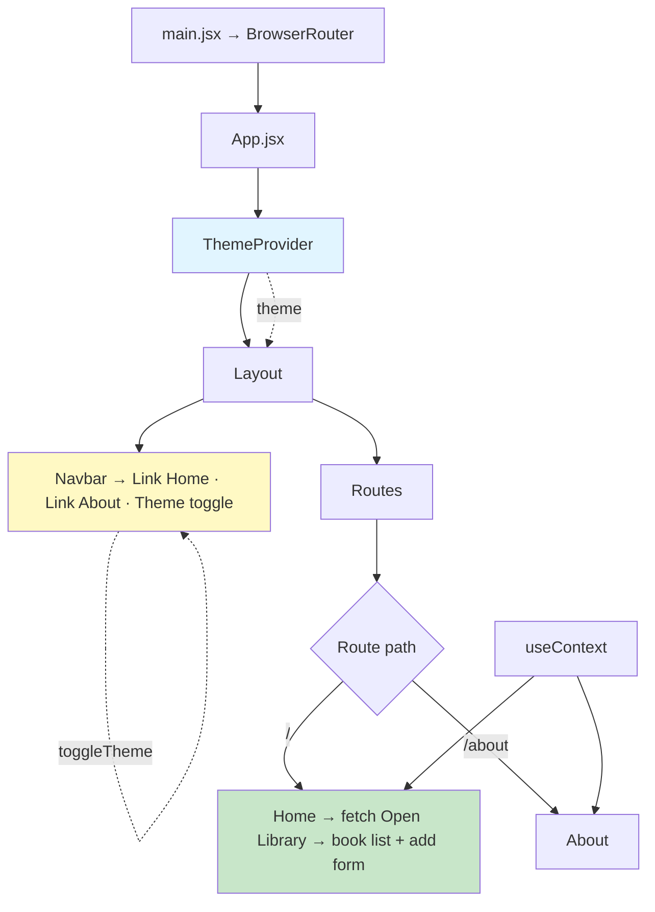
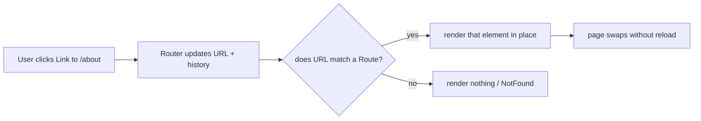
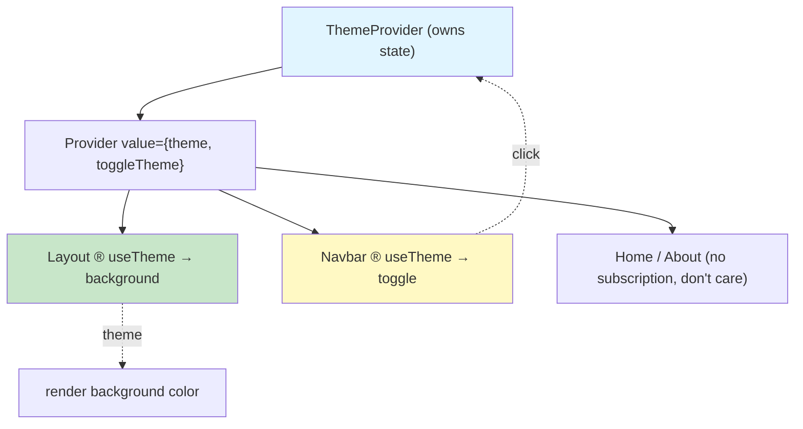

# Lab 5: Routing, Context & the Book Club Mini Project

**Difficulty: Beginner | ~60-70 min | Requires Lab 4**

## 1. Problem Statement / Use Case Overview

Every app you have built so far (Labs 1-4) has been a **single page**: one
screen, one component tree, everything visible at once. Real products are
**multi-page** — a landing page, an about page, a settings page — yet a modern
branded app never feels like the old web, because switching page never reloads
the browser. You also have *shared* data — a theme, a logged-in user — that
every page needs to read, without threading it through a dozen props.

Lab 5 turns the ShelfWise work into a real application. You build **Book Club**,
a mini project that unites every earlier lab and adds the two missing pieces:

- **React Router** lets the app have multiple pages — **Home** and **About** —
  navigated through a **navigation bar** of `<Link>`s, with **no full browser
  reload**.
- **Context** (via `useContext`) stores the **selected theme** (`light` /
  `dark`) once, at the top, and lets any page and the nav bar read and flip it
  instantly — the theme changes the page background color.

Along the way you also style it two ways: a **`styles.css`** file applied with
`className`, and at least one **inline style** (a JavaScript object bound to
`style={...}`) for the theme-driven background, showing both ways React
controls appearance.

## 2. Input Data

Three kinds of input feed this app:

1. **Live API data — the reading list.** Home fetches real book results from
   the free Open Library search API (no key required):

   ```
   GET https://openlibrary.org/search.json?q=react&limit=4
   ```

   The response is one object whose `docs` property holds an array of book
   results; we read `key` (stable id), `title`, and `author_name` from each:

   | Field | Type | Example from the real response |
   |---|---|---|
   | `docs[].key` | string | `"/works/OL1781495W"` |
   | `docs[].title` | string | `"Learning React"` |
   | `docs[].author_name` | array | `["Alex Banks"]` |

2. **User input — the add-book form.** The learner types a book title, which is
   appended to the list as a new entry with `author: 'Club pick'`.

3. **User choice — the theme.** `light` or `dark` held in Context state; no
   server involved.

(While verifying this lab, the Open Library request was intercepted with a
fixed 4-book payload so the tests stay deterministic; interacting with the
lab app hits the real API.)

## 3. Processing

The build has five steps, matching the structure you will type in Section 9:

- **Step 1 — CSS styling:** write `styles.css`, import it into `App.jsx`
  (which imports it after `main.jsx`; here we let `main.jsx` load it so CSS is
  bundled before React mounts), and use `className` in at least two
  components (`.navbar`, `.page`, `.theme-btn`, `.add-form`).
- **Step 2 — an inline style:** bind a JS object to `style` so the page
  background is controlled by the `theme` state — the React way to change
  appearance dynamically.
- **Step 3 — React Router:** install `react-router-dom`, wrap the app in
  `<BrowserRouter>`, render `<Routes>/<Route>` for `/` (Home) and `/about`
  (About), and build a `<Navbar>` of `<Link>`s. Clicking a link swaps the page
  in place; the URL changes but the browser never reloads.
- **Step 4 — Theme Context:** create `ThemeContext` with a `ThemeProvider`
  holding `theme` + `toggleTheme` in state, and a `useTheme()` hook. The
  navbar's toggle button calls `toggleTheme`; the layout reads `theme` and
  applies the matching background color. Every consumer re-renders when the
  value changes.
- **Step 5 — the Book Club mini project:** wire everything together — Home
  fetches and lists books with a loading/error guard (Labs 3-4 patterns), the
  add form updates the list (Labs 2-3), About is a plain component (Lab 1),
  and the theme travels across every page (Context).



## 4. Output

The running app (captured on a real headless Chrome while verifying this lab):

```
Book Club  Home  About  [Light/Dark toggle button]
   ─────────────────────────────
Home
[ Add a book title............... ] [ Add ]

  • React — Sir Max Beerbohm
  • Learning React — Alex Banks
  • Literature — Laurie G. Kirszner
  • React and React Native — Adam Boduch
```

- **Loading / failure:** while the request is pending the card shows
  `Loading...`; if the network fails it shows
  `Could not load books: <message>` instead of a crash (the Lab 4 pattern).
- **Adding a book:** typing `The Hobbit` and clicking **Add** inserts
  `The Hobbit — Club pick` as a fifth row.
- **Navigation:** clicking **About** changes the URL to localhost:5173/about,
  shows the About paragraph, and — verified in testing — the page object never
  reloaded (a sentinel variable set before navigating was still present after,
  and the route changed client-side).
- **Theme toggle:** the navbar button shows `Dark` in light mode. Clicking it
  paints the page background from `rgb(244, 246, 248)` (#f4f6f8, light) to
  `rgb(17, 24, 39)` (#111827, dark) instantly, the button label flips to
  `Light`, and the choice *persists across pages* — navigating Home→About→Home
  keeps the theme, because both routes read the same Context value.

One thing you will notice: a book you add with the form **disappears if you
navigate away from Home and come back** (verified in testing). That is because
Home's `books` state lives inside the component, and React unmounts Home when
you leave the route. This is the exact gap Section 10's optional exercise
fixes.
## 5. Tech Stack

- **React 18.3.1** — components, hooks (`useState`, `useEffect`,
  `useContext`).
- **react-dom 18.3.1** — `createRoot` mounting.
- **react-router-dom 7.18.4** — `BrowserRouter`, `Routes`, `Route`, `Link`.
- **Vite 8** — dev server + bundling.
- **CSS** — plain `styles.css` imported by `main.jsx`.
- **Open Library API** — free book search (`openlibrary.org/search.json`), no
  key.
- **Fetch API** — browser-native HTTP, no library.

All versions verified in this exact combination during lab testing.

## 6. Underlying Concepts

### Multi-page apps vs. single-page apps

A traditional website navigates by asking the server for an entire new HTML
document — the browser throws away the current page, loads fresh markup, and
re-runs every script. A React **single-page application (SPA)**
loads HTML/CSS/JS once. "Navigating" only swaps which component is on screen
and pushes the new URL into the browser's history menu. No full reload means
no flash of white, no lost in-memory state, and a snappy feel.

### React Router

React Router keeps the URL and the on-screen component in sync:

- `<BrowserRouter>` — listens to the browser's URL/history and gives every
  nested component router context.
- `<Routes>` + `<Route path element>` — declare which component renders for
  which URL path (`/` → Home, `/about` → About).
- `<Link to>` — renders a real `<a href>` but intercepts the click, updates
  the URL via the History API, and asks React Router to render the matching
  route — no browser navigation.



### Context and why prop drilling hurts

Passing data down through props works, but for **app-wide** data (theme,
logged-in user, locale) it means threading props through every middle
component that never uses them — **prop drilling**. Context is the
subscription model that removes it:

- `createContext(default)` makes a context object.
- `<Context.Provider value={...}>` (usually inside a dedicated provider
  component) **provides** the value to the whole subtree below it.
- `useContext(Context)` inside any child **consumes** the nearest provider's
  value — and the component re-renders whenever that value changes.

Only the components that call `useTheme()` subscribe; the rest of the tree
ignores the theme entirely.



### Two ways to apply CSS in React

- **`className` + a stylesheet** — the everyday way. `styles.css` declares
  classes (`.navbar`, `.page`, ...) and components opt in with
  `className="navbar"`. Static, readable, reusable.
- **Inline styles via a JS object** — `style={{ background: ... }}`. The outer
  `{...}` is JSX interpolation; the inner `{...}` is a JavaScript *object
  literal*. Property names are camelCase (`backgroundColor`, not
  `background-color`). Use this when the value comes from **JavaScript state**
  — exactly our theme. (For `background` we use the short form; the same rule
  applies to `background-color` → `backgroundColor`.)

### Why the theme must live in Context, not in Home

If `theme` were state inside Home, About could not read it, and navigating
away would reset it. Context stores it once, above the routes, so it never
depends on which page is mounted. The same reasoning applies to any value
several unrelated pages share — and to the reading list in Section 10.

## 7. Prerequisites

- Labs 2-4 completed: `useState` + events/Lists/forms/keys (Lab 3, needed for
  the list and the add form), `useEffect` + `fetch` + loading/error pattern
  (Lab 4, reused verbatim on Home).
- Basic CSS comfort (classes, flexbox shorthand).
- No accounts or API keys — Open Library and the theme are key-less.

## 8. Environment / Dependencies Setup

Create the same Vite app as in Lab 4 (cleanest from scratch):

```bash
npm create vite@8 lab5-book-club -- --template react
cd lab5-book-club
npm install
npm install react@18.3.1 react-dom@18.3.1 react-router-dom@7.18.4
npm run dev
```

- Node.js 18+, bundled `npm`.
- `react-router-dom` is the **only** new dependency (installed in Step 3 of
  the build; listing it here so the environment is complete before coding).
- Version-pinned against the combo tested for this lab: React/react-dom
  18.3.1, react-router-dom 7.18.4, Vite 8, Chrome.
## 9. Step-wise Development Instructions

The five build steps follow the plan in Section 3 exactly. All files are shown
exactly as verified; the final project is 166 lines across 7 files.

### Step 1 — CSS styling with `styles.css`

Create `src/styles.css`:

```css
:root { font-family: 'Segoe UI', Roboto, Helvetica, Arial, sans-serif; line-height: 1.6; color: #1f2933; }
body { margin: 0; }
.app { min-height: 100vh; color: #1f2933; transition: background 0.3s; }
.navbar { display: flex; align-items: center; gap: 18px; padding: 14px 24px; background: #ffffff; box-shadow: 0 1px 3px rgba(0, 0, 0, 0.12); }
.navbar .brand { font-size: 1.15rem; }
.navbar a { text-decoration: none; font-weight: 600; color: #2563eb; }
.theme-btn { margin-left: auto; padding: 6px 14px; border: 1px solid #cbd2d9; border-radius: 6px; background: #ffffff; cursor: pointer; }
.page { max-width: 720px; margin: 24px auto; padding: 20px 24px; background: #ffffff; border-radius: 8px; box-shadow: 0 1px 3px rgba(0, 0, 0, 0.12); }
.add-form { display: flex; gap: 8px; margin: 12px 0 16px; }
.add-form input { flex: 1; padding: 8px; border: 1px solid #cbd2d9; border-radius: 6px; }
.add-form button { padding: 8px 14px; border: 0; border-radius: 6px; background: #2563eb; color: #ffffff; cursor: pointer; }
.status { color: #52606d; margin: 8px 0 0; }
ul { padding-left: 20px; margin: 8px 0 0; }
li { margin: 4px 0; }
```

Each rule does one job:

- `:root` — project-wide font and default text color.
- `.app` — the full-height wrapper; `transition: background 0.3s` makes the
  theme flip feel smooth (the background itself changes from JavaScript in
  Step 4, not from this file).
- `.navbar` — the top bar: flexbox spreads the brand, links, and toggle in a
  row; `margin-left: auto` on `.theme-btn` pushes the button to the right end.
- `.page` — the white card each page's content sits in, centered with
  `max-width: 720px; margin: 24px auto`.
- `.add-form` + children — the Home form's one-row layout and blue submit
  button.
- `.status` — the muted gray used for `Loading...` / error messages.
- `ul` / `li` — simple list spacing.

This stylesheet is **loaded** at the entry point. Like Lab 4 (where `main.jsx`
imported `index.css`), `main.jsx` imports it — see its final version in Step 3.
(Importing it at the top of `App.jsx` instead also works; Vite bundles CSS
wherever it is imported.) The components opt in with `className`:
`<nav className="navbar">`, `<section className="page">`,
`<button className="theme-btn">`, `<form className="add-form">` — visible
throughout Steps 3-5, so Step 1's styling and the components connect as you
type.

### Step 2 — inline styling

Inline styles are a **JavaScript object** bound with `style`. Two pairs of
curly braces:

```jsx
<div className="app"
     style={{ background: theme === 'dark' ? '#111827' : '#f4f6f8' }}>
```

- outer `{ }` — JSX interpolation, "the value of this attribute is JS".
- inner `{ }` — an object **literal**; here one key `background` whose value is
  a ternary that picks a color from the current `theme`.

You will paste this exact div when building `App.jsx` in Step 5. It is the
piece of the app where *appearance comes from state*: flip the theme and the
background color flips with it — something a static `.css` rule cannot do on
its own. CSS properties use camelCase keys inside the object
(`backgroundColor`, not `background-color`).
### Step 3 — React Router

Install the router:

```bash
npm install react-router-dom@7.18.4
```

Replace `src/main.jsx` so the whole app is wrapped in `<BrowserRouter>` — the
router's ears on the URL — and load the stylesheet:

```jsx
import { StrictMode } from 'react'
import { createRoot } from 'react-dom/client'
import { BrowserRouter } from 'react-router-dom'
import './styles.css'
import App from './App.jsx'

createRoot(document.getElementById('root')).render(
  <StrictMode>
    <BrowserRouter>
      <App />
    </BrowserRouter>
  </StrictMode>,
)
```

Create the two pages. First `src/About.jsx` — a plain component (Lab 1 skills):

```jsx
function About() {
  return (
    <section className="page">
      <h2>About</h2>
      <p>
        Book Club is the mini project that ties together Labs 1–5: components,
        props, state, events, lists, forms, effects, API fetching, CSS, routing,
        and context.
      </p>
    </section>
  );
}

export default About;
```

Then `src/Home.jsx` — the page that fetches and lists books and owns the
"add a book" form. This is the Lab 4 pattern (state + `useEffect` +
`fetch` + loading/error branch) fused with the Lab 3 pattern (controlled
input + `.map()` with keys) and the Lab 2 rule (never mutate state —
`setBooks([...books, newBook])`):

```jsx
import { useState, useEffect } from 'react';

function Home() {
  const [books, setBooks] = useState([]);
  const [loading, setLoading] = useState(true);
  const [error, setError] = useState(null);
  const [title, setTitle] = useState('');

  useEffect(() => {
    // fetch real books from the free Open Library search API, once on mount
    fetch('https://openlibrary.org/search.json?q=react&limit=4')
      .then((res) => {
        if (!res.ok) throw new Error(`Request failed with status ${res.status}`);
        return res.json();
      })
      .then((data) =>
        setBooks(data.docs.map((d) => ({
          id: d.key,
          title: d.title,
          author: d.author_name?.[0] ?? 'Unknown',
        })))
      )
      .catch((err) => setError(err.message))
      .finally(() => setLoading(false));
  }, []);

  function handleSubmit(e) {
    e.preventDefault();
    if (!title.trim()) return; // ignore blank submissions
    setBooks([...books, { id: Date.now(), title: title.trim(), author: 'Club pick' }]);
    setTitle('');
  }

  return (
    <section className="page">
      <h2>Home</h2>
      <form className="add-form" onSubmit={handleSubmit}>
        <input
          placeholder="Add a book title"
          value={title}
          onChange={(e) => setTitle(e.target.value)}
        />
        <button type="submit">Add</button>
      </form>
      {loading && <p className="status">Loading...</p>}
      {error && <p className="status">Could not load books: {error}</p>}
      {!loading && !error && (
        <ul>
          {books.map((book) => (
            <li key={book.id}>
              <strong>{book.title}</strong> — {book.author}
            </li>
          ))}
        </ul>
      )}
    </section>
  );
}

export default Home;
```

Note `d.author_name?.[0] ?? 'Unknown'`: `author_name` is an *array* in the API
response (`["Alex Banks"]`), `?.[0]` takes its first element (or `undefined`),
and `?? 'Unknown'` substitutes a fallback for missing authors — a real-world
data-shape nuance.

Now the **navigation bar**, `src/Navbar.jsx`, using `<Link>`:

```jsx
import { Link } from 'react-router-dom';
import { useTheme } from './theme.jsx';

function Navbar() {
  const { theme, toggleTheme } = useTheme();

  return (
    <nav className="navbar">
      <strong className="brand">Book Club</strong>
      <Link to="/">Home</Link>
      <Link to="/about">About</Link>
      <button type="button" onClick={toggleTheme} className="theme-btn">
        {theme === 'light' ? 'Dark' : 'Light'}
      </button>
    </nav>
  );
}

export default Navbar;
```

`<Link to="/">` renders an `<a href="/">` but intercepts the click — no full
page reload, just a client-side route swap. The toggle button and `useTheme`
import need `src/theme.jsx`, which we create in the next step; the file
compiles fine without it once that step exists.

And the first version of `src/App.jsx` — just the routing, no theme yet:

```jsx
import { Routes, Route } from 'react-router-dom';
import Navbar from './Navbar.jsx';
import Home from './Home.jsx';
import About from './About.jsx';

function Layout() {
  return (
    <div className="app">
      <Navbar />
      <Routes>
        <Route path="/" element={<Home />} />
        <Route path="/about" element={<About />} />
      </Routes>
    </div>
  );
}

export default function App() {
  return <Layout />;
}
```

Save, run `npm run dev`, and click the links: Home→About→Home, with the URL
changing and the page **never reloading** (watch the Network tab — no document
requests).

### Step 4 — Theme Context

Create `src/theme.jsx`. The provider owns the state; `useTheme` is the hook
every consumer calls:

```jsx
import { createContext, useContext, useState } from 'react';

// ThemeContext holds the current theme and its toggle, shared app-wide.
const ThemeContext = createContext();

export function ThemeProvider({ children }) {
  const [theme, setTheme] = useState('light');
  const toggleTheme = () =>
    setTheme((current) => (current === 'light' ? 'dark' : 'light'));

  return (
    <ThemeContext.Provider value={{ theme, toggleTheme }}>
      {children}
    </ThemeContext.Provider>
  );
}

// A tiny hook so consumers don't call useContext directly with the raw context.
export function useTheme() {
  return useContext(ThemeContext);
}
```

- `createContext()` — a new empty context object.
- `ThemeProvider` — a component that holds `theme` in state, wraps its subtree
  in `<ThemeContext.Provider value={{ theme, toggleTheme }}>`, and forwards
  `children`. Every component inside it can now read the value.
- `toggleTheme` — flips between the two values using the functional `setState`
  form (we always compute from `current`, so rapid clicks stay correct).
- `useTheme()` — a one-line wrapper around `useContext(ThemeContext)`; calling
  it subscribes the component to the value, so it re-renders when the theme
  changes.

No consumer sees `ThemeContext` directly — they import `useTheme`. That's the
whole API surface of the theme system.
### Step 5 — the Book Club mini project (final wiring)

Replace `src/App.jsx` with the final version. It combines Step 2 (the inline
theme background), Step 3 (routes), and Step 4 (the provider + `useTheme`):

```jsx
import { Routes, Route } from 'react-router-dom';
import { ThemeProvider, useTheme } from './theme.jsx';
import Navbar from './Navbar.jsx';
import Home from './Home.jsx';
import About from './About.jsx';

// Layout reads the theme from context and paints the page background with an
// inline style — the React way to change colors from JavaScript state.
function Layout() {
  const { theme } = useTheme();

  return (
    <div
      className="app"
      style={{ background: theme === 'dark' ? '#111827' : '#f4f6f8' }}
    >
      <Navbar />
      <Routes>
        <Route path="/" element={<Home />} />
        <Route path="/about" element={<About />} />
      </Routes>
    </div>
  );
}

export default function App() {
  return (
    <ThemeProvider>
      <Layout />
    </ThemeProvider>
  );
}
```

What changed from Step 3's version:

- `ThemeProvider` now wraps everything, so the theme state exists above the
  routes — that is why the choice survives navigating Home→About→Home (the
  provider is mounted once, at the app root, not inside a page).
- `Layout` calls `useTheme()` and puts the chosen color into the inline
  `style` prop — Step 2's concept, in action: `theme === 'dark' ? '#111827' :
  '#f4f6f8'`.

Save everything and check `http://localhost:5173`:

1. Home loads **real book titles** from Open Library and shows
   `Loading...` first (throttle the network in DevTools to see it clearly).
2. Type a book, click **Add** — the row appears instantly (Lab 2 immutability:
   the old array is copied with spread, a new one is passed to `setBooks`).
3. Click **Dark** in the navbar — the page background flips to #111827 and the
   button label becomes **Light**; navigate to About and back — still dark.
4. Nothing in the Network panel ever reloads the document.

**Already-noticed gotcha:** add a book, click About, then return to Home — the
added book is gone. Home's `books` state lives inside the Home component and
Home unmounts when you leave the route, so the list resets and the fetch
refills it from the API. That is the bug Section 10 fixes.

## 10. Optional Exercise — the reading list survives navigation

Make the reading list (and your manually added books) live **above** the
routes so they survive navigation — exactly the lesson of Step 4, applied to
data instead of theme.

1. Create `src/books.jsx` mirroring the ThemeProvider pattern:

```jsx
import { createContext, useContext, useState } from 'react';

// BooksContext lifts the reading list ABOVE the pages, so it survives navigation.
const BooksContext = createContext();

export function BooksProvider({ children }) {
  const [books, setBooks] = useState([]);
  const addBook = (title) =>
    setBooks([...books, { id: Date.now(), title, author: 'Club pick' }]);

  return (
    <BooksContext.Provider value={{ books, setBooks, addBook }}>
      {children}
    </BooksContext.Provider>
  );
}

export function useBooks() {
  return useContext(BooksContext);
}
```

2. In `Home.jsx`, replace the local `books` state with the context: add
   `const { books, setBooks, addBook } = useBooks();` (import it from
   `./books.jsx`), drop `const [books, setBooks] = useState([]);`, change the
   `.then` to fill only when the shelf is empty, and make `handleSubmit` call
   `addBook(title.trim())` instead of `setBooks([...books, ...])`:

```jsx
.then((data) =>
        // only fill the shelf from the API if it is still empty (first visit),
        // otherwise the refetch on re-mount would wipe the user's added books
        setBooks((currentBooks) =>
          currentBooks.length
            ? currentBooks
            : data.docs.map((d) => ({
                id: d.key,
                title: d.title,
                author: d.author_name?.[0] ?? 'Unknown',
              }))
        )
      )
```

3. Add a **Shelf page** that renders everything in context (`src/Shelf.jsx`),
   plus a `/shelf` `<Route>` and a `<Link to="/shelf">Shelf</Link>` in the
   navbar, and wrap the app with `<BooksProvider>` inside `App.jsx`.

**Verified during testing:** after adding `The Hobbit` on Home, navigating
About→Home *kept* the book (previously lost), and the new Shelf page listed
`Learning React — Alex Banks` **and** `The Hobbit — Club pick`. The context
did exactly what Step 4's theme did — shared state above the routes.

## 11. What We Learnt

- A React app is a **single page**; routing is client-side. `Link` updates the
  URL and swaps components, never reloading the browser.
- `BrowserRouter` + `Routes`/`Route` + `Link` is the whole mental model of
  React Router: wrap, declare, link.
- **Context** fixes prop drilling: a provider owns shared state, `useContext`
  subscribes consumers, and only the components that ask re-render when the
  value changes.
- Theme (and any app-wide data) must live **above the routes** — component
  state is destroyed on unmount, so page-local state cannot survive
  navigation.
- Two styling channels: `className` + a stylesheet for static, readable CSS;
  inline `style={{...}}` objects (camelCase keys) for values that come from
  JavaScript state.
- The mini project is the cumulative proof: every file and pattern restates
  Labs 1-4 (components, props, state, events, lists, forms, effects, fetch,
  error handling) with routing and context on top — and the Optional Exercise
  shows how to bend state so data, not just theme, survives navigation.
