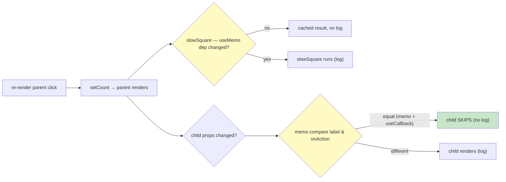

# Lab 6: More Hooks & Performance Optimization

**Difficulty: Advanced | ~50-60 min | Requires Lab 5**

## 1. Problem Statement / Use Case Overview

The skills you have from Labs 1-5 — state, effects, lists, forms, context,
routing — build working apps, but they leave two questions open: **how do you
manage state whose transitions are too complex for `useState`?** and **how do
you stop React from re-rendering work that never changed?**

Lab 6 is the switch to advanced React. Across five steps you add the tools that
answer both questions, and you learn to *measure* what React is doing, not
guess:

- **`useRef`** — reach directly into a DOM node (auto-focus a search box without
  `querySelector`).
- **`useReducer`** — rebuild the Lab 2 counter with explicit
  `{ type: 'increment' }` / `{ type: 'reset' }` actions instead of raw
  `setState` calls.
- **Custom hooks** — extract the Lab 3 todo logic into a `useTodos()` hook and
  reuse it in two components, proving logic packages, not just components.
- **`React.memo`, `useMemo`, `useCallback`** — the three tools that stop
  unnecessary re-renders, demonstrated by a small parent/child pair that logs
  every render to the console, so you *see* the difference.

Every optimization in this lab is justified by observable console output — and
the lab's second lesson is the opposite of "memoize everything": because React
is already fast for small trees, some of these tools are more about teaching
*when* they matter than about the app needing them. Step 5 ends by asking you to
strip the optimizers and watch the re-renders return.

## 2. Input Data

Five distinct inputs feed the demo widgets:

1. **`SearchBox`** — no data; the whole point is the `useRef` handle to its own
   `<input>` element so the effect can call `.focus()` on mount.
2. **`Counter`** — action objects dispatched to a reducer:
   `{ type: 'increment' }`, `{ type: 'reset' }`. The reducer input is
   `(state, action)`; output is the next state `{ count }`.
3. **`useTodos`** — a hard-coded initial list of two todo objects
   (`{ id, text, done }`), plus the "add" text from the form. Each call to the
   hook gets its **own** `useState`, so two consumers hold independent copies.
4. **`ExpensiveChild`** — two props: `label` (a number) and `onAction` (a
   function). `React.memo` compares these to decide whether to skip.
5. **`PerfDemo` (parent)** — two pieces of state: `count` (drives "re-render
   parent") and `number` (drives the expensive computation and the child's
   `label`).

No network, no persistence — every input is local state and immediated user
interaction, which keeps the lesson on hook behavior rather than data plumbing.

## 3. Processing

- **Step 1 — `useRef`:** a `useRef` object holds `.current` pointing at the real
  input DOM node (assigned via `ref={inputRef}`). An empty-dep `useEffect` runs
  once after mount and calls `inputRef.current.focus()`.
- **Step 2 — `useReducer`:** define a pure `reducer(state, action)` with a
  `switch` over `action.type`. `dispatch(action)` feeds it; the next state is
  whatever it returns. Actions are plain objects — `{ type: 'increment' }` —
  which is what makes multi-rule state readable.
- **Step 3 — custom hook:** move the todo list, `addTodo` and `toggleTodo` out
  of the component into `useTodos()`. Components call it like a normal hook;
  each call is its own state. `TodoApp` (list + form) and `TodoStats` (read-only
  totals) both consume it.
- **Step 4 — `React.memo`:** wrap the child (`export default memo(Child)`) so
  it re-renders only when a **prop** actually changes. A `useEffect`-based
  console log inside the child proves, per commit, whether it rendered.
- **Step 5 — `useMemo` + `useCallback`:** the parent runs `slowSquare(number)`
  (a few million square roots) inside `useMemo(() => ..., [number])` so it
  recomputes only when `number` changes, and passes the child `onAction`
  created with `useCallback(..., [])` so its identity never changes — the two
  reasons a memoized sibling can still re-render are both neutralized. Two
  buttons then drive the experiment: one re-renders the parent, one changes the
  child's label.



## 4. Output

The app renders five instrumented widgets in a single column
(see Section 9's shell). It *looks* simple — the truth is in the DevTools
console, captured on a real headless Chrome while verifying this lab:

```
Search the docs...                      ← search input is FOCUSED on load

useReducer — Counter
count: 0                                 ← +1 twice → count: 2, Reset → count: 0

useTodos — copy #1                       useTodos — copy #2
[ New todo.......... ] [Add]             1 done · 2 total
○ Read the useMemo docs
✓ Measure the renders                    ← copy #1 changes stay in copy #1

memo · useMemo · useCallback
memo child · label 0                     child action
count: 0 · result: 0.00
[ re-render parent ] [ change label ]
```

Opening the console and clicking the checkpoint buttons shows the experiment,
exactly as verified:

| Action | Console output | Meaning |
|---|---|---|
| (initial mount) | `slowSquare runs` x2, `ExpensiveChild rendered` x2 | StrictMode dev double-invokes renders/effects once on mount |
| **re-render parent** | *(nothing new)* | memo + stable useCallback-prop + cached useMemo ⇒ **no re-render, no recompute** |
| **change label** | `slowSquare runs` x2, `ExpensiveChild rendered — label=1` | dep changed ⇒ recompute; prop changed ⇒ child re-renders once |

(The `x2` on `slowSquare runs` is React StrictMode in development
double-invoking the `useMemo` factory to surface impure code — production runs
it once.)

`TodoStats` notices nothing the user does in `copy #1`, because each `useTodos()`
call owns its state — an important custom-hook property to internalize. The
counter and todos behave exactly as their Lab 2/3 originals did, which is the
point: the new state machinery must not change the UI contract.

## 5. Tech Stack

- **React 18.3.1** — `useReducer`, `useRef`, custom hooks, `memo`, `useMemo`,
  `useCallback`.
- **react-dom 18.3.1** — mounting, StrictMode.
- **Vite 8** — dev server + bundler.
- **Plain CSS** — same file-import setup as Labs 4-5.
- **No new runtime dependencies** — every hook ships with React itself.

Verified against exactly these versions during lab testing (Chrome, Node 18+).
## 6. Underlying Concepts

### `useRef` — the escape hatch into the DOM

A ref is a **mutable box**: `useRef(null)` returns `{ current: null }`, and
that object is the *same object for the component's whole life*. Setting
`ref={box}` on an element makes React write the real DOM node into `box.current`
after mount. Because it never changes identity, putting an effect with `[]`
deps around a `.focus()` is safe — and because it is mutable, changing
`.current` does **not** cause a re-render (unlike state). Use refs for the DOM
or for values you want to hold *without* re-rendering (timers, previous values).

### `useReducer` — state transitions as data

`useState` is sugar for the simplest reducer; when several setState calls must
stay consistent, logic leaks into every handler. `useReducer(reducer,
initialState)` splits the difference: **all** state changes move into one pure
function

```js
reducer(prevState, action)  ->  nextState
```

and handlers become declarations of intent — `dispatch({ type: 'increment' })`.
The reducer never touches the DOM, never calls other setters; given the same
`(state, action)` it always returns the same next state, which makes it
trivially testable and replayable. This is the Redux mental model built into
React, minus the library.

### Custom hooks — packaging logic, not markup

A custom hook is a function whose name starts with `use` and which calls other
hooks (the Rules of Hooks apply *inside* it too). It returns whatever you want
— usually state plus the functions that change it. Components then share that
**logic package**:

- Each `useTodos()` call runs its own `useState`, so **state is not shared**
  between consumers. Two components get the same *behavior*, different
  *data*. To share the data itself you lift it (props) or put it in Context
  (Lab 5) — worth saying again, because it is the difference between "reuse the
  logic" and "share the state."
- Why it matters: the hero of Step 3 is not "todo code relocated" but "two
  components now depend on the *same* behavior contract" — and Tests can then
  target the hook directly.

### Rules of Hooks

Three rules, all enforced by the `eslint-plugin-react-hooks` lint rule:

1. **Call hooks at the top level** — never inside loops, conditions, or nested
   functions. React relies on hook *order* to match previous renders; a
   conditional hook silently remaps state to the wrong piece of memory.
2. **Call hooks only from React functions** — components or other custom hooks,
   never plain JS functions.
3. **(by implication) Maps and renders happen on a stable hook order** — custom
   hooks forestall rule-breaking by centralizing hook calls.

### Re-renders, and what `React.memo` can and cannot stop

A component re-renders when: its own state changes, its parent re-renders (and
passes it new elements), or a Context it reads changes. Re-rendering is not
evil — React's diffing is fast — it is only *wasteful work* you can measure.

`React.memo(Component)` is a **shallow prop-equality guard**: on a parent
re-render, if every prop is `===` to the previous render's prop, the child is
skipped. It never prevents re-renders driven by the child's *own* state or by
context. And it costs a comparison on every render — for a cheap child, the
comparison can cost more than the render it "saves."

### `useMemo` and `useCallback` — memoizing values and function identities

```js
const heavy = useMemo(() => compute(), [number]);  // caches compute()'s result
const fn    = useCallback(() => go(), [number]);   // caches the function itself
```

- `useMemo` caches the **result** of a pure computation between renders,
  recomputing only when a dependency changes. It is for *expensive
  calculations* shown on every render, not a general "cache all the things".
- `useCallback` caches a **function identity**: the same function object is
  returned every render until a dependency changes. Its usual job is to keep a
  memoized child's function-prop stable — because a *new* inline function every
  render makes `React.memo`'s prop comparison fail, silently undoing the memo.
- Both take a dependency array and both are only useful when the work they
  memoize is genuinely repeat-expensive — which is why the lab's instrumented
  logs exist: measure first, memoize second.

### When optimization genuinely is not necessary

This is the lab's design pressure-valve. React is already fast: a re-render of
a small subtree is microseconds, and the tree diff is cheap. Reach for the
optimization trio only when **all** are true: (a) the component's render is
measurably expensive, (b) it re-renders often, and (c) its props stay equal
most of the time. `ExpensiveChild` in this lab is deliberately tiny — the memo
demonstration is *for teaching*; in a real app you would more likely memoize a
large, stable data-table row than a two-element card. The same reasoning
applies to `useMemo`'s `slowSquare`: 3M square roots is thousands of times
heavier than a real render tends to be, deliberately, to make the log legible.

## 7. Prerequisites

- Lab 2 (events + state) — the counter being rebuilt with `useReducer`.
- Lab 3 (lists, keys, controlled forms) — the todo logic being extracted.
- Lab 5 (context, providers) — the "who owns shared state" discussion in
  Step 3 and Section 6 relies on it.
- Comfort reading DevTools console output — all verification in this lab is by
  console log.
- Node.js 18+, a Vite project scaffold.

## 8. Environment / Dependencies Setup

Cleanest from scratch, exactly as before:

```bash
npm create vite@8 lab6-hooks-perf -- --template react
cd lab6-hooks-perf
npm install
npm install react@18.3.1 react-dom@18.3.1
npm run dev
```

- Node.js 18+, bundled `npm`.
- **No new runtime dependency** — hooks and `memo` are part of React.
- `src/main.jsx` follows the pattern from Lab 4 (imports `styles.css`, renders
  `<App />` inside `StrictMode`).
## 9. Step-wise Development Instructions

All files are byte-identical to the versions verified end-to-end for this lab
(220 lines total across 10 files). Build the shell first, then drop each
component in.

**The shell** — `src/main.jsx` (identical pattern to Lab 4):

```jsx
import { StrictMode } from 'react'
import { createRoot } from 'react-dom/client'
import './styles.css'
import App from './App.jsx'

createRoot(document.getElementById('root')).render(
  <StrictMode>
    <App />
  </StrictMode>,
)
```

`src/styles.css` — the demo's cards, forms, and buttons (compact, one rule per
selector):

```css
:root { font-family: 'Segoe UI', Roboto, Helvetica, Arial, sans-serif; line-height: 1.6; color: #1f2933; background: #f4f6f8; }
body { margin: 0; }
.lab { max-width: 760px; margin: 0 auto; padding: 24px; }
.console { background: #ffffff; border-radius: 8px; box-shadow: 0 1px 3px rgba(0, 0, 0, 0.12); padding: 18px 22px; margin: 18px 0; }
.grid { display: flex; gap: 20px; flex-wrap: wrap; }
.grid > .console { flex: 1; min-width: 300px; }
.search { width: 100%; padding: 10px; border: 1px solid #cbd2d9; border-radius: 6px; font-size: 1rem; box-sizing: border-box; }
.total { font-size: 1.3rem; font-weight: 600; margin: 10px 0; }
.btn-group { display: flex; gap: 8px; }
.btn-group button { padding: 8px 14px; border: 0; border-radius: 6px; background: #2563eb; color: #fff; cursor: pointer; }
.add-form { display: flex; gap: 8px; margin: 12px 0; }
.add-form input { flex: 1; padding: 8px; border: 1px solid #cbd2d9; border-radius: 6px; }
.add-form button { padding: 8px 14px; border: 0; border-radius: 6px; background: #2563eb; color: #fff; cursor: pointer; }
ul { list-style: none; padding: 0; margin: 8px 0 0; }
li button { background: none; border: 0; cursor: pointer; padding: 6px 0; font-size: 1rem; color: #1f2933; }
li button.done { text-decoration: line-through; color: #7b8794; }
.muted { color: #52606d; }
```

`src/App.jsx` — the finished assembly. Each component you build below replaces
one region; the import lines come on step by step:

```jsx
import SearchBox from './SearchBox.jsx';
import Counter from './Counter.jsx';
import TodoApp from './TodoApp.jsx';
import TodoStats from './TodoStats.jsx';
import PerfDemo from './PerfDemo.jsx';

export default function App() {
  return (
    <main className="lab">
      <h1>Lab 6: More Hooks & Performance</h1>
      <p className="muted">
        Open DevTools console — it proves which work actually runs.
      </p>
      <SearchBox />
      <Counter />
      <div className="grid">
        <TodoApp />
        <TodoStats />
      </div>
      <PerfDemo />
    </main>
  );
}
```

### Step 1 — `SearchBox` with `useRef`

Create `src/SearchBox.jsx`:

```jsx
import { useRef, useEffect } from 'react';

function SearchBox() {
  // inputRef is a stable "box" that points at a real DOM node
  const inputRef = useRef(null);

  useEffect(() => {
    // DOM methods are available through .current — no querySelectors needed
    inputRef.current.focus();
  }, []);

  return <input ref={inputRef} className="search" placeholder="Search the docs..." />;
}

export default SearchBox;
```

`ref={inputRef}` makes React put the input's DOM node into `inputRef.current`.
The effect runs once after mount (empty deps) and calls `.focus()` — verify by
loading the page: the cursor is in the box before you touch anything.
Contrast this with `document.querySelector`: a ref is scoped to this component,
survives re-renders, and needs no global string lookup. Change `.current` without
expecting a re-render — that is the ref contract.

### Step 2 — the `useReducer` Counter

Create `src/Counter.jsx` — the Lab 2 counter, state transitions now data:

```jsx
import { useReducer } from 'react';

const initialState = { count: 0 };

function reducer(state, action) {
  switch (action.type) {
    case 'increment':
      return { count: state.count + 1 };
    case 'reset':
      return initialState;
    default:
      return state;
  }
}

function Counter() {
  const [state, dispatch] = useReducer(reducer, initialState);

  return (
    <section className="console">
      <h2>useReducer — Counter</h2>
      <p className="total">count: {state.count}</p>
      <div className="btn-group">
        <button onClick={() => dispatch({ type: 'increment' })}>+1</button>
        <button onClick={() => dispatch({ type: 'reset' })}>Reset</button>
      </div>
    </section>
  );
}

export default Counter;
```

- `dispatch({ type: 'increment' })` hands a plain **action object** to the
  reducer; the reducer returns the next `{ count }`.
- The `default` case returns the state unchanged — with `switch` reducers this
  silence-of-the-unknown is what keeps a bad payload from destroying state.
- `initialState` is reused by `reset`; keeping it outside the component (module
  scope) means every reset returns the *same* initial shape and avoids a new
  object per render.

Why this beats `useState` for a counter with two transitions? The logic — which
transition maps to which state change — now *lives in one pure function* you
can unit-test, instead of being scattered across handlers. Add the export to
App: `import Counter from './Counter.jsx';` and render `<Counter />`.

### Step 3 — a custom hook, reused twice

First abstract the todo logic. Create `src/useTodos.js`:

```js
import { useState } from 'react';

const initialTodos = [
  { id: 1, text: 'Read the useMemo docs', done: false },
  { id: 2, text: 'Measure the renders', done: true },
];

// the Lab 3 todo logic, packaged as a reusable custom hook
export function useTodos() {
  const [todos, setTodos] = useState(initialTodos);

  const addTodo = (text) => {
    if (!text.trim()) return;
    setTodos((prev) => [...prev, { id: Date.now(), text: text.trim(), done: false }]);
  };

  const toggleTodo = (id) =>
    setTodos((prev) => prev.map((t) => (t.id === id ? { ...t, done: !t.done } : t)));

  return { todos, addTodo, toggleTodo };
}
```

The name rule (`use...`, calling hooks inside) is what makes it a hook. The
captured functions use the **functional update** form (`prev => ...`) so they
never close over a stale `todos` — the detail that would otherwise bite in a
reused hook.

Consumer #1 writes the list. Create `src/TodoApp.jsx` (Lab 3's form + list,
source of `addTodo`/`toggleTodo` swapped for the hook):

```jsx
import { useState } from 'react';
import { useTodos } from './useTodos.js';

function TodoApp() {
  const { todos, addTodo, toggleTodo } = useTodos();
  const [text, setText] = useState('');

  function handleSubmit(e) {
    e.preventDefault();
    addTodo(text);
    setText('');
  }

  return (
    <section className="console">
      <h2>useTodos — copy #1</h2>
      <form className="add-form" onSubmit={handleSubmit}>
        <input value={text} onChange={(e) => setText(e.target.value)} placeholder="New todo" />
        <button type="submit">Add</button>
      </form>
      <ul>
        {todos.map((todo) => (
          <li key={todo.id}>
            <button className={todo.done ? 'done' : ''} onClick={() => toggleTodo(todo.id)}>
              {todo.done ? '✓' : '○'} {todo.text}
            </button>
          </li>
        ))}
      </ul>
    </section>
  );
}

export default TodoApp;
```

Consumer #2 only reads. Create `src/TodoStats.jsx`:

```jsx
import { useTodos } from './useTodos.js';

function TodoStats() {
  // second consumer — its own data, from the same packaged logic
  const { todos } = useTodos();
  const done = todos.filter((t) => t.done).length;

  return (
    <section className="console">
      <h2>useTodos — copy #2</h2>
      <p className="total">{done} done · {todos.length} total</p>
    </section>
  );
}

export default TodoStats;
```

Two components, one hook — the forms, validation, and immutability rules are
written **once**. Add both to App inside the `.grid`. Refs, then reducer, now
logic-sharing: add a todo in `copy #1` and watch `copy #2`'s totals stay put —
separate `useState` instances. That is neither a bug nor a mistake; it is the
custom-hook contract. To make the totals *follow*, you'd lift the state to a
parent and pass `todos` down as props, or move `useTodos`' state into Context
(Lab 5).
### Step 4 — the memoized child that proves it

Create `src/ExpensiveChild.jsx`:

```jsx
import { memo, useEffect } from 'react';

// memo() lets this child skip re-renders while its props stay equal.
function ExpensiveChild({ label, onAction }) {
  useEffect(() => {
    // instrumentation: a log proves when this component actually re-renders
    console.log(`ExpensiveChild rendered — label=${label}`);
  });

  return (
    <div>
      <p className="muted">memo child · label {label}</p>
      <button onClick={onAction}>child action</button>
    </div>
  );
}

export default memo(ExpensiveChild);
```

Two things to notice:

- The `useEffect` has **no dependency array**, so it re-runs after every commit
  where the component *actually rendered* — a render counter you can observe.
- `export default memo(ExpensiveChild)` is the whole trick: React now shallow-
  compares `label` and `onAction` against the previous props on **every parent
  render**, and skips this subtree if both are identical.

This child is tiny on purpose. The lab's point is not "children are expensive",
it is "here is a render you can turn on and off like a tap".

### Step 5 — `useMemo` + `useCallback` in the parent, and the experiment

Create `src/PerfDemo.jsx`:

```jsx
import { useMemo, useCallback, useState } from 'react';
import ExpensiveChild from './ExpensiveChild.jsx';

function slowSquare(n) {
  // simulated heavy work: a few million square roots (log makes it observable)
  console.log('slowSquare runs');
  let total = 0;
  for (let i = 0; i < 3000000; i++) total += Math.sqrt(n);
  return total;
}

function PerfDemo() {
  const [count, setCount] = useState(0);
  const [number, setNumber] = useState(0);

  // recompute only when `number` changes, cache the rest of the time
  const result = useMemo(() => slowSquare(number), [number]);

  // stable function identity so the memoized child skips re-renders
  const onAction = useCallback(() => setCount((c) => c + 1), []);

  return (
    <section className="console">
      <h2>memo · useMemo · useCallback</h2>
      <ExpensiveChild label={number} onAction={onAction} />
      <p className="total">count: {count} · result: {result.toFixed(2)}</p>
      <div className="btn-group">
        <button onClick={() => setCount(count + 1)}>re-render parent</button>
        <button onClick={() => setNumber(number + 1)}>change label</button>
      </div>
      <p className="muted">Console proves it: change label logs both, re-render parent logs neither.</p>
    </section>
  );
}

export default PerfDemo;
```

Wire `PerfDemo` into `App` (`<PerfDemo />` after the grid). Save everything and
run the experiment:

1. Open DevTools → Console, with `Preserve log` off, so the mounting noise is
   separate.
2. Click **re-render parent** several times — the child's tree and the cached
   `slowSquare` result both survive. **Nothing new is logged.** `count` is the
   only thing that changes.
3. Click **change label** — now both instruments fire:
   `slowSquare runs` (dependency changed ⇒ recompute) and
   `ExpensiveChild rendered — label=1` (prop changed ⇒ child renders).

Together, the two buttons disassemble *why a React app re-renders*: the parent
re-render in (2) is neutralized three times over — `memo` stops the child,
`useCallback` keeps `onAction`'s identity stable so the memo comparison passes,
and `useMemo` spares the expensive call. In (3) all three opt back in because
`number` — the actual input — changed.

The `muted` paragraph under the buttons summarizes the expected result in one
line; the console is the ground truth. Run with no optimization and the story
inverts (see Section 11).
## 10. Verification: What to Check at Each Milestone

Sanity checklist that maps 1:1 to the verified behavior in Section 4. Keep the
DevTools console open throughout.

**Milestone 1 — SearchBox (Step 1)**
- **Untouched keyboard:** the blinking cursor sits in the search input when the
  page loads.
- **Confidence check:** remove `inputRef.current.focus();` → reload → no focus.
  Put it back afterward.

**Milestone 2 — Counter (Step 2)**
- `count: 0` on load; two `+1` clicks → `count: 2`; `Reset` → `count: 0`.
- UI behavior is identical to the Lab 2 counter — only the mechanism changed.

**Milestone 3 — useTodos (Step 3)**
- `copy #1` shows the two seed todos, `copy #2` shows `1 done · 2 total`.
- Type + Add in `copy #1` → its list grows; **`copy #2` totals unchanged.**
- One click on a todo toggles ✓/○ in `copy #1` only.

**Milestone 4 — memo child (Step 4)**
- On load the console shows the mount logs (twice, StrictMode).
- Click **re-render parent** (full lab) → no new `ExpensiveChild` log.
- Click **change label** → exactly one `ExpensiveChild rendered — label=N`.

**Milestone 5 — full experiment (Step 5)**
- re-render parent → `count` changes, `result` line unchanged, zero new logs.
- change label → `result` recomputes (`slowSquare runs` appears) and the child
  logs once.
- No red errors in the console at any point.

**Equivalence check:** the widgets behave exactly like their Labs 2/3 ancestors
— the new state machinery is invisible to the mouse.

## 11. Optional Exercise — Strip the Optimizers

Now the inverse proof: remove all three tools, observe what returns, and restore.

1. Edit `src/ExpensiveChild.jsx`:
   `export default memo(ExpensiveChild);` → `export default ExpensiveChild;`
2. Edit `src/PerfDemo.jsx`:
   - import only `useState` (`import { useState } from 'react';`)
   - `const result = useMemo(() => slowSquare(number), [number]);` →
     `const result = slowSquare(number);`
   - `const onAction = useCallback(() => setCount((c) => c + 1), []);` →
     `const onAction = () => setCount((c) => c + 1);`
3. Reload and redo the two-button experiment. Verified result:

| Button | With optimizers | Stripped |
|---|---|---|
| re-render parent | `0 slowSquare` / `0 child` logs | `2 slowSquare` / `1 child` log |
| change label | `2 slowSquare` / `1 child` log | `2 slowSquare` / `1 child` log |

Interpret: without `useMemo`, **every parent re-render recomputes** the heavy
call; without a stable `useCallback`, the inline arrow re-created each render
carries a new identity into the child; without `memo`, the child re-renders
with it. The first column shows what the three tools buy.

**Section 6's rule, applied:** here the "damage" is obvious because the console
measures it. In a real app you would only reach for this trio when the re-render
is *measurable* — and you would reach for `useMemo` for the computed value, not
for the counter's `{count}` literal, which memoizing would waste more than
save. Knowing when *not* to optimize is the capstone of Lab 6: restore every
stripped line when you are done.

## 12. What You Have Learned

- **`useRef`** — a stable, mutable box for reaching DOM nodes and holding values
  that must not trigger renders; `.focus()` on mount with zero selectors.
- **`useReducer`** — state transitions written as pure `(state, action) -> next`
  functions with readable action objects; the mental model behind Redux.
- **Custom hooks** — logic (state + updaters) packaged into a `use`-named
  function and reused, with the Rules of Hooks applying inside.
- **Independent state** — each `useTodos()` call owns its state, so "reuse the
  logic" and "share the data" are different jobs; shares go up (props) or out
  (context).
- **`React.memo`** — the prop-equality guard that skips unnecessary child
  re-renders, defeated only by changed props (or the child's own state/context).
- **`useMemo`** — caching a heavy computation's result behind a dependency
  array, recomputing on dependency change only.
- **`useCallback`** — caching a function's *identity*, the companion piece that
  keeps a memoized child's prop comparison honest.
- **Measurement over guessing** — DevTools console as render-observability;
  StrictMode's dev-only double-invocation of renders, effects, and `useMemo`
  factories (no `x2` surprises in production builds).
- **Knowing when NOT to optimize** — React's diff is fast; the trio pays off
  for measurable work re-rendering often, and costs comparison overhead
  otherwise (the strip-everything experiment of Section 11).
