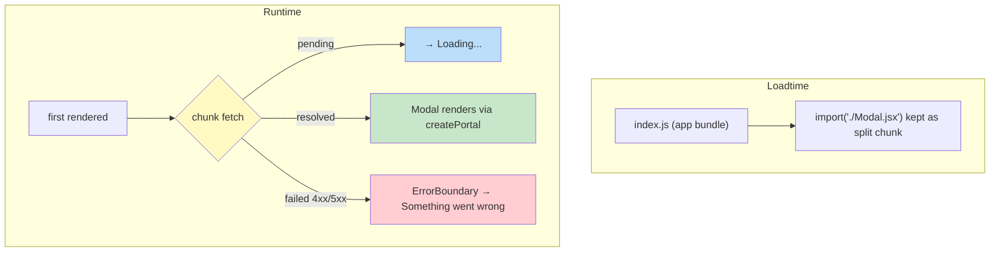

# Lab 7: Class Components, Error Boundaries, Portals & Code Splitting

**Difficulty: Advanced | ~60 min | Requires Lab 6**

## 1. Problem Statement / Use Case Overview

Modern React is function components + Hooks, but three realities push you beyond
that comfort zone:

- **Legacy code.** Thousands of production apps are built with class
  components. You will read, maintain, and hand-convert them — which is
  impossible without understanding the lifecycle methods.
- **Class-only features.** Some machinery still has *no* Hook equivalent.
  Error boundaries (catching render crashes so the page never goes blank) are
  still class components in React 18.
- **Exporting DOM and bytes.** Two tools change *where* and *when* your UI
  lives: portals (render a modal into a different DOM node than the app) and
  `React.lazy` + `<Suspense>` (download heavy code only when it's needed).

Lab 7 builds them together in one instrumented app. Step 1 writes the same
component as a class with `componentDidMount`/`componentDidUpdate`/
`componentWillUnmount`; Step 2 converts it to a Hook component whose
`useEffect` reproduces the same logs. Step 3 introduces an `ErrorBoundary` —
then deliberately crashes a child to watch it catch the crash. Step 4 makes a
modal render into a dedicated `#modal-root` DOM node. Step 5 loads that modal
*only on demand* with `React.lazy` and suspends behind `Loading...` — wrapping
the lazy component with the boundary from Step 3, so even a failed fetch can
never blank the page.

The running thread is **class-to-hook translation**: if you can explain why
`componentWillUnmount` *is* `useEffect`'s cleanup, you can read any legacy
component's intent.

## 2. Input Data

- **`Greeting` (class)** — one prop `name`. Its lifecycle logs prove
  mount/update/unmount by being *observed* on a toggle button.
- **`GreetingFunction` (hooks)** — the same `name` prop, same three log events
  reproduced with two `useEffect` calls.
- **`ErrorBoundary` (class)** — children; an internal `{ hasError }` state; the
  crash source is `Boom`, a component that throws on render.
- **`Modal`** — rendered via `createPortal(jsx, document.getElementById('modal-root'))`;
  its single input is the `onClose` callback.
- **`App`** — the only stateful orchestrator: `show` (mount/unmount the
  greetings), `name` (drive the update logs), `broken` + `bcKey` (crash/reset
  the boundary), `open` (render the lazy modal).
- **`index.html`** — two root divs: `#root` (the app) and `#modal-root` (the
  portal target, outside the app container).

No network in the happy path; the only network is Vite serving/code-splitting
the lazy `Modal` module.

## 3. Processing

- **Step 1 — Class shape:** `class Greeting extends Component`. `render()`
  returns JSX using `this.props.name`. Lifecycle hooks — `componentDidMount`
  (after first mount), `componentDidUpdate(prevProps)` (after every re-render),
  `componentWillUnmount` (right before removal) — each log.
- **Step 2 — The conversion:** the function version reads props via the
  parameter. `useEffect(() => {...}, [])` fires once for mount and its returned
  cleanup fires for the unmount — the Hook mirror of the first and third
  lifecycle methods in one call. A second `useEffect(..., [name])` mirrors
  update-detection, with two differences the lab highlights (Section 6).
- **Step 3 — Boundary:** `static getDerivedStateFromError()` returns the
  fallback state when a *child render* throws; `componentDidCatch(error)` runs
  for logging. Since the throw is caught, the app keeps rendering — the fallback
  replaces the crashed subtree. `Boom` throws `new Error('Boom! — intentional
  crash')` while rendering. A `key` remounts the boundary so the demo recovers
  after the crash.
- **Step 4 — Portal:** `createPortal` takes the JSX and a real DOM node read
  from `document.getElementById('modal-root')`. React renders the tree into
  that external node while events still bubble through the React tree.
- **Step 5 — Lazy + Suspense:** `const LazyModal = lazy(() => import('./Modal.jsx'))`
  registers a *dynamic import*. Rendering `LazyModal` starts the download;
  until it settles, the nearest `<Suspense fallback={...}>` shows `Loading...`.
  The production build then emits a separate chunk for `Modal` (verified:
  `Modal-Tnm8M7EN.js`) that the browser fetches in real time after the click.



## 4. Output

Live verification in headless Chrome while writing this lab produced the exact
UI and log streams below. The page shows three console cards:

```
Lab 7 — Classes · Boundaries · Portals · Code Splitting

Steps 1–2 · class vs hooks lifecycle
[toggle lifecycle] [change name]
Hello, React!              Hello, React!
(class Greeting)           (hooks GreetingFunction)

Step 3 · Error Boundary
[run / reset crash test]
Healthy child — nothing crashed

Steps 4–5 · Portal + Lazy load
[Open Modal]                → click → overlay + "Portal Modal" card,
                              in #modal-root, with [Close]
```

**Verified lifecycle logs** (dev StrictMode is ON; the raw quotes below are the
actual captures — initial-mount doubling is explained in Section 6):

| Action | Console output |
|---|---|
| initial mount (dev only) | each component logs mount, update-on-first-effect, `unmounting`, mount *again* — StrictMode's dev double-mounting of every subtree |
| **toggle OFF** | `Greeting (class) unmounting` · `Greeting (hooks) unmounting` |
| **toggle ON** | `Greeting (class) mounted` → `Greeting (hooks) mounted` → (hooks update log) → `Greeting (class) unmounting` → `Greeting (hooks) unmounting` → mounted ×2 again — the 8-line StrictMode double-mount dance |
| **change name** | `Greeting (class) updated: React -> Hooks` · `Greeting (hooks) updated: name -> Hooks` |

**Verified boundary behavior:**

| Action | Result |
|---|---|
| click crash test | fallback renders **`Something went wrong`**; React's dev error report for `<Boom>` plus one `ErrorBoundary caught: Boom! — intentional crash` log |
| click crash test again | fresh `key` remounts the boundary → `Healthy child — nothing crashed` |
| lazy module unreachable (404) | `Something went wrong` — the boundary catches chunk-load failures too |

**Verified portal + lazy:**

- Before click: `#modal-root` innerHTML is empty; `#root` has no `.overlay`.
- After click (with an artificial 1.2 s module delay to make the fallback
  visible): **`Loading...`** appears, then the modal card mounts as a direct DOM
  descendant of `#modal-root` — `document.querySelector('#root .overlay')` is
  null, `document.querySelector('#modal-root .overlay')` is truthy.
- Clicking `Close` empties `#modal-root` again.
- Production build (`npm run build`) emits two JS assets: the main bundle plus
  a separate **`Modal-Tnm8M7EN.js`** (0.47 kB) — the code-splitting proof.

## 5. Tech Stack

- **React 18.3.1 / react-dom 18.3.1** — `Component`, lifecycle methods,
  `createPortal`, `lazy`, `Suspense`.
- **Vite 8** — dev server and production bundler; its dynamic-import support is
  what produces the split `Modal` chunk.
- **ES2020 dynamic `import()`** — the syntax `React.lazy` wraps.
- **Plain CSS** — same card styling convention as Labs 4-6.
- **No new runtime dependencies** — everything in this lab is core React.

Verified against these exact versions in the lab run (Node 20, Chrome).

## 6. Underlying Concepts

### Class lifecycle vs `useEffect`

A class component goes through exactly three observable moments, and every
Hook-era translation maps to the same moments:

| Class lifecycle | Runs | Hook equivalent |
|---|---|---|
| `componentDidMount()` | Once, after the first commit | `useEffect(fn, [])` |
| `componentDidUpdate(prevProps)` | After *every* re-commit (even identical props) | `useEffect(fn, [deps])` — but only when `deps` change |
| `componentWillUnmount()` | Right before removal | `useEffect(() => { ...; return cleanup }, [])` — the returned cleanup |

Two asymmetries matter when converting legacy code:

- `componentDidUpdate` never fires on the first render; `useEffect` *always*
  fires on mount too. A port must add a "skipped first run" guard if the old
  code relied on that.
- `componentDidUpdate` fires on ANY parent-driven re-render regardless of
  props; `useEffect([deps])` is the stricter, usually-what-you-wanted version.

This run's own evidence: the crash-test click re-rendered `App`, which
re-rendered `Greeting` → `Greeting (class) updated: React -> React` (same props —
the class still logged). The `useEffect([name])` version stayed silent.

### Lifecycle ordering

Mount order (deepest-first effecting, parent `render` → child `render` →
children mount/effects → parent `componentDidMount`), then unmount in reverse.
The toggle-OFF capture shows class and hooks unmounting together after the
parent re-render — in a real tree you would watch children clean up before
parents.

### StrictMode's dev double-mount

`<StrictMode>` forces every component to mount → unmount → mount again in
development so side effects must be idempotent. It is why the very first load
(and every later toggle-ON -- see Section 4's 8-line capture) logs each
mount/cleanup twice. Production builds run each lifecycle exactly once. Never
"fix" the missing double by deleting StrictMode — fix the cleanup that broke.

### Error boundaries

A boundary is a class component implementing one or both of:

- `static getDerivedStateFromError(error)` → return the fallback state.
- `componentDidCatch(error, info)` → side effects (logging, reporting).

It catches **render errors of anything below it** (plus errors raised by
lifecycle methods and, this lab's twist, **failed lazy loads**). It does *not*
catch: its own render errors, errors in event handlers, async code, or errors
in the boundary's parent. There is **no Hook API** for boundaries in React 18 —
one reason to keep reading class components. A caught error in development
still surfaces as a red report (React deliberately re-propagates so tooling
sees it) plus one `componentDidCatch` log; the fallback is what saves the page.

### Portals

`createPortal(jsx, domNode)` mounts the JSX *into `domNode`* while keeping the
React element in the main tree. Consequences worth knowing:

- The DOM parent (e.g. `#modal-root` at `body`) differs from the React parent
  — that is the point: overlays escape `overflow: hidden` and stacking
  contexts.
- **Events still bubble through the React tree**, not the DOM tree: a `click`
  on the modal is seen by ancestors *in JSX*, even far above `#modal-root`.
- The portal node must exist — hence the second `<div>` in `index.html`.

### `React.lazy`, `Suspense`, and code splitting

`lazy(() => import('./Modal.jsx'))` defers evaluating the module. The dynamic
`import()` is recognized by Vite at *build time* and emitted as its own chunk;
`<Suspense fallback>` is the loading state shown while the promise resolves.
Combined effects verified here: separate `Modal-*.js` file in `dist`, `Loading...`
while the chunk flies in, and — because boundaries wrap lazy components — the
same fallback UI handles a *broken network* chunk: not just slow, but failed.
This is why lazy route*components* are commonly wrapped in a boundary: an
unreachable chunk is a render error.

## 7. Prerequisites

- Labs 1-6 — JSX, props, state, `useEffect`, controlled components.
- Comfort with an ES module Vite project (Lab 6 setup).
- No class syntax experience required — Step 1 teaches the shape directly.

## 8. Environment / Dependencies Setup

Same scaffold as previous labs; this lab adds a second root `<div>` to
`index.html` and requires the production build to prove splitting.

```bash
npm create vite@8 lab7-classes-portals -- --template react
cd lab7-classes-portals
npm install
npm install react@18.3.1 react-dom@18.3.1
npm run dev
```

- Node.js 18+.
- **No new runtime dependency.** All APIs are core React / react-dom.
- To verify code splitting: `npm run build`, then inspect `dist/assets/` for a
  separate `Modal-*.js` chunk.
P1## 9. Step-wise Development Instructions

All code blocks are byte-identical to the versions verified end-to-end for this
lab (163 lines across 9 source files + `index.html`). Build the shell first,
then add Step 1 → 5.

**Start from this `index.html`** — note the **second root**: `#modal-root`,
already declared in the document *before* the app mounts:

```html
<!doctype html>
<html lang="en">
  <head>
    <meta charset="UTF-8" />
    <link rel="icon" type="image/svg+xml" href="/favicon.svg" />
    <meta name="viewport" content="width=device-width, initial-scale=1.0" />
    <title>Lab 7 — Classes · Boundaries · Portals · Code Splitting</title>
  </head>
  <body>
    <div id="root"></div>
    <div id="modal-root"></div>
    <script type="module" src="/src/main.jsx"></script>
  </body>
</html>
```

`src/main.jsx` — unchanged from Lab 4; `StrictMode` stays because its dev
double-mounting is part of the lesson (Section 6):

```jsx
import { StrictMode } from 'react'
import { createRoot } from 'react-dom/client'
import './styles.css'
import App from './App.jsx'

createRoot(document.getElementById('root')).render(
  <StrictMode>
    <App />
  </StrictMode>,
)
```

`src/styles.css` — the console-card convention from Labs 4-6, plus overlay
styles used by the portal modal:

```css
:root { font-family: 'Segoe UI', Roboto, Helvetica, Arial, sans-serif; line-height: 1.6; color: #1f2933; background: #f4f6f8; }
body { margin: 0; }
.lab { max-width: 760px; margin: 0 auto; padding: 24px; }
.console { background: #ffffff; border-radius: 8px; box-shadow: 0 1px 3px rgba(0, 0, 0, 0.12); padding: 18px 22px; margin: 18px 0; }
.grid { display: flex; gap: 20px; flex-wrap: wrap; }
.grid > * { flex: 1; min-width: 240px; }
.result { font-size: 1.2rem; font-weight: 600; margin: 10px 0; }
.result.error { color: #b91c1c; }
.btn-group { display: flex; gap: 8px; margin-bottom: 6px; }
button { padding: 8px 14px; border: 0; border-radius: 6px; background: #2563eb; color: #fff; cursor: pointer; }
.overlay { position: fixed; inset: 0; background: rgba(15, 23, 42, 0.6); display: grid; place-items: center; z-index: 100; }
.modal-card { background: #fff; padding: 22px 26px; border-radius: 10px; box-shadow: 0 20px 50px rgba(0, 0, 0, 0.3); }
```

### Step 1 — `Greeting`, a class component

Create `src/Greeting.jsx`:

```jsx
import { Component } from 'react';

class Greeting extends Component {
  componentDidMount() {
    console.log('Greeting (class) mounted');
  }

  componentDidUpdate(prevProps) {
    console.log(`Greeting (class) updated: ${prevProps.name} -> ${this.props.name}`);
  }

  componentWillUnmount() {
    console.log('Greeting (class) unmounting');
  }

  render() {
    return <p className="result">Hello, {this.props.name}!</p>;
  }
}

export default Greeting;
```

- `import { Component } from 'react'` brings the base class; `extends
  Component` gives us `this.props`, `this.state`-friendly plumbing, and the
  lifecycle slot methods.
- `render()` must return JSX — the only **required** method. Everything else is
  optional lifecycle.
- `this.props` is where props live in a class. Pass `name` from `App` and the
  text `Hello, React!` renders off a real prop read.
- The three log methods announce the moments: mount, post-update, unmount.
  `componentDidUpdate` receives `prevProps` — class components reconstruct
  "old value" from arguments because `this.props` always points at the newest.

### Step 2 — Convert to Hooks with `useEffect`

Create `src/GreetingFunction.jsx`:

```jsx
import { useEffect } from 'react';

function GreetingFunction({ name }) {
  useEffect(() => {
    console.log('Greeting (hooks) mounted');
    return () => console.log('Greeting (hooks) unmounting');
  }, []);

  useEffect(() => {
    console.log(`Greeting (hooks) updated: name -> ${name}`);
  }, [name]);

  return <p className="result">Hello, {name}!</p>;
}

export default GreetingFunction;
```

Read it as a direct translation of Step 1:

- The `[]` effect = `componentDidMount` **plus** `componentWillUnmount`: its
  returned function *is* the cleanup, so one `useEffect` captures both life
  moments the class splits across two methods.
- The `[name]` effect = `componentDidUpdate` *filtered*: it only re-runs when
  `name` actually changes.
- Two documented asymmetries vs the class version (Section 6): the update
  effect also fires on mount, and it is dep-driven rather than
  every-re-render-driven.

### Step 3 — `ErrorBoundary` + a crashing child

Create `src/ErrorBoundary.jsx`:

```jsx
import { Component } from 'react';

class ErrorBoundary extends Component {
  constructor(props) {
    super(props);
    this.state = { hasError: false };
  }

  static getDerivedStateFromError() {
    return { hasError: true };
  }

  componentDidCatch(error) {
    console.log('ErrorBoundary caught:', error.message);
  }

  render() {
    if (this.state.hasError) {
      return <p className="result error">Something went wrong</p>;
    }
    return this.props.children;
  }
}

export default ErrorBoundary;
```

- `static getDerivedStateFromError()` flips `hasError` when a child render
  throws — this is what swaps in the fallback.
- `componentDidCatch(error)` runs *after* the state flip for logging/reporting.
- Normal renders pass through unchanged (`return this.props.children`).
- Class-only in React 18: there is no Hook equivalent, so the boundary stays a
  class even in a Hooks world.

Create `src/Boom.jsx`, the component designed to crash:

```jsx
function Boom() {
  throw new Error('Boom! — intentional crash');
}

export default Boom;
```

Anything rendered under an `ErrorBoundary` that throws during `render()` is
caught instead of blanking the app (verified in Section 4).

### Step 4 — a Portal Modal

Create `src/Modal.jsx`:

```jsx
import { createPortal } from 'react-dom';

function Modal({ onClose }) {
  return createPortal(
    <div className="overlay" onClick={onClose}>
      <div className="modal-card" onClick={(e) => e.stopPropagation()}>
        <h3>Portal Modal</h3>
        <p>I live in #modal-root, outside the app tree.</p>
        <button onClick={onClose}>Close</button>
      </div>
    </div>,
    document.getElementById('modal-root')
  );
}

export default Modal;
```

- `createPortal(<jsx/>, domNode)` renders into `#modal-root` — a DOM node the
  page owns, *outside* `#root`'s subtree, so `position: fixed` overlays are
  free of the app container's stacking/overflow context.
- The overlay div closes on background click; `stopPropagation` on the card
  keeps its own clicks from bubbling to the overlay.
- React state/effects inside a portal still belong to the *React* tree — only
  the physical DOM parent differs. If an error happens inside the modal, the
  boundary wrapping it (Step 5) still catches it.

### Step 5 — Lazy-load the Modal

Create `src/App.jsx` that ties all five steps together:

```jsx
import { Suspense, lazy, useState } from 'react';
import Greeting from './Greeting.jsx';
import GreetingFunction from './GreetingFunction.jsx';
import ErrorBoundary from './ErrorBoundary.jsx';
import Boom from './Boom.jsx';

const LazyModal = lazy(() => import('./Modal.jsx'));

export default function App() {
  const [show, setShow] = useState(true);
  const [name, setName] = useState('React');
  const [broken, setBroken] = useState(false);
  const [open, setOpen] = useState(false);
  const [bcKey, setBcKey] = useState(0);

  return (
    <main className="lab">
      <h1>Lab 7 — Classes · Boundaries · Portals · Code Splitting</h1>

      <section className="console">
        <h2>Steps 1–2 · class vs hooks lifecycle</h2>
        <div className="btn-group">
          <button onClick={() => setShow(!show)}>toggle lifecycle</button>
          <button onClick={() => setName(name === 'React' ? 'Hooks' : 'React')}>change name</button>
        </div>
        <div className="grid">
          {show && <Greeting name={name} />}
          {show && <GreetingFunction name={name} />}
        </div>
      </section>

      <section className="console">
        <h2>Step 3 · Error Boundary</h2>
        <button onClick={() => { setBroken(!broken); setBcKey(bcKey + 1); }}>run / reset crash test</button>
        <ErrorBoundary key={bcKey}>
          {broken ? <Boom /> : <p className="result">Healthy child — nothing crashed</p>}
        </ErrorBoundary>
      </section>

      <section className="console">
        <h2>Steps 4–5 · Portal + Lazy load</h2>
        <button onClick={() => setOpen(true)}>Open Modal</button>
        {open && (
          <ErrorBoundary>
            <Suspense fallback={<p className="result">Loading...</p>}>
              <LazyModal onClose={() => setOpen(false)} />
            </Suspense>
          </ErrorBoundary>
        )}
      </section>
    </main>
  );
}
```

- `const LazyModal = lazy(() => import('./Modal.jsx'))` — `Modal` is only
  *imported* when first rendered → its own build chunk → code splitting.
- `{open && <Suspense ...>` — until `Open Modal` is clicked, `Modal` never
  mounts and never downloads.
- `fallback` is the tree shown while the promise is pending: `Loading...`.
- **The lazy component sits under `ErrorBoundary`** — a failed chunk fetch is a
  render error, so the boundary (not a blank page) swallows it. Same boundary,
  second trick.

When you save all files, DevTools → Network shows `/src/Modal.jsx` fetched only
after `Open Modal`, and `npm run build` produces a separate `Modal-*.js` asset.

## 10. Verification: What to Check at Each Milestone

Keep DevTools → Console open; all lifecycle evidence is log-based.

**Milestone 1 — class `Greeting` (Step 1)**
- Page shows `Hello, React!` from `this.props.name`.
- Clear the console, click **toggle lifecycle** once: `Greeting (class)
  unmounting`. Toggle back on: `Greeting (class) mounted` (sees two per dev
  StrictMode — expected).

**Milestone 2 — hooks twin (Step 2)**
- Same UI text, same toggling, but logs say `(hooks)`; the toggle-off log now
  comes from the **cleanup function** of the `[]` effect.
- **change name** → `Greeting (class) updated: React -> Hooks` **and**
  `Greeting (hooks) updated: name -> Hooks`.

**Milestone 3 — boundary (Step 3)**
- Default: `Healthy child — nothing crashed`.
- **run / reset crash test** → text swaps to **`Something went wrong`**; console
  shows React's dev error report for `<Boom>` plus `ErrorBoundary caught: Boom!
  — intentional crash`. The rest of the page keeps working.
- Click again → healthy again (the `key` remount did it — Section 6 explains
  why without the key the fallback would persist).

**Milestone 4 — portal (Step 4)**
- DevTools → Elements: the modal, when open, is a child of `#modal-root`, NOT
  of `#root`. `#modal-root` is empty before opening and after close.

**Milestone 5 — lazy + Suspense (Step 5)**
- Network tab: `/src/Modal.jsx` is fetched **only after** `Open Modal` is
  clicked, not on page load.
- Slow-network test (Section 11) shows `Loading...` while the fetch is in
  flight.
- `npm run build` → `dist/assets/` lists an extra `Modal-*.js` chunk at ~0.5 kB
  alongside the ~144 kB main bundle — the app shell stays small; the modal's
  code is deferred.

## 11. Optional Exercise — Break the Lazy Fetch

The boundary exists to make the *network itself* a crash you can catch. Make
`Modal.jsx` unreachable and watch the hierarchy of React be your last line of
defense:

1. Rename `src/Modal.jsx` → `src/Modal-old.jsx` (or point the lazy import at a
   path that does not exist, e.g. `import('./ModalDoNotExist.jsx')`).
2. Keep `Open Modal` the only interaction. Do **not** touch `ErrorBoundary`.
3. Reload, click **Open Modal**, and observe. Verified result: the module fetch
   fails → the promise rejects → the error is a *render* error inside
   `LazyModal`'s Suspense → the surrounding **ErrorBoundary** flips state and
   the page shows **`Something went wrong`** — while every other widget on the
   page keeps working. A second `ErrorBoundary caught:` log confirms it.

Then rename the file back. Two takeaways to carry into production rouing:

- A boundary around lazy code is the difference between a 404'd chunk and an
  infinite spinner — the fallback is the graceful failure mode.
- Combined with Section 10's `Loading...` check, you have now seen the full
  lifecycle of a lazy component: pending (`Suspense`), available (mounts into
  `#modal-root`), and failed (boundary fallback).

## 12. What You Have Learned

- **Class components** — `render()`, `this.props`, `extends Component`, and the
  three lifecycle methods that bracket a component's life.
- **Lifecycle ↔ Hooks mapping** — `componentDidMount` → `useEffect(fn, [])` with
  its returned cleanup replacing `componentWillUnmount`; `componentDidUpdate`
  → dep-driven `useEffect` (two documented asymmetries in Section 6).
- **Error boundaries** — the class-only safety net (`getDerivedStateFromError`
  + `componentDidCatch`) that turns any render-time crash, child or lazy-chunk
  failure, into a controlled `Something went wrong` instead of a blank page.
- **Boundary recovery** — a boundary's fallback persists until its subtree is
  remounted; changing a `key` is the standard reset.
- **Portals** — `createPortal` renders into any DOM node (`#modal-root`) while
  staying in the React tree; events still bubble through the React hierarchy.
- **`React.lazy` + `<Suspense>`** — dynamic `import()` becomes a separate build
  chunk fetched on demand, with `fallback` rendering while it loads.
- **Code splitting in practice** — measured: one ~0.5 kB `Modal-*.js` deferred
  chunk vs keeping the whole modal in the main bundle.
- **StrictMode in dev** — mount/unmount/mount on every first mount is the
  double-check React does in development; production runs lifecycle exactly
  once.