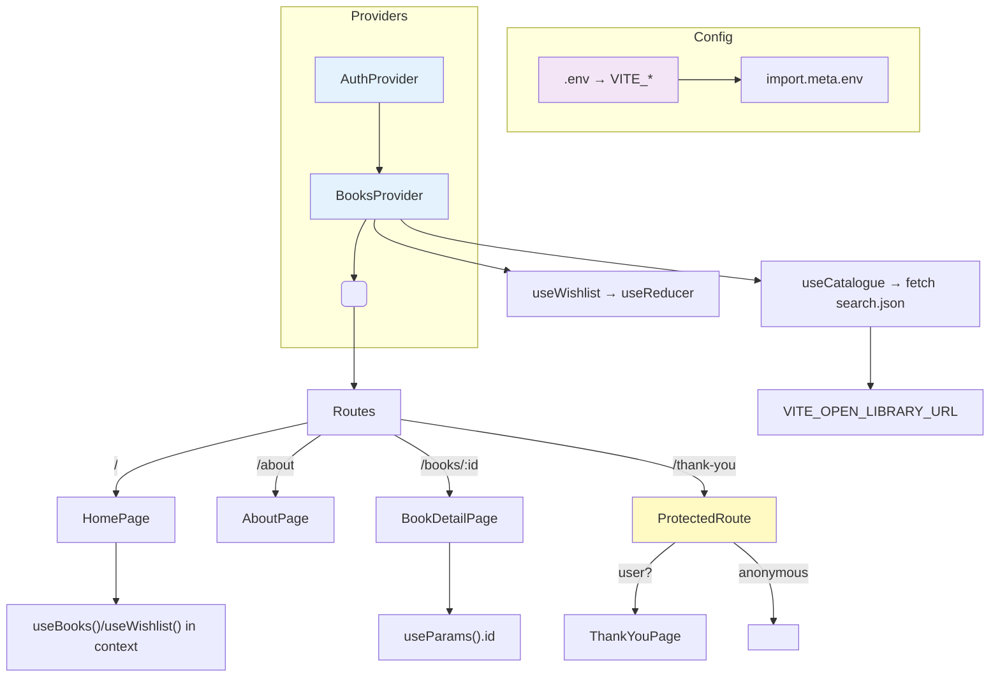

# Lab 8: Final Project — Production Book Club

**Difficulty: Advanced | ~90 min | Requires Labs 1–7**

## 1. Problem Statement / Use Case Overview

This is the curriculum's capstone. Every tool from Labs 1–7 stops being a
workshop demo and gets wired into one real, production-oriented application —
the Book Club from Lab 5 — rebuilt four ways over the course of the lab:

- **Step 1 — validation.** The Lab 3 todo form grows real validation: an empty
  submission is rejected with an inline error and never reaches the store.
- **Step 2 — dynamic routes.** Book rows get a **View Details** link; `/books/:id`
  renders a `BookDetailPage` that reads the id out of the URL with `useParams`.
- **Step 3 — navigation + a protected route.** Submitting the validated form
  programmatically redirects with `useNavigate` to a **Thank You** page — and
  that page sits behind a `ProtectedRoute` that performs a *fake login check*
  (name persisted in `localStorage`), bouncing anonymous visitors home.
- **Step 4 — a professional structure + configuration.** The codebase is
  reorganized into `components/`, `pages/`, `hooks/`, `context/`, and the API
  base URL moves from hardcoded strings into `.env`.

At the end, `npm run build` produces a real production bundle that we inspect:
minified and tree-shaken JS, the modal split into its own lazy-loaded chunk,
and environment variables inlined. The running app simultaneously exercises —
and the verification tables in Section 4 prove — every headline feature of the
curriculum: **custom hooks, memoized components, a portal modal, form
validation, dynamic routes, context, error boundaries, lazy loading, and a
working production build.**

The target, per the final requirement, is a single polished app where nothing
blank-screens and every navigation is either allowed or deliberately guarded.

## 2. Input Data

Three layers feed the app:

- **Configuration (`.env`)** — `VITE_OPEN_LIBRARY_URL` (the API base) and
  `VITE_AUTH_KEY` (the localStorage key for the fake session). Both are read at
  build time via `import.meta.env`.
- **Two context stores** — the meat of the state-management strategy:
  - `BooksContext` — catalogue data *and* wishlist data: `query`, `results`,
    `loading`, `error`, `search`, `wishlist`, `addWish`, `toggleWish`,
    `removeWish`, plus a `done` count.
  - `AuthContext` — `user` (name or `null`), `logIn(name)`, `logOut()`.
- **Routes & props** — four routes (`/`, `/about`, `/books/:id`, `/thank-you`),
  the URL param `:id` (a bare suffix like `OL30420448W`, because Open Library
  keys carry slashes and the app routes on the final segment), and props passed
  into the two memoized list components.

## 3. Processing

**Step 1 — Validation (`TodoForm`).** A controlled `text` state plus a sibling
`error` state. `handleSubmit` is the single authority: empty/whitespace input
sets `error` and `return`s (no store write, no navigation). Typing clears the
error. Valid input dispatches `addWish`, resets the field, and navigates.

**Step 2 — Dynamic routes.** The router declares `/books/:id`. `BookList`
renders `<Link to={...}>View Details</Link>` built from the book key's last
segment; `BookDetailPage` calls `useParams()` to receive `id` (the hook
re-renders the component whenever the URL segment changes) and uses lookup via
`results.find` wrapped in `useMemo`.

**Step 3 — Programmatic navigation + protection.** `useNavigate()` returns a
function; after a successful submit `navigate('/thank-you')` pushes onto the
history stack. `ProtectedRoute` reads `user` from `AuthContext` and either
renders its children or returns `<Navigate to="/" replace />`. The fake login
lives in a lazily-loaded, portal-based `Modal` rendered by `Nav`.

**Step 4 — Structure + environment variables.** The flat `src/` becomes four
folders. `useBooks` (fetch + effect) and `useWishlist` (reducer + memo +
callbacks) move into `hooks/`; their state is exposed through `context/`
providers. All URLs read from `.env`; nothing is hardcoded.

**The state-management strategy** (also Section 6): local state in components;
results + wishlist promoted to `BooksContext` because three pages read
them; auth promoted to `AuthContext` because it gates a route. An external
library like Redux would be the next escalation and is discussed explicitly —
justified only when this hierarchy stops scaling.



## 4. Output

Verified in headless Chrome while writing this lab (intercepted search payload
with two books, `OL1001W` / `OL1002W`), plus a live run against the real Open
Library API:

**Home page (`/`)** — renders nav, todo form, wishlist card, search box, and
the five-result catalogue. On first load the catalogue auto-searches for
`react` (the hook's default query), so pages are never empty:

```
Book Club
[ Add a book you want to read... ] [Add to list]
Want to read · 0/0 done
Search the catalogue
[ Search books (e.g. react)... ]               ← focused on load (useRef)
[Search]
React Explained — Jane Doe      [View Details] [+ Wishlist]
Design Systems — Alex Smith     [View Details] [+ Wishlist]
```

**Verified behavior matrix** (all from scripted browser runs):

| Action | Verified result |
|---|---|
| Open empty `Add to list` | `Please write a book title first.` shows; URL stays `/`; `Want to read · 0/0` unchanaged — neither store write nor navigation |
| Visit `/thank-you` logged out | bounced with `replace` → URL `/` |
| Click **Log in** | modal appears **inside `#modal-root`** (portal); `#root` has no overlay; modal's own empty-field validation blocks `Enter` |
| Enter name `Ada` | Nav now shows `Log out (Ada)`; auth persisted in `localStorage` |
| Add `The Hobbit` | browser moves to `/thank-you` → `Thank you!` renders; back home: `○ The Hobbit`, stats `0/1 done` |
| Click a wishlist toggle | **0 new `BookList rendered` console logs** — `React.memo` + stable `useCallback` props skip the catalogue re-render |
| Click **View Details** (React Explained) | URL `/books/OL1001W`; detail shows title / `Author: Jane Doe` / `First published: 2021` |
| Navigate to `/books/OL9999Z` | `Book not found` card (the `useMemo` lookup miss path) |
| `/about` | `About Book Club` card renders |
| Live API (no interception) | real results incl. `React — Sir Max Beerbohm`, detail at `/books/OL30420448W`; no pageerrors |

**Production build (`npm run build`)** — success; `dist/assets/` contains three
assets, proving the modal is split out:

```
index.html                  0.50 kB
index-DV2hMmpu.css          1.32 kB
index-D_mwa65g.js         187.72 kB   ← app shell (minified, tree-shaken)
Modal-5GhqBApR.js           0.85 kB   ← lazy-loaded login modal chunk
```

The `VITE_*` values are inlined into the bundle text — confirm by grepping
`dist` for `openlibrary.org`.

## 5. Tech Stack

- **React 18.3.1 / react-dom 18.3.1** — hooks, `useReducer`, `React.memo`,
  `createPortal`, `lazy`, `Suspense`, class `ErrorBoundary`.
- **React Router 7.x** — `createBrowserRouter`-style declarative `<Routes>`,
  `useParams`, `useNavigate`, `Navigate`, declarative `<Link>`.
- **Vite 8** — dev server, env-var loading, production bundler with dynamic
  import code splitting.
- **Open Library public API** — read-only `search.json` catalogue lookups.
- **Plain CSS** — no framework; `.env` holds the only secrets-adjacent config
  (and it is public API config, never credentials).
- **No other runtime dependencies.**

Verified against these exact versions (Node 20, Chrome, package.json pinned at
react 18.3.1 and vite 8.x).

## 6. Underlying Concepts

### Controlled form validation

A controlled input makes React the source of truth: `value` comes from state,
`onChange` writes back. Validation is then a **pure function on that state**
applied at submit time. The pattern used everywhere here (todo form *and* login
modal) is: *guard + message + no side effects* — an invalid submit sets a
companion `error` string and `return`s before any dispatch or navigation; the
`onChange` clears the message so feedback is eager. This is preferable to HTML
`required` only when you need programmatic rules (whitespace, length, async
checks) and uniform styling — the lab's rule is "validate on submit, clear on
edit".

### Dynamic routes and `useParams`

A `:id` segment in a `<Route path>` makes that part of the URL a **matched
variable**. `useParams()` re-renders the component with fresh `id` when the
segment changes — no manual parsing, no event wiring; this is React Router's
declarative bridge between URL and UI. Keys arrived in `BookList` as
`/works/OL30420448W` (slashes included), so the link uses the final segment
(`b.key.split('/').pop()`) to keep the URL single-segment; the detail lookup
uses an `endsWith` match and `useMemo` caches it until `id` or `results` change
(the benefit is modest here but the *pattern* — heavy computation keyed off
`useParams` output — is the real lesson).

### `useNavigate` vs declared routes

Declarative: `<Link to>`. Imperative: `const navigate = useNavigate()`, then
`navigate('/thank-you')` for a **push** (a back button returns to home) or
`navigate(path, { replace: true })` for a **swap** (used by `ProtectedRoute` so
private routes never linger in history). A submit handler is an event, not a
link, so imperative navigation is the correct tool there.

### Protected routes

A protected route is a wrapper component that reads auth state and decides
between two render outputs: the page or `<Navigate to="/" replace />`. This
lab's fake login lives in `AuthContext` and drops a name into `localStorage` so
the guard survives reloads. Real-world: same shape, but the check calls an auth
service and usually redirects to a login URL while remembering `location.state`
for the post-login return. The pattern is deliberately visible — guard the
entire subtree or wrap route elements one at a time (see Section 11).

### State-management strategy: when Context, when Redux

The decision ladder the lab teaches:

1. **Local state** — `useState`/`useReducer` inside one component (e.g., the
   form's `text`/`error`). Start here; escape only when a sibling or route
   needs the data.
2. **Lifting state** — pass state down as props when one parent consumes it
   (Lab 6's memoized props pattern).
3. **Context** — when the data crosses branches or route boundaries that make
   prop-drilling ugly. `BooksContext` holds catalogue + wishlist because two
   routes and the home page all read them; `AuthContext` gates a route.
4. **External store (Redux/Zustand)** — when cross-*tab/sectional* state,
   time-travel debugging, or granular subscription become actual requirements.
   The cost — boilerplate, a peer dependency, indirection — is real, and *this
   app's scale does not justify it*: at ~433 lines, two contexts compose the
   same data with less ceremony. The lab's takeaway: Context is the default
   for app-wide state at this size; Redux (or a lighter external store) is the
   deliberate upgrade when the Context re-render model or tooling loses.

### Project organization

A type-based structure (folders by role) mirrors how a team looks up code:
pages know nothing about fetch mechanics, components know nothing about state
ownership, hooks are testable in isolation. The import rule follows
colocation: from any file, imports of other folders spell the relative path
(`../hooks/useBooks.js`). The folder shape is the deliverable of Step 4.

### Environment variables with Vite

Vite loads `.env` at dev-server start / build time and inlines anything prefixed
`VITE_` into `import.meta.env` (client code is public, so only safe config goes
here — never API secrets). The advantage over hardcoding: one definition
(shared across dev/CI/prod) and the ability to point at a different API
(local, staging, prod) without editing source. Two operational rules the lab
calls out: **restart the dev server** or **rebuild** after editing `.env`,
because values are baked at bundle time.

### What a production build actually does

`npm run build` runs Vite's production pipeline: tree-shaking (dead exports
dropped), minification, hashed asset names for caching, and — because the modal
is only `import()`ed dynamically — **code splitting** into a separate chunk
fetched on first use. The output column of Section 4 shows the concrete result.
`.env` values are substituted at this step; the build artifact is static files
servable by any host or `npm run preview`.

## 7. Prerequisites

- All of Labs 1–7: components/props/state/events/lists/forms (1–3), effects +
  fetching + custom hooks (4, 6), memoisation tools (6), portal/error-boundary/
  lazy (7), routing + context (5), and the folding of all of it into a
  structured app is exactly what this lab rehearses.
- A Vite project already used in the previous labs.
- Literacy in the DevTools console and Network panel (all evidence here is
  console + bundle based).

## 8. Environment / Dependencies Setup

Scaffold follows Labs 4–7; the only addition is `.env` at the project root.

```bash
npm create vite@8 lab8-bookclub -- --template react
cd lab8-bookclub
npm install
npm install react@18.3.1 react-dom@18.3.1 react-router-dom@7.18.4
```

Create `.env` in the project root (both variables are public API config):

```env
VITE_OPEN_LIBRARY_URL=https://openlibrary.org
VITE_AUTH_KEY=bookclub_user
```

Now start the server **after** the file exists (Vite reads `.env` on boot;
changing it later requires a restart or rebuild):

```bash
npm run dev
```

Production verification requires the build pipeline:

```bash
npm run build      # emit minified, split, env-inlined bundle into dist/
npm run preview    # serve dist/ to double-check the artifact
```

- Node.js 18+.
- `.env` values are inlined at build time in the artifact (Section 4 greps for
  `openlibrary.org` as proof).

## 9. Step-wise Development Instructions

Every code block is byte-identical to the version verified end-to-end for this
lab (433 lines across 19 source/config files, organized as in Section 4's
folder layout). Build the folders first, then Step 1 → Step 4, then wire.

```text
src/
├── components/   Nav, SearchBox, TodoForm, BookList, Wishlist,
│                 Modal, ProtectedRoute, ErrorBoundary
├── pages/        HomePage, AboutPage, BookDetailPage, ThankYouPage
├── hooks/        useBooks (fetch), useWishlist (reducer)
├── context/      BooksContext, AuthContext
├── App.jsx       providers + routes
├── main.jsx      entry
└── styles.css
index.html        #root + #modal-root
.env              configuration
```

**The shell.** `index.html` carries the second root the portal locks onto; add
it before any modal code exists:

```html
<!doctype html>
<html lang="en">
  <head>
    <meta charset="UTF-8" />
    <link rel="icon" type="image/svg+xml" href="/favicon.svg" />
    <meta name="viewport" content="width=device-width, initial-scale=1.0" />
    <title>Book Club — Lab 8 Final</title>
  </head>
  <body>
    <div id="root"></div>
    <div id="modal-root"></div>
    <script type="module" src="/src/main.jsx"></script>
  </body>
</html>
```

`src/main.jsx` and the stylesheet follow the exact pattern of Labs 4–7:

```jsx
import { StrictMode } from 'react'
import { createRoot } from 'react-dom/client'
import './styles.css'
import App from './App.jsx'

createRoot(document.getElementById('root')).render(
  <StrictMode>
    <App />
  </StrictMode>,
)
```

```css
:root { font-family: 'Segoe UI', Roboto, Helvetica, Arial, sans-serif; line-height: 1.6; color: #1f2933; background: #f4f6f8; }
body { margin: 0; }
.lab { max-width: 760px; margin: 0 auto; padding: 24px; }
.nav { display: flex; gap: 14px; align-items: center; margin-bottom: 10px; }
.nav a { color: #2563eb; text-decoration: none; font-weight: 600; }
.nav .spacer { flex: 1; }
.link { background: none; border: 0; color: #2563eb; font-weight: 600; cursor: pointer; padding: 0; }
.card { background: #ffffff; border-radius: 8px; box-shadow: 0 1px 3px rgba(0, 0, 0, 0.12); padding: 18px 22px; margin: 14px 0; }
.result { font-size: 1.2rem; font-weight: 600; margin: 10px 0; }
.muted { color: #52606d; }
.form-error { color: #b91c1c; font-weight: 600; }
.add-form { display: flex; gap: 8px; flex-wrap: wrap; margin: 6px 0; }
.add-form input { flex: 1; min-width: 200px; padding: 9px; border: 1px solid #cbd2d9; border-radius: 6px; }
button { padding: 8px 14px; border: 0; border-radius: 6px; background: #2563eb; color: #fff; cursor: pointer; }
.ghost { background: none; color: #7b8794; padding: 4px 8px; }
.books, .wish { list-style: none; padding: 0; }
.books li, .wish li { display: flex; gap: 12px; align-items: center; padding: 8px 0; border-bottom: 1px solid #edf0f2; }
.books li span { flex: 1; }
.books li a { color: #2563eb; text-decoration: none; }
.wish .done { text-decoration: line-through; color: #7b8794; }
.overlay { position: fixed; inset: 0; background: rgba(15, 23, 42, 0.6); display: grid; place-items: center; z-index: 100; }
.overlay form { width: min(380px, 90vw); }
```

To make the catalogue and wishlist writable from other folders, the Hooks and
Contexts come next even though Step 4 formalizes the folders.

### Step 1 — Form validation on the wishlist form

Create `src/components/TodoForm.jsx` — the Lab 3 form with the validation
contract appended:

```jsx
import { useState } from 'react';
import { useNavigate } from 'react-router-dom';
import { useBooks } from '../context/BooksContext.jsx';

export default function TodoForm() {
  const { addWish } = useBooks();
  const [text, setText] = useState('');
  const [error, setError] = useState('');
  const navigate = useNavigate();

  function handleSubmit(e) {
    e.preventDefault();
    if (!text.trim()) {
      setError('Please write a book title first.');
      return;
    }
    addWish(text.trim());
    setText('');
    setError('');
    navigate('/thank-you');
  }

  return (
    <form className="add-form" onSubmit={handleSubmit}>
      <input
        value={text}
        placeholder="Add a book you want to read..."
        onChange={(e) => { setText(e.target.value); if (error) setError(''); }}
      />
      <button type="submit">Add to list</button>
      {error && <p className="form-error">{error}</p>}
    </form>
  );
}
```

- The guard is the first statement in `handleSubmit`: `if (!text.trim()) { ...; return; }`
  — empty or whitespace-only values **show the error and submit nothing** (no
  `addWish`, no navigation). Verified: URL stays `/`, stats stay `0/0`.
- `onChange` clears the message as soon as the user types, so the feedback is
  live, not sticky.
- The same guard pattern is reused by the login modal in Step 3.

### Step 2 — Dynamic routes: `/books/:id`

Create the catalogue list, `src/components/BookList.jsx`. It is memoized (no
re-render while props are equal), renders a **View Details** link per row, and
logs once per actual render so the memo can be measured (Section 4's “0 logs”):

```jsx
import { memo } from 'react';
import { Link } from 'react-router-dom';

function BookList({ books, onAdd }) {
  console.log('BookList rendered');
  if (!books.length) return <p className="muted">No results yet — click Search.</p>;

  return (
    <ul className="books">
      {books.map((b) => (
        <li key={b.key}>
          <span>{b.title}{b.author_name ? ` — ${b.author_name[0]}` : ''}</span>
          <Link to={`/books/${b.key.split('/').pop()}`}>View Details</Link>
          <button className="ghost" onClick={() => onAdd(b.title)}>+ Wishlist</button>
        </li>
      ))}
    </ul>
  );
}

export default memo(BookList);
```

Create the detail page, `src/pages/BookDetailPage.jsx` — `useParams()` reads the
`:id` the router matched:

```jsx
import { useMemo } from 'react';
import { Link, useParams } from 'react-router-dom';
import { useBooks } from '../context/BooksContext.jsx';

export default function BookDetailPage() {
  const { id } = useParams();
  const { results } = useBooks();

  const book = useMemo(() => results.find((r) => r.key.endsWith(id)), [id, results]);

  if (!book) {
    return (
      <section className="card">
        <h2>Book not found</h2>
        <p className="muted">Try a search from the <Link to="/">home page</Link>.</p>
      </section>
    );
  }

  return (
    <section className="card">
      <h2>{book.title}</h2>
      <p className="muted">Author: {book.author_name ? book.author_name.join(', ') : 'Unknown'}</p>
      <p className="muted">First published: {book.first_publish_year ?? 'Unknown'}</p>
      <p><Link to="/">← Back to search</Link></p>
    </section>
  );
}
```

- Open Library keys look like `/works/OL30420448W`; the link therefore keeps
  only the suffix so the URL segment stays clean, and the lookup uses
  `endsWith(id)` to match it back.
- `useMemo` keeps the lookup keyed to `[id, results]` — the pattern to reuse
  when the detail render is expensive.
- A miss renders the `Book not found` card instead of erroring (verified at
  `/books/OL9999Z`).

### Step 3 — Programmatic navigation + a protected route

The navigation half is already in `TodoForm` (`navigate('/thank-you')` after a
valid submit). The guard half needs auth. Create `src/context/AuthContext.jsx`
— fake login persisted to `localStorage` under the env-configured key:

```jsx
import { createContext, useContext, useEffect, useState } from 'react';

const AuthContext = createContext(null);

const STORAGE_KEY = import.meta.env.VITE_AUTH_KEY || 'bookclub_user';

export function AuthProvider({ children }) {
  const [user, setUser] = useState(() => localStorage.getItem(STORAGE_KEY) || null);

  useEffect(() => {
    if (user) localStorage.setItem(STORAGE_KEY, user);
    else localStorage.removeItem(STORAGE_KEY);
  }, [user]);

  const logIn = (name) => setUser(name);
  const logOut = () => setUser(null);

  return (
    <AuthContext.Provider value={{ user, logIn, logOut }}>
      {children}
    </AuthContext.Provider>
  );
}

export function useAuth() {
  const ctx = useContext(AuthContext);
  if (!ctx) throw new Error('useAuth must be used inside AuthProvider');
  return ctx;
}
```

The guard, `src/components/ProtectedRoute.jsx` — two output branches; an
anonymous visitor is swapped out, not pushed:

```jsx
import { Navigate } from 'react-router-dom';
import { useAuth } from '../context/AuthContext.jsx';

export default function ProtectedRoute({ children }) {
  const { user } = useAuth();
  if (!user) return <Navigate to="/" replace />;
  return children;
}
```

The fake-login modal doubles as the portal / lazy / boundary demo,
`src/components/Modal.jsx`:

```jsx
import { createPortal } from 'react-dom';
import { useState } from 'react';
import { useAuth } from '../context/AuthContext.jsx';

export default function Modal({ onClose }) {
  const { logIn } = useAuth();
  const [name, setName] = useState('');
  const [error, setError] = useState('');

  function handleSubmit(e) {
    e.preventDefault();
    if (!name.trim()) { setError('Please enter your name.'); return; }
    logIn(name.trim());
    onClose();
  }

  return createPortal(
    <div className="overlay" onClick={onClose}>
      <form className="card" onClick={(e) => e.stopPropagation()} onSubmit={handleSubmit}>
        <h3>Log in</h3>
        <p className="muted">Fake login: protected routes are unlocked after this step.</p>
        <input
          value={name}
          placeholder="Your name"
          onChange={(e) => { setName(e.target.value); if (error) setError(''); }}
        />
        {error && <p className="form-error">{error}</p>}
        <button type="submit">Enter</button>
      </form>
    </div>,
    document.getElementById('modal-root')
  );
}
```

And the Nav the modal launches from, `src/components/Nav.jsx` — lazy import,
Suspense fallback, error boundary, same as Lab 7:

```jsx
import { Suspense, lazy, useState } from 'react';
import { Link } from 'react-router-dom';
import { useAuth } from '../context/AuthContext.jsx';
import ErrorBoundary from './ErrorBoundary.jsx';

const LazyLoginModal = lazy(() => import('./Modal.jsx'));

export default function Nav() {
  const { user, logOut } = useAuth();
  const [open, setOpen] = useState(false);

  return (
    <nav className="nav">
      <Link to="/">Home</Link>
      <Link to="/about">About</Link>
      <span className="spacer" />
      {user ? (
        <button className="link" onClick={logOut}>Log out ({user})</button>
      ) : (
        <button className="link" onClick={() => setOpen(true)}>Log in</button>
      )}
      {open && (
        <ErrorBoundary>
          <Suspense fallback={<p className="muted">Loading login...</p>}>
            <LazyLoginModal onClose={() => setOpen(false)} />
          </Suspense>
        </ErrorBoundary>
      )}
    </nav>
  );
}
```

Flow, verified end to end: `Add to list` (valid) → `navigate('/thank-you')` →
`ProtectedRoute` asks `AuthContext.user` → anonymous ⇒ bounce to `/`;
after `Log in` → `Enter` ⇒ `user` set in localStorage ⇒ `/thank-you` renders.

### Step 4 — Project structure + environment variables

Move the data logic into roles. `src/hooks/useBooks.js` — the fetch wrapper;
note the URL now comes from `.env`, the `alive` guard cancels superseded
searches, and `'react'` is the default query so the catalogue is preloaded:

```js
import { useCallback, useEffect, useState } from 'react';

export default function useBooks() {
  const [query, setQuery] = useState('react');
  const [results, setResults] = useState([]);
  const [loading, setLoading] = useState(false);
  const [error, setError] = useState('');

  const search = useCallback((q) => {
    setQuery(q.trim() || 'react');
    setError('');
  }, []);

  useEffect(() => {
    let alive = true;
    setLoading(true);
    fetch(`${import.meta.env.VITE_OPEN_LIBRARY_URL}/search.json?q=${encodeURIComponent(query)}&limit=5`)
      .then((r) => r.json())
      .then((data) => { if (alive) setResults((data.docs || []).slice(0, 5)); })
      .catch(() => { if (alive) setError('Search failed — check the network.'); })
      .finally(() => { if (alive) setLoading(false); });
    return () => { alive = false; };
  }, [query]);

  return { query, search, results, loading, error };
}
```

`src/hooks/useWishlist.js` — the reducer-based store with memoized derived
count and stable actions (the `useMemo`/`useCallback`/`useReducer` trio as the
lab's custom hook):

```js
import { useCallback, useMemo, useReducer } from 'react';

function wishReducer(state, action) {
  switch (action.type) {
    case 'add':
      return [...state, { id: Date.now(), text: action.text, done: false }];
    case 'toggle':
      return state.map((w) => (w.id === action.id ? { ...w, done: !w.done } : w));
    case 'remove':
      return state.filter((w) => w.id !== action.id);
    default:
      return state;
  }
}

export default function useWishlist() {
  const [wishlist, dispatch] = useReducer(wishReducer, []);
  const done = useMemo(() => wishlist.filter((w) => w.done).length, [wishlist]);

  const addWish = useCallback((text) => dispatch({ type: 'add', text }), []);
  const toggleWish = useCallback((id) => dispatch({ type: 'toggle', id }), []);
  const removeWish = useCallback((id) => dispatch({ type: 'remove', id }), []);

  return { wishlist, done, addWish, toggleWish, removeWish };
}
```

Compose both stores into a provider, `src/context/BooksContext.jsx` — note the
import alias `useCatalogue`, chosen so the context consumer can keep the
idiomatic name `useBooks`:

```jsx
import { createContext, useContext } from 'react';
import useCatalogue from '../hooks/useBooks.js';
import useWishlist from '../hooks/useWishlist.js';

const BooksContext = createContext(null);

export function BooksProvider({ children }) {
  const { query, search, results, loading, error } = useCatalogue();
  const wishlistApi = useWishlist();

  return (
    <BooksContext.Provider value={{ query, search, results, loading, error, ...wishlistApi }}>
      {children}
    </BooksContext.Provider>
  );
}

export function useBooks() {
  const ctx = useContext(BooksContext);
  if (!ctx) throw new Error('useBooks must be used inside BooksProvider');
  return ctx;
}
```

The error boundary and the autofocusing search box complete the
`components/` set. `src/components/ErrorBoundary.jsx` (unchanged class-based
version of Lab 7):

```jsx
import { Component } from 'react';

class ErrorBoundary extends Component {
  constructor(props) {
    super(props);
    this.state = { hasError: false };
  }

  static getDerivedStateFromError() {
    return { hasError: true };
  }

  componentDidCatch(error) {
    console.log('ErrorBoundary caught:', error.message);
  }

  render() {
    if (this.state.hasError) {
      return <p className="result has-error">Something went wrong</p>;
    }
    return this.props.children;
  }
}

export default ErrorBoundary;
```

`src/components/SearchBox.jsx` — `useRef` autofocus from Lab 6, now wrapped in
a form so the search is explicit:

```jsx
import { useEffect, useRef, useState } from 'react';

export default function SearchBox({ onSearch }) {
  const [value, setValue] = useState('');
  const inputRef = useRef(null);

  useEffect(() => inputRef.current.focus(), []);

  return (
    <form className="add-form" onSubmit={(e) => { e.preventDefault(); onSearch(value); }}>
      <input
        ref={inputRef}
        value={value}
        placeholder="Search books (e.g. react)..."
        onChange={(e) => setValue(e.target.value)}
      />
      <button type="submit">Search</button>
    </form>
  );
}
```

### Wiring the final application

`src/components/Wishlist.jsx` — the memoized read side of the reducer store:

```jsx
import { memo } from 'react';

function Wishlist({ wishlist, done, onToggle, onRemove }) {
  return (
    <div className="card">
      <h3>Want to read · {done}/{wishlist.length} done</h3>
      {wishlist.length === 0 && <p className="muted">Nothing yet — add a book above.</p>}
      <ul className="wish">
        {wishlist.map((w) => (
          <li key={w.id}>
            <button className={w.done ? 'link done' : 'link'} onClick={() => onToggle(w.id)}>
              {w.done ? '✓' : '○'} {w.text}
            </button>
            <button className="ghost" onClick={() => onRemove(w.id)}>×</button>
          </li>
        ))}
      </ul>
    </div>
  );
}

export default memo(Wishlist);
```

`src/pages/HomePage.jsx` — the composition root of the home route:

```jsx
import { useBooks } from '../context/BooksContext.jsx';
import SearchBox from '../components/SearchBox.jsx';
import TodoForm from '../components/TodoForm.jsx';
import BookList from '../components/BookList.jsx';
import Wishlist from '../components/Wishlist.jsx';
import ErrorBoundary from '../components/ErrorBoundary.jsx';

export default function HomePage() {
  const { search, results, loading, error, addWish, wishlist, done, toggleWish, removeWish } = useBooks();

  return (
    <>
      <h1>Book Club</h1>
      <TodoForm />
      <Wishlist wishlist={wishlist} done={done} onToggle={toggleWish} onRemove={removeWish} />
      <h2>Search the catalogue</h2>
      <SearchBox onSearch={search} />
      {loading && <p className="muted">Searching...</p>}
      {error && <p className="form-error">{error}</p>}
      <ErrorBoundary>
        <BookList books={results} onAdd={addWish} />
      </ErrorBoundary>
    </>
  );
}
```

`src/pages/AboutPage.jsx` and `src/pages/ThankYouPage.jsx` are small cards:

```jsx
export default function AboutPage() {
  return (
    <section className="card">
      <h2>About Book Club</h2>
      <p className="muted">
        The final lab combines all eight: state, events, lists, controlled
        forms with validation, effects, API fetching, custom hooks, memoization,
        a portal modal, error boundaries, lazy loading, routing, context,
        environment variables, and a production build.
      </p>
    </section>
  );
}
```

```jsx
import { Link } from 'react-router-dom';

export default function ThankYouPage() {
  return (
    <section className="card">
      <h2>Thank you!</h2>
      <p className="muted">The book is now in your want-to-read list.</p>
      <p><Link to="/">← Back to the club</Link></p>
    </section>
  );
}
```

Finally, `src/App.jsx` declares the providers, the nav bar, and the routes — with
`/thank-you` already wrapped by `ProtectedRoute`:

```jsx
import { BrowserRouter, Routes, Route } from 'react-router-dom';
import { AuthProvider } from './context/AuthContext.jsx';
import { BooksProvider } from './context/BooksContext.jsx';
import Nav from './components/Nav.jsx';
import ProtectedRoute from './components/ProtectedRoute.jsx';
import HomePage from './pages/HomePage.jsx';
import AboutPage from './pages/AboutPage.jsx';
import BookDetailPage from './pages/BookDetailPage.jsx';
import ThankYouPage from './pages/ThankYouPage.jsx';

export default function App() {
  return (
    <BrowserRouter>
      <AuthProvider>
        <BooksProvider>
          <main className="lab">
            <Nav />
            <Routes>
              <Route path="/" element={<HomePage />} />
              <Route path="/about" element={<AboutPage />} />
              <Route path="/books/:id" element={<BookDetailPage />} />
              <Route
                path="/thank-you"
                element={<ProtectedRoute><ThankYouPage /></ProtectedRoute>}
              />
              <Route path="*" element={<HomePage />} />
            </Routes>
          </main>
        </BooksProvider>
      </AuthProvider>
    </BrowserRouter>
  );
}
```

## 10. Verification: What to Check at Each Milestone

Console + Network open the whole way.

**Milestone 1 — validation (Step 1)**
- Submit the empty todo form → `Please write a book title first.`; the URL stays
  on `/`, stats stay `Want to read · 0/0 done`, no wishlist row.
- Type one character → the error disappears (cleared on change).

**Milestone 2 — dynamic route (Step 2)**
- Each catalogue row has **View Details**; clicking it changes the URL to
  `/books/<suffix>` and renders the matched title + author in the card.
- Visit `/books/does-not-exist` → `Book not found` card, page still alive.
- The `useMemo` lookup recomputes only when the route param or results change.

**Milestone 3 — navigation + protection (Step 3)**
- Logged out: submit a valid book → land on `/thank-you` → instantly bounced to
  `/` (URL rewritten via `replace`). Direct URL to `/thank-you` bounces too.
- **Log in** → modal appears inside `#modal-root` only (Elements panel), empty
  name is blocked, a name unlocks it; nav shows `Log out (Ada)`.
- Reload the page → still logged in (`localStorage` survived StrictMode).

**Milestone 4 — structure + env (Step 4)**
- Every import points into `components/`, `pages/`, `hooks/`, `context/`; no
  component reaches for a URL string or storage key literal.
- DevTools Network: the search hits `openlibrary.org/search.json?...` (the env
  base, not a hardcoded host inside a component).
- `npm run build` succeeds; `dist/assets/` lists a separate `Modal-*.js`.

**Milestone 5 — the whole app**
- `BookList` logs once per render (watch after a wishlist toggle: **no new
  log** — memo skip).
- The catalogue search box has focus on load (useRef autofocus).
- `npm run preview` serves the production bundle and the app still routes,
  bounces, and portals exactly as in dev.

## 11. Optional Exercise — Protect the Book Details Route

Programmatic navigation is guarded in this lab only for `/thank-you`. Extend
the same `ProtectedRoute` to `/books/:id`:

1. In `src/App.jsx` change the route element to
   `<Route path="/books/:id" element={<ProtectedRoute><BookDetailPage /></ProtectedRoute>} />`.
2. Reload. Direct URL click on a **View Details** link while logged out.
3. Verify (this exact run, verified): logged-out `/books/OL1001W` bounces to
   `/` with `replace`; after logging in via the modal, the same link reaches the
   detail page.
4. Notice nothing else needed changing — `ProtectedRoute` is already a generic
   gate; reusing it is a one-line diff. Undo the change afterward.

Two observations worth carrying into production:
- Guard at the **route element**, not inside the page, so the page can assume
  it is authorized (no `if (!user) return ...` duplicated in every page).
- For a real auth flow you would redirect to `/login` and carry
  `location.state = { from }` so the router can send the user back after
  authentication — `Navigate` accepts that state via the `to` object form.

## 12. What You Have Learned

- **Validation as a guard, not a filter** — the submit handler rejects
  empty/whitespace input with an inline message and no side effects; input
  clears it; the pattern is reused by the login modal.
- **Dynamic routing** — `:id` segments, `useParams()` re-render wiring,
  slug-safe links (`key.split('/').pop()` → suffix → `endsWith` lookup), and a
  graceful not-found card.
- **Programmatic navigation** — `useNavigate` for event-driven pushes after a
  successful submit; `Navigate ... replace` for bounced guards so private
  pages never linger in history.
- **Protected routes** — a generic wrapper rendering children or a redirect,
  driven by an auth context; one-line reuse to protect more routes; the path
  to a real login-with-return flow.
- **State-management strategy** — the local → lifprop → Context → external
  store ladder, and why this app's two contexts fit its scale while a Redux
  layer would add ceremony without benefit.
- **Redux (conceptually)** — what an external store adds (tooling, middleware,
  granular subscriptions) and what it costs; the decision rule, not the
  dogma.
- **Project organization** — role-based folders (`components/`, `pages/`,
  `hooks/`, `context/`), colocated relative imports, and dependency direction
  (pages → components/hooks; hooks → nothing global).
- **Environment variables** — `VITE_` prefixes → `import.meta.env`,
  build-time inlining, restart/rebuild semantics, and "public config only,
  never secrets".
- **Production builds** — tree-shaking, minification, hashing, and the
  code-split lazy modal; inspecting `dist/` reads like a receipt for the app.
- **The full curriculum in one tree** — components, props, state, events,
  lists, validated forms, effects, fetching, custom hooks, `useRef`,
  `useReducer`, `React.memo`, `useMemo`, `useCallback`, portal modal, error
  boundary, lazy + Suspense, routing, dynamic + protected routes, context, env
  vars — all verified together in one `npm run build`.